# ema_crossover

Representative sample of 20 trades drawn from the full library (`enter_tag = ema_crossover`). Charts were generated by the upstream all-trades pipeline; this page only embeds them. Selection is outcome-stratified to surface failure modes alongside winners — not a top-N-by-PnL list.

## Trade index

| # | Strategy | Pair | open_date | profit | MFE | MAE | outcome | exit_diagnosis |
|---:|---|---|---|---:|---:|---:|---|---|
| 1 | `YujiStrategyV2` | LINK/USDT | 2025-05-13 | +4.02% | +4.52% | -0.18% | `clean_win` | `efficient_exit` |
| 2 | `YujiStrategyV2` | LINK/USDT | 2025-02-14 | +2.51% | +2.87% | -0.96% | `noisy_win` | `efficient_exit` |
| 3 | `YujiStrategyV3` | XRP/USDT | 2025-03-19 | +4.00% | +10.86% | -0.81% | `missed_continuation` | `missed_continuation` |
| 4 | `YujiStrategyV2` | BTC/USDT | 2025-05-26 | -7.19% | +1.57% | -7.92% | `bad_entry_good_idea` | `stop_loss_failure` |
| 5 | `YujiStrategyV2` | BTC/USDT | 2025-01-31 | -7.19% | +0.10% | -7.01% | `fast_loss` | `poor_entry` |
| 6 | `YujiStrategyV2` | BTC/USDT | 2025-12-11 | -7.19% | +0.49% | -7.31% | `slow_loss` | `poor_entry` |
| 7 | `YujiStrategyV2` | BTC/USDT | 2024-05-07 | -0.01% | +1.00% | -5.99% | `scratch` | `premature_exit` |
| 8 | `YujiStrategyV2` | ETH/USDT | 2025-05-08 | +4.00% | +4.60% | -0.00% | `clean_win` | `efficient_exit` |
| 9 | `YujiStrategyV2` | LINK/USDT | 2025-08-20 | +2.50% | +2.75% | -2.55% | `noisy_win` | `efficient_exit` |
| 10 | `YujiStrategyV2` | LINK/USDT | 2026-02-28 | +2.50% | +3.95% | -1.35% | `missed_continuation` | `premature_exit` |
| 11 | `YujiStrategyV2` | BTC/USDT | 2025-01-20 | -7.19% | +1.93% | -7.84% | `bad_entry_good_idea` | `stop_loss_failure` |
| 12 | `YujiStrategyV2` | BTC/USDT | 2025-10-28 | -7.19% | +0.49% | -7.03% | `fast_loss` | `poor_entry` |
| 13 | `YujiStrategyV2` | BTC/USDT | 2025-10-07 | -7.19% | +0.10% | -7.18% | `slow_loss` | `poor_entry` |
| 14 | `YujiStrategyV2` | XRP/USDT | 2025-06-30 | +4.00% | +5.15% | -0.06% | `clean_win` | `efficient_exit` |
| 15 | `YujiStrategyV2` | AVAX/USDT | 2025-07-15 | +2.50% | +3.67% | -2.85% | `noisy_win` | `premature_exit` |
| 16 | `YujiStrategyV2` | ETH/USDT | 2024-09-22 | +2.50% | +3.76% | -1.95% | `missed_continuation` | `premature_exit` |
| 17 | `YujiStrategyV2` | BTC/USDT | 2022-07-24 | -7.19% | +1.47% | -7.54% | `bad_entry_good_idea` | `premature_exit` |
| 18 | `YujiStrategyV2` | BTC/USDT | 2024-11-25 | -7.19% | +0.80% | -7.43% | `fast_loss` | `premature_exit` |
| 19 | `YujiStrategyV2` | BTC/USDT | 2024-06-07 | -7.19% | +0.99% | -7.35% | `slow_loss` | `premature_exit` |
| 20 | `YujiStrategyV2` | AVAX/USDT | 2025-02-12 | +2.91% | +4.15% | -0.12% | `clean_win` | `stop_loss_failure` |

## Charts

### 1. YujiStrategyV2 — LINK/USDT · +4.02%

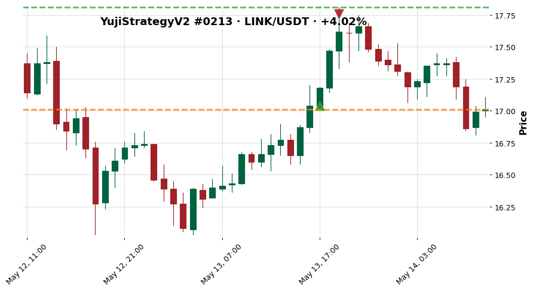

- outcome: `clean_win`  ·  exit_diagnosis: `efficient_exit`
- MFE +4.52%  ·  MAE -0.18%
- exit_reason: `roi`

### 2. YujiStrategyV2 — LINK/USDT · +2.51%

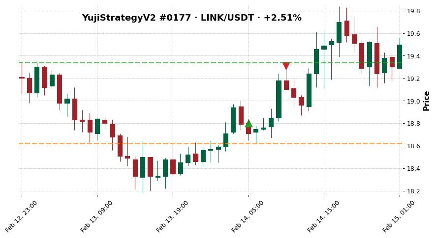

- outcome: `noisy_win`  ·  exit_diagnosis: `efficient_exit`
- MFE +2.87%  ·  MAE -0.96%
- exit_reason: `roi`

### 3. YujiStrategyV3 — XRP/USDT · +4.00%

- outcome: `missed_continuation`  ·  exit_diagnosis: `missed_continuation`
- MFE +10.86%  ·  MAE -0.81%
- exit_reason: `roi`

### 4. YujiStrategyV2 — BTC/USDT · -7.19%

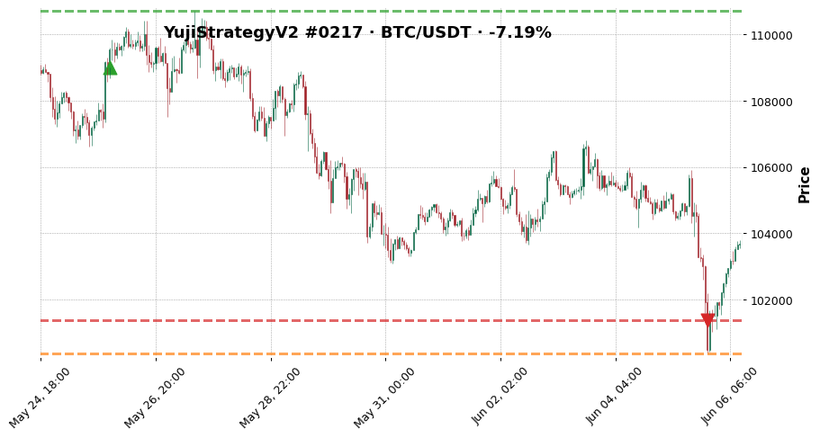

- outcome: `bad_entry_good_idea`  ·  exit_diagnosis: `stop_loss_failure`
- MFE +1.57%  ·  MAE -7.92%
- exit_reason: `stop_loss`

### 5. YujiStrategyV2 — BTC/USDT · -7.19%

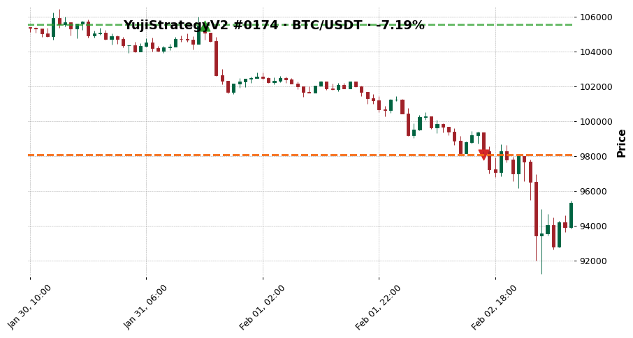

- outcome: `fast_loss`  ·  exit_diagnosis: `poor_entry`
- MFE +0.10%  ·  MAE -7.01%
- exit_reason: `stop_loss`

### 6. YujiStrategyV2 — BTC/USDT · -7.19%

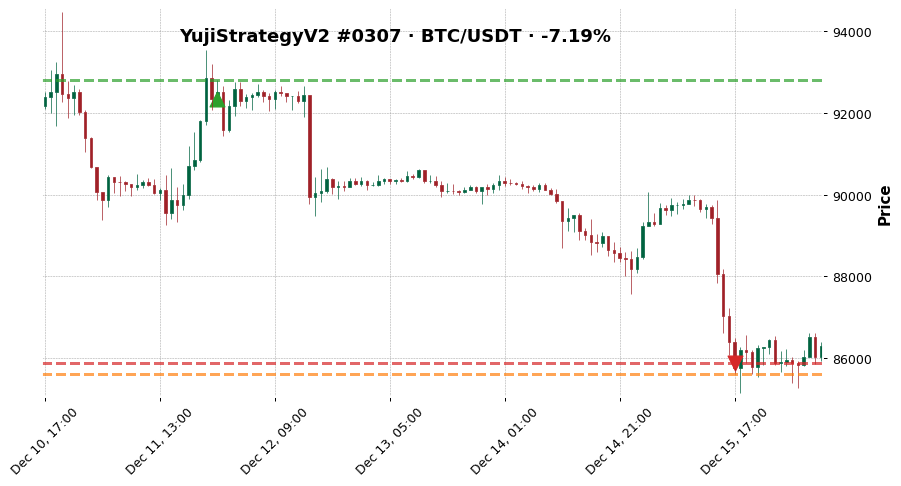

- outcome: `slow_loss`  ·  exit_diagnosis: `poor_entry`
- MFE +0.49%  ·  MAE -7.31%
- exit_reason: `stop_loss`

### 7. YujiStrategyV2 — BTC/USDT · -0.01%

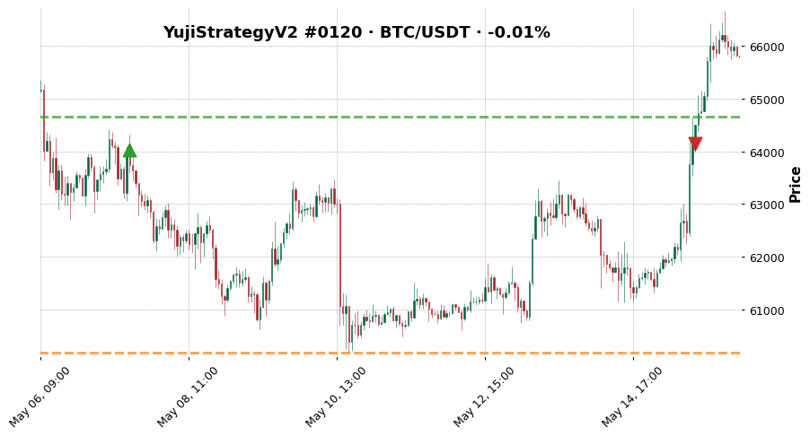

- outcome: `scratch`  ·  exit_diagnosis: `premature_exit`
- MFE +1.00%  ·  MAE -5.99%
- exit_reason: `exit_signal`

### 8. YujiStrategyV2 — ETH/USDT · +4.00%

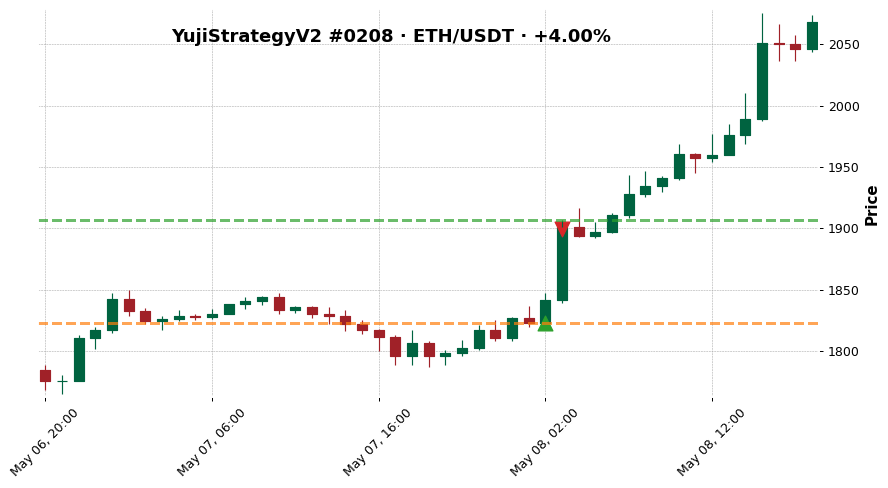

- outcome: `clean_win`  ·  exit_diagnosis: `efficient_exit`
- MFE +4.60%  ·  MAE -0.00%
- exit_reason: `roi`

### 9. YujiStrategyV2 — LINK/USDT · +2.50%

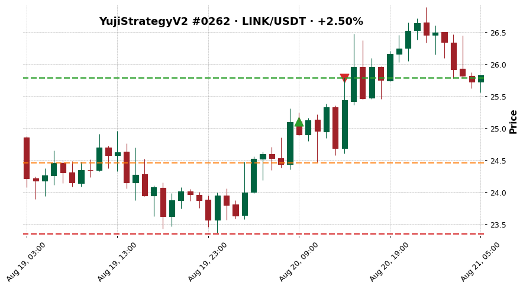

- outcome: `noisy_win`  ·  exit_diagnosis: `efficient_exit`
- MFE +2.75%  ·  MAE -2.55%
- exit_reason: `roi`

### 10. YujiStrategyV2 — LINK/USDT · +2.50%

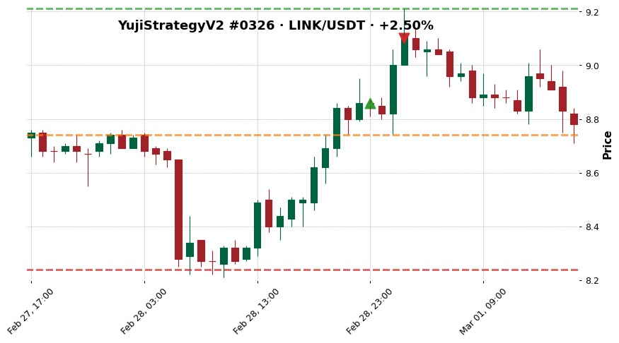

- outcome: `missed_continuation`  ·  exit_diagnosis: `premature_exit`
- MFE +3.95%  ·  MAE -1.35%
- exit_reason: `roi`

### 11. YujiStrategyV2 — BTC/USDT · -7.19%

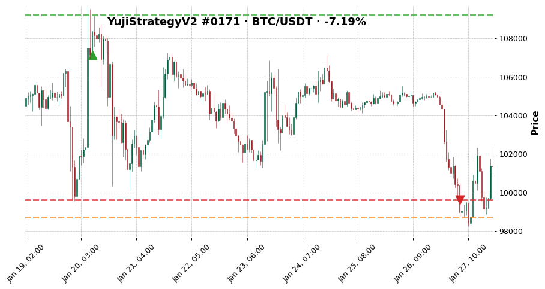

- outcome: `bad_entry_good_idea`  ·  exit_diagnosis: `stop_loss_failure`
- MFE +1.93%  ·  MAE -7.84%
- exit_reason: `stop_loss`

### 12. YujiStrategyV2 — BTC/USDT · -7.19%

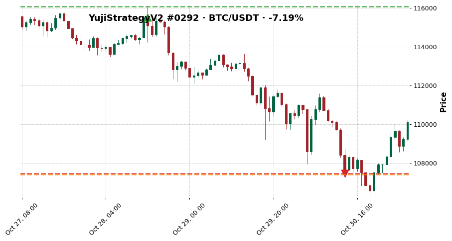

- outcome: `fast_loss`  ·  exit_diagnosis: `poor_entry`
- MFE +0.49%  ·  MAE -7.03%
- exit_reason: `stop_loss`

### 13. YujiStrategyV2 — BTC/USDT · -7.19%

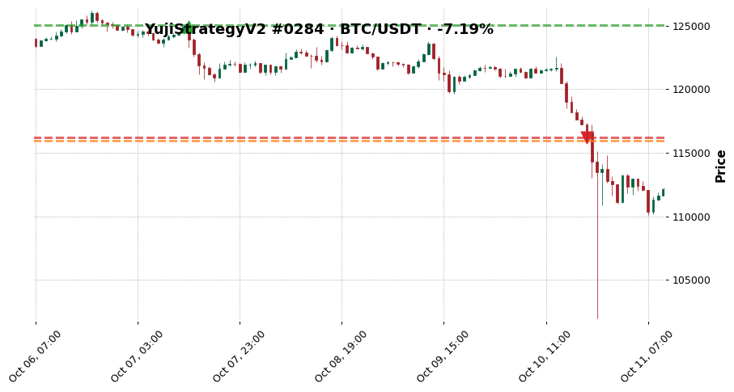

- outcome: `slow_loss`  ·  exit_diagnosis: `poor_entry`
- MFE +0.10%  ·  MAE -7.18%
- exit_reason: `stop_loss`

### 14. YujiStrategyV2 — XRP/USDT · +4.00%

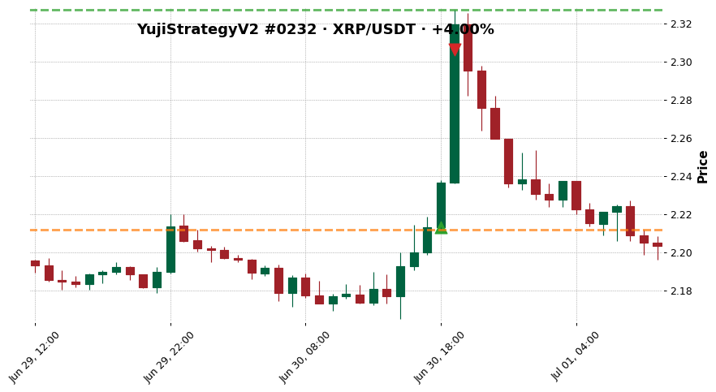

- outcome: `clean_win`  ·  exit_diagnosis: `efficient_exit`
- MFE +5.15%  ·  MAE -0.06%
- exit_reason: `roi`

### 15. YujiStrategyV2 — AVAX/USDT · +2.50%

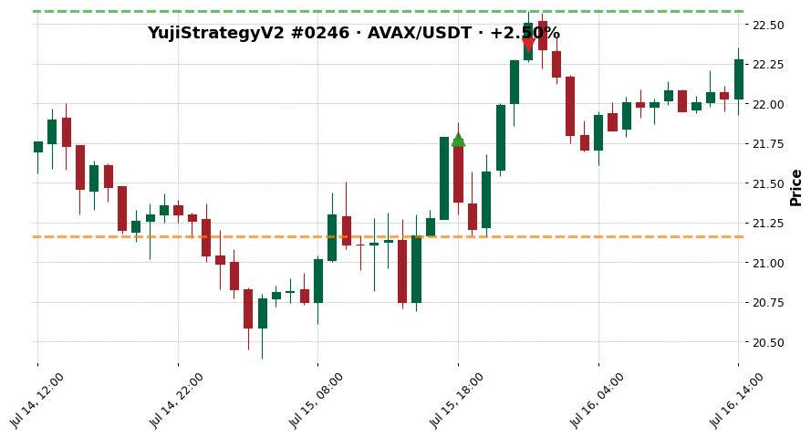

- outcome: `noisy_win`  ·  exit_diagnosis: `premature_exit`
- MFE +3.67%  ·  MAE -2.85%
- exit_reason: `roi`

### 16. YujiStrategyV2 — ETH/USDT · +2.50%

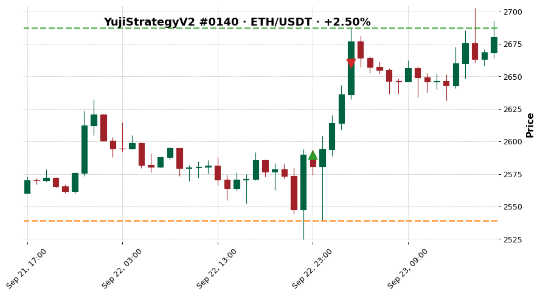

- outcome: `missed_continuation`  ·  exit_diagnosis: `premature_exit`
- MFE +3.76%  ·  MAE -1.95%
- exit_reason: `roi`

### 17. YujiStrategyV2 — BTC/USDT · -7.19%

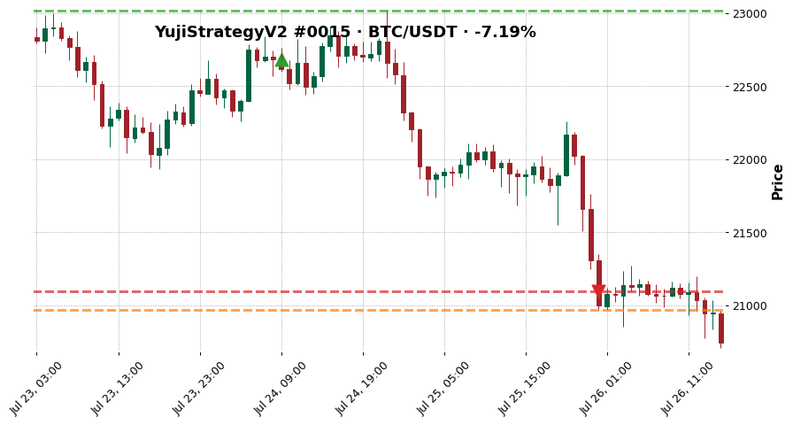

- outcome: `bad_entry_good_idea`  ·  exit_diagnosis: `premature_exit`
- MFE +1.47%  ·  MAE -7.54%
- exit_reason: `stop_loss`

### 18. YujiStrategyV2 — BTC/USDT · -7.19%

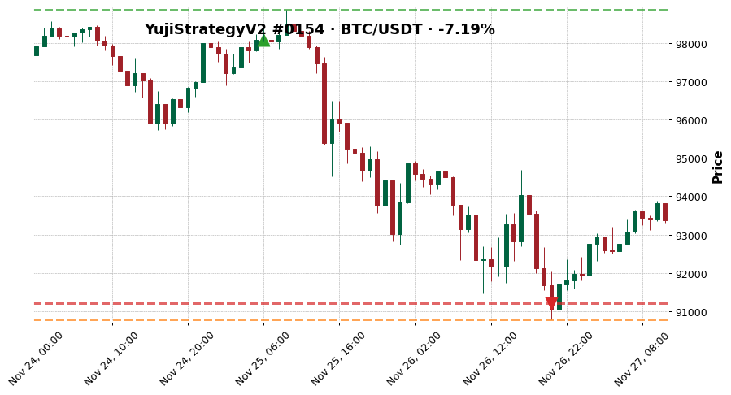

- outcome: `fast_loss`  ·  exit_diagnosis: `premature_exit`
- MFE +0.80%  ·  MAE -7.43%
- exit_reason: `stop_loss`

### 19. YujiStrategyV2 — BTC/USDT · -7.19%

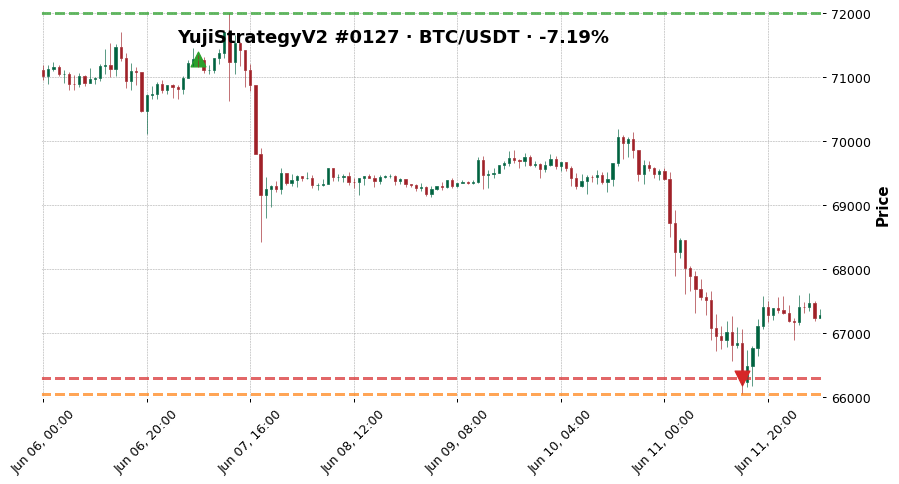

- outcome: `slow_loss`  ·  exit_diagnosis: `premature_exit`
- MFE +0.99%  ·  MAE -7.35%
- exit_reason: `stop_loss`

### 20. YujiStrategyV2 — AVAX/USDT · +2.91%

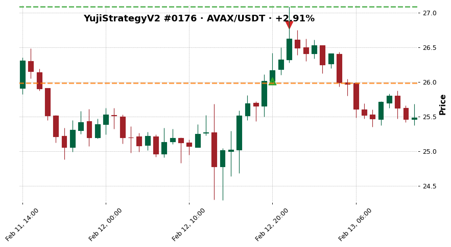

- outcome: `clean_win`  ·  exit_diagnosis: `stop_loss_failure`
- MFE +4.15%  ·  MAE -0.12%
- exit_reason: `trailing_stop_loss`

## See also

- [[../../../wiki/synthesis/cross-strategy-trade-library|Cross-Strategy Trade Library]]
- [[../../README|Research index]]
- [[../../../Training Journal/master|Training Journal master]]
