# inv_ha_continuation

Representative sample of 20 trades drawn from the full library (`enter_tag = inv_ha_continuation`). Charts were generated by the upstream all-trades pipeline; this page only embeds them. Selection is outcome-stratified to surface failure modes alongside winners — not a top-N-by-PnL list.

## Trade index

| # | Strategy | Pair | open_date | profit | MFE | MAE | outcome | exit_diagnosis |
|---:|---|---|---|---:|---:|---:|---|---|
| 1 | `YujiInverseScalperStrategy` | BTC/USDT | 2026-03-02 | +3.00% | +3.50% | -0.30% | `clean_win` | `efficient_exit` |
| 2 | `YujiInverseScalperStrategy` | ETH/USDT | 2026-02-07 | +2.59% | +3.63% | -1.85% | `noisy_win` | `stop_loss_failure` |
| 3 | `YujiInverseScalperStrategy` | ETH/USDT | 2026-03-15 | +1.47% | +2.50% | -0.64% | `missed_continuation` | `stop_loss_failure` |
| 4 | `YujiInverseScalperStrategy` | ETH/USDT | 2026-02-03 | -3.05% | +1.66% | -3.77% | `bad_entry_good_idea` | `premature_exit` |
| 5 | `YujiInverseScalperStrategy` | ETH/USDT | 2026-02-11 | -4.19% | +0.14% | -5.02% | `fast_loss` | `poor_entry` |
| 6 | `YujiInverseScalperStrategy` | ETH/USDT | 2026-02-05 | -3.48% | +0.48% | -3.62% | `slow_loss` | `poor_entry` |
| 7 | `YujiInverseScalperStrategy` | BTC/USDT | 2026-04-04 | -0.20% | +0.21% | -0.01% | `scratch` | `noise_trade` |
| 8 | `YujiInverseScalperStrategy` | ETH/USDT | 2026-02-13 | +2.00% | +3.06% | -0.38% | `clean_win` | `premature_exit` |
| 9 | `YujiInverseScalperStrategy` | ETH/USDT | 2026-02-02 | +2.00% | +2.31% | -2.31% | `noisy_win` | `efficient_exit` |
| 10 | `YujiInverseScalperStrategy` | BTC/USDT | 2026-03-04 | +1.38% | +2.40% | -0.57% | `missed_continuation` | `stop_loss_failure` |
| 11 | `YujiInverseScalperStrategy` | ETH/USDT | 2026-02-06 | -2.24% | +1.90% | -2.67% | `bad_entry_good_idea` | `premature_exit` |
| 12 | `YujiInverseScalperStrategy` | ETH/USDT | 2026-03-23 | -2.67% | +0.31% | -3.11% | `slow_loss` | `poor_entry` |
| 13 | `YujiInverseScalperStrategy` | BTC/USDT | 2026-01-12 | -0.18% | +1.11% | -0.35% | `scratch` | `premature_exit` |
| 14 | `YujiInverseScalperStrategy` | ETH/USDT | 2026-02-25 | +2.00% | +2.51% | -0.09% | `clean_win` | `efficient_exit` |
| 15 | `YujiInverseScalperStrategy` | ETH/USDT | 2026-02-23 | +1.49% | +2.11% | -0.59% | `noisy_win` | `premature_exit` |
| 16 | `YujiInverseScalperStrategy` | ETH/USDT | 2026-03-11 | +1.00% | +2.63% | -0.81% | `missed_continuation` | `missed_continuation` |
| 17 | `YujiInverseScalperStrategy` | BTC/USDT | 2026-01-21 | -1.88% | +1.01% | -2.32% | `bad_entry_good_idea` | `premature_exit` |
| 18 | `YujiInverseScalperStrategy` | BTC/USDT | 2026-02-06 | -2.53% | +0.59% | -2.87% | `slow_loss` | `premature_exit` |
| 19 | `YujiInverseScalperStrategy` | BTC/USDT | 2026-01-17 | -0.16% | +0.33% | -0.13% | `scratch` | `noise_trade` |
| 20 | `YujiInverseScalperStrategy` | BTC/USDT | 2026-02-25 | +2.00% | +2.35% | -0.16% | `clean_win` | `efficient_exit` |

## Charts

### 1. YujiInverseScalperStrategy — BTC/USDT · +3.00%

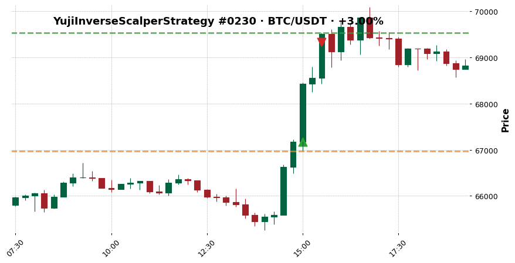

- outcome: `clean_win`  ·  exit_diagnosis: `efficient_exit`
- MFE +3.50%  ·  MAE -0.30%
- exit_reason: `roi`

### 2. YujiInverseScalperStrategy — ETH/USDT · +2.59%

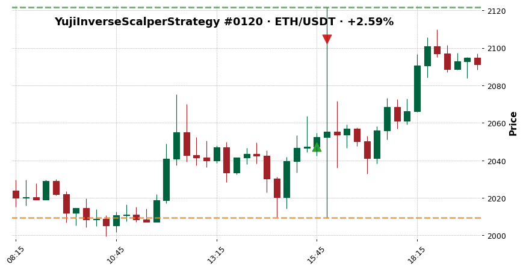

- outcome: `noisy_win`  ·  exit_diagnosis: `stop_loss_failure`
- MFE +3.63%  ·  MAE -1.85%
- exit_reason: `trailing_stop_loss`

### 3. YujiInverseScalperStrategy — ETH/USDT · +1.47%

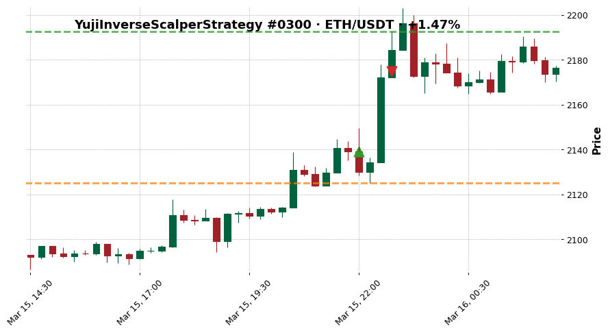

- outcome: `missed_continuation`  ·  exit_diagnosis: `stop_loss_failure`
- MFE +2.50%  ·  MAE -0.64%
- exit_reason: `trailing_stop_loss`

### 4. YujiInverseScalperStrategy — ETH/USDT · -3.05%

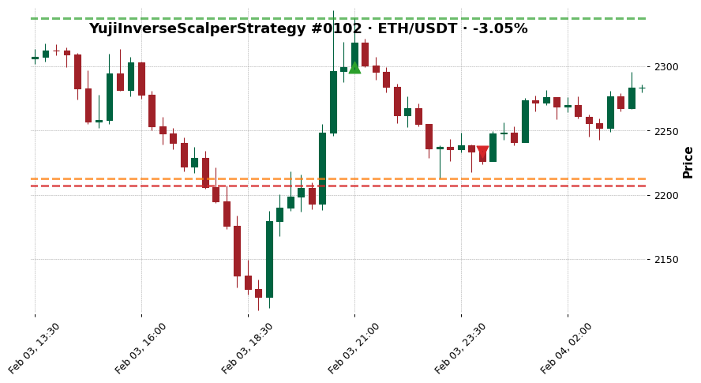

- outcome: `bad_entry_good_idea`  ·  exit_diagnosis: `premature_exit`
- MFE +1.66%  ·  MAE -3.77%
- exit_reason: `exit_signal`

### 5. YujiInverseScalperStrategy — ETH/USDT · -4.19%

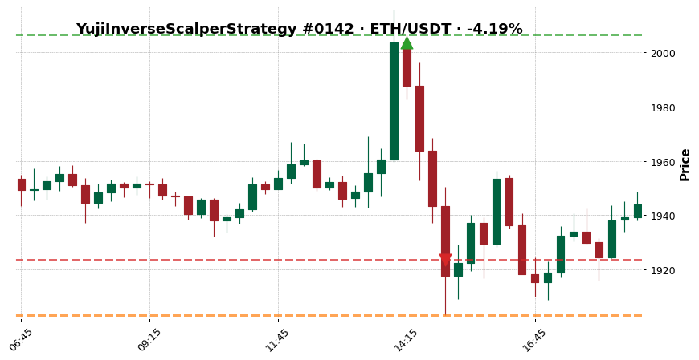

- outcome: `fast_loss`  ·  exit_diagnosis: `poor_entry`
- MFE +0.14%  ·  MAE -5.02%
- exit_reason: `stop_loss`

### 6. YujiInverseScalperStrategy — ETH/USDT · -3.48%

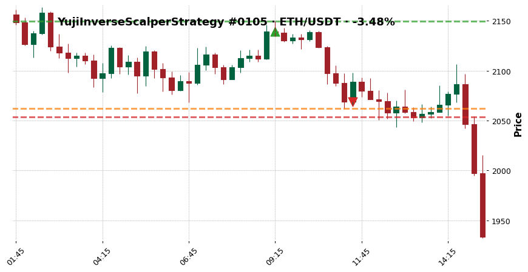

- outcome: `slow_loss`  ·  exit_diagnosis: `poor_entry`
- MFE +0.48%  ·  MAE -3.62%
- exit_reason: `exit_signal`

### 7. YujiInverseScalperStrategy — BTC/USDT · -0.20%

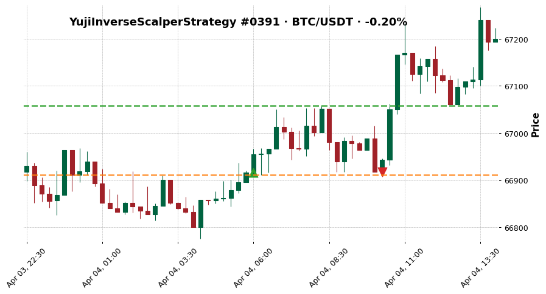

- outcome: `scratch`  ·  exit_diagnosis: `noise_trade`
- MFE +0.21%  ·  MAE -0.01%
- exit_reason: `exit_signal`

### 8. YujiInverseScalperStrategy — ETH/USDT · +2.00%

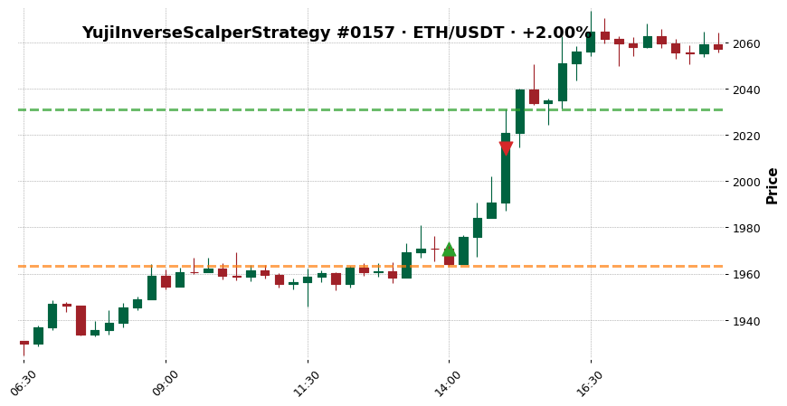

- outcome: `clean_win`  ·  exit_diagnosis: `premature_exit`
- MFE +3.06%  ·  MAE -0.38%
- exit_reason: `roi`

### 9. YujiInverseScalperStrategy — ETH/USDT · +2.00%

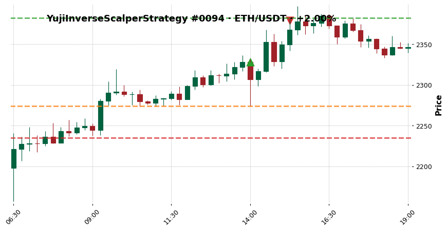

- outcome: `noisy_win`  ·  exit_diagnosis: `efficient_exit`
- MFE +2.31%  ·  MAE -2.31%
- exit_reason: `roi`

### 10. YujiInverseScalperStrategy — BTC/USDT · +1.38%

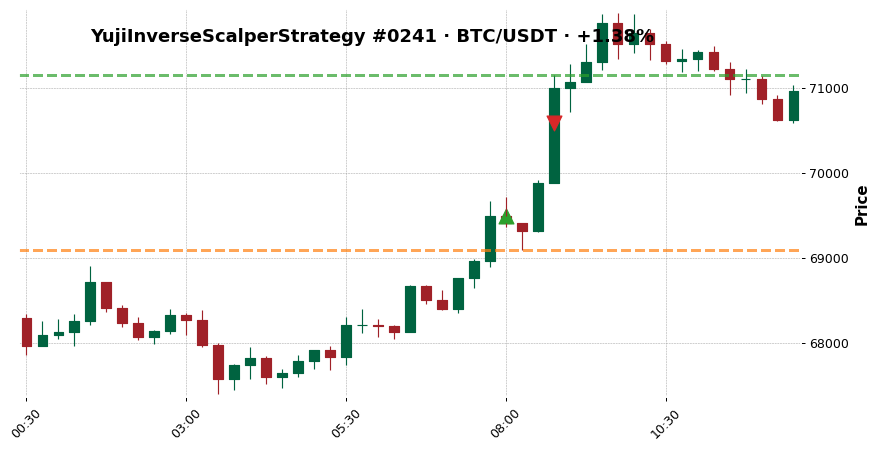

- outcome: `missed_continuation`  ·  exit_diagnosis: `stop_loss_failure`
- MFE +2.40%  ·  MAE -0.57%
- exit_reason: `trailing_stop_loss`

### 11. YujiInverseScalperStrategy — ETH/USDT · -2.24%

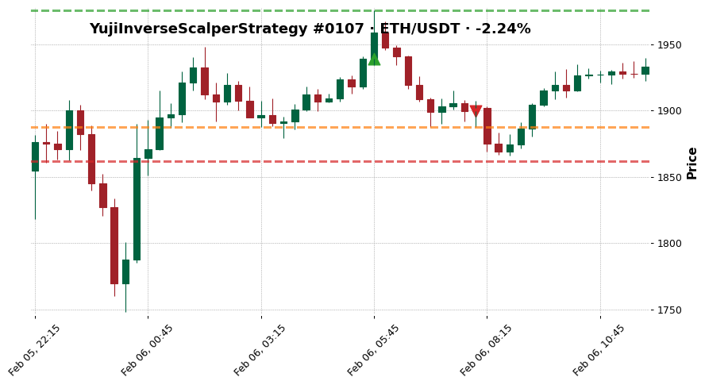

- outcome: `bad_entry_good_idea`  ·  exit_diagnosis: `premature_exit`
- MFE +1.90%  ·  MAE -2.67%
- exit_reason: `exit_signal`

### 12. YujiInverseScalperStrategy — ETH/USDT · -2.67%

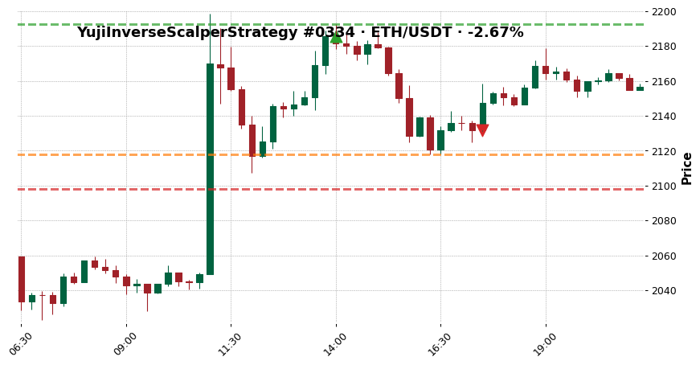

- outcome: `slow_loss`  ·  exit_diagnosis: `poor_entry`
- MFE +0.31%  ·  MAE -3.11%
- exit_reason: `exit_signal`

### 13. YujiInverseScalperStrategy — BTC/USDT · -0.18%

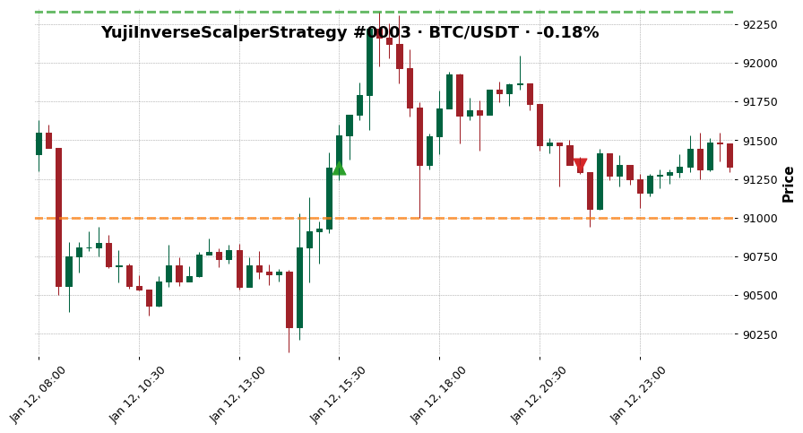

- outcome: `scratch`  ·  exit_diagnosis: `premature_exit`
- MFE +1.11%  ·  MAE -0.35%
- exit_reason: `exit_signal`

### 14. YujiInverseScalperStrategy — ETH/USDT · +2.00%

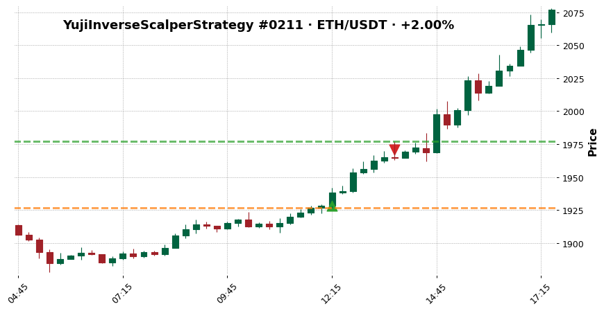

- outcome: `clean_win`  ·  exit_diagnosis: `efficient_exit`
- MFE +2.51%  ·  MAE -0.09%
- exit_reason: `roi`

### 15. YujiInverseScalperStrategy — ETH/USDT · +1.49%

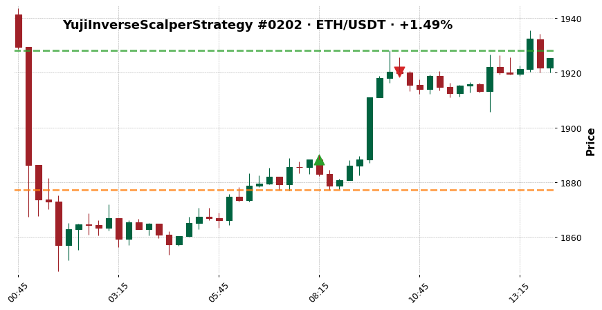

- outcome: `noisy_win`  ·  exit_diagnosis: `premature_exit`
- MFE +2.11%  ·  MAE -0.59%
- exit_reason: `roi`

### 16. YujiInverseScalperStrategy — ETH/USDT · +1.00%

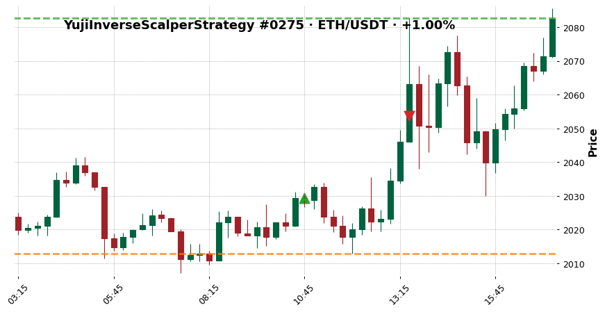

- outcome: `missed_continuation`  ·  exit_diagnosis: `missed_continuation`
- MFE +2.63%  ·  MAE -0.81%
- exit_reason: `roi`

### 17. YujiInverseScalperStrategy — BTC/USDT · -1.88%

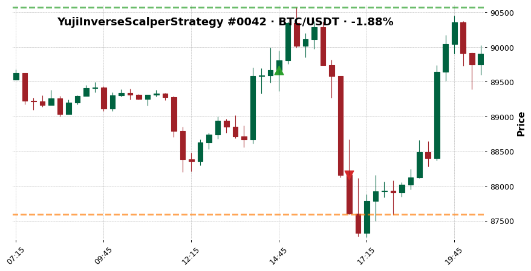

- outcome: `bad_entry_good_idea`  ·  exit_diagnosis: `premature_exit`
- MFE +1.01%  ·  MAE -2.32%
- exit_reason: `exit_signal`

### 18. YujiInverseScalperStrategy — BTC/USDT · -2.53%

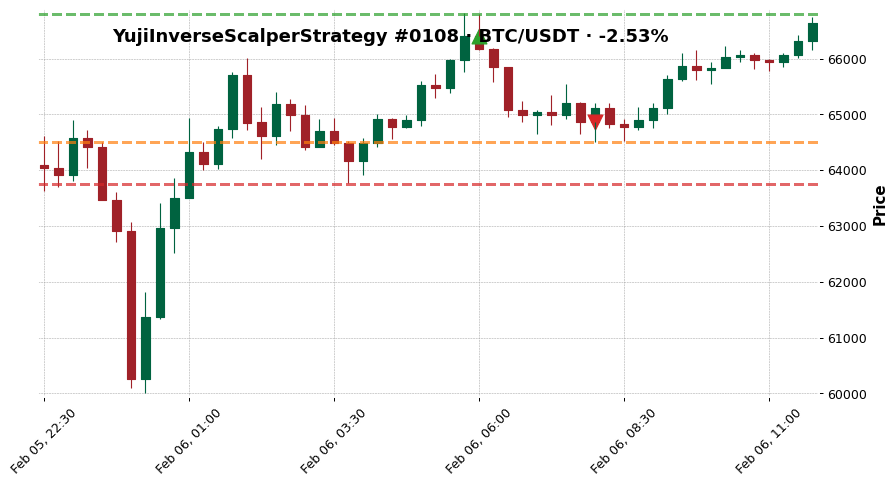

- outcome: `slow_loss`  ·  exit_diagnosis: `premature_exit`
- MFE +0.59%  ·  MAE -2.87%
- exit_reason: `exit_signal`

### 19. YujiInverseScalperStrategy — BTC/USDT · -0.16%

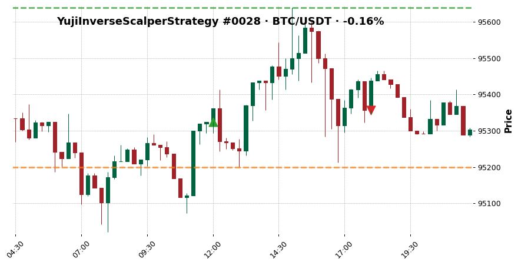

- outcome: `scratch`  ·  exit_diagnosis: `noise_trade`
- MFE +0.33%  ·  MAE -0.13%
- exit_reason: `exit_signal`

### 20. YujiInverseScalperStrategy — BTC/USDT · +2.00%

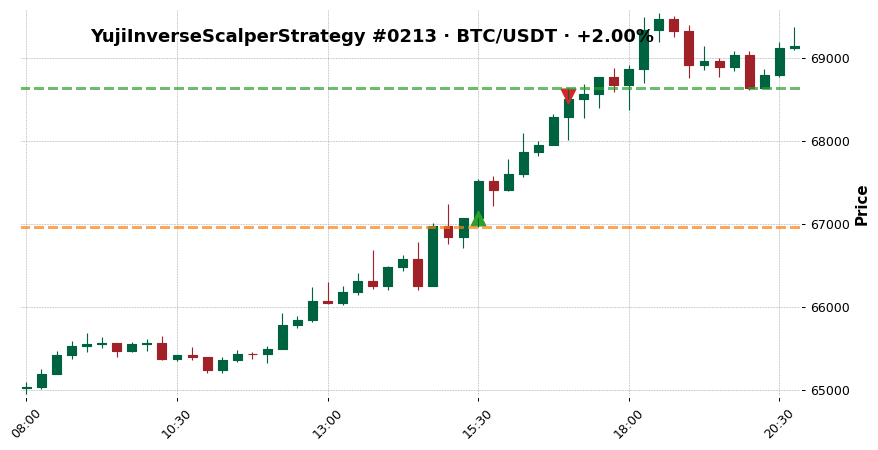

- outcome: `clean_win`  ·  exit_diagnosis: `efficient_exit`
- MFE +2.35%  ·  MAE -0.16%
- exit_reason: `roi`

## See also

- [[../../../wiki/synthesis/cross-strategy-trade-library|Cross-Strategy Trade Library]]
- [[../../README|Research index]]
- [[../../../Training Journal/master|Training Journal master]]
