# trend_acceleration

Representative sample of 20 trades drawn from the full library (`enter_tag = trend_acceleration`). Charts were generated by the upstream all-trades pipeline; this page only embeds them. Selection is outcome-stratified to surface failure modes alongside winners — not a top-N-by-PnL list.

## Trade index

| # | Strategy | Pair | open_date | profit | MFE | MAE | outcome | exit_diagnosis |
|---:|---|---|---|---:|---:|---:|---|---|
| 1 | `YujiTrendRiderStrategy` | BTC/USDT | 2023-10-23 | +8.00% | +10.80% | -0.11% | `clean_win` | `premature_exit` |
| 2 | `YujiTrendRiderStrategy` | XRP/USDT | 2025-07-11 | +8.00% | +10.38% | -0.85% | `noisy_win` | `efficient_exit` |
| 3 | `YujiTrendRiderStrategy` | AVAX/USDT | 2025-09-10 | +3.98% | +6.71% | -2.22% | `missed_continuation` | `premature_exit` |
| 4 | `YujiTrendRiderStrategy` | ETH/USDT | 2024-03-05 | -7.19% | +1.68% | -14.87% | `bad_entry_good_idea` | `stop_loss_failure` |
| 5 | `YujiTrendRiderStrategy` | ETH/USDT | 2025-05-23 | -7.19% | +0.15% | -8.22% | `fast_loss` | `poor_entry` |
| 6 | `YujiTrendRiderStrategy` | SOL/USDT | 2025-10-05 | -7.19% | +0.51% | -7.14% | `slow_loss` | `premature_exit` |
| 7 | `YujiTrendRiderStrategy` | BTC/USDT | 2024-10-14 | -0.19% | +0.88% | -0.70% | `scratch` | `premature_exit` |
| 8 | `YujiTrendRiderStrategy` | ETH/USDT | 2025-05-09 | +8.00% | +10.36% | -0.04% | `clean_win` | `efficient_exit` |
| 9 | `YujiTrendRiderStrategy` | LINK/USDT | 2025-07-18 | +5.01% | +6.50% | -0.83% | `noisy_win` | `efficient_exit` |
| 10 | `YujiTrendRiderStrategy` | ETH/USDT | 2023-11-09 | +3.64% | +5.72% | -1.07% | `missed_continuation` | `premature_exit` |
| 11 | `YujiTrendRiderStrategy` | ETH/USDT | 2022-07-20 | -7.19% | +1.15% | -7.35% | `bad_entry_good_idea` | `premature_exit` |
| 12 | `YujiTrendRiderStrategy` | BTC/USDT | 2025-01-20 | -7.19% | +0.55% | -7.21% | `fast_loss` | `premature_exit` |
| 13 | `YujiTrendRiderStrategy` | ETH/USDT | 2022-09-11 | -7.19% | +0.95% | -8.79% | `slow_loss` | `premature_exit` |
| 14 | `YujiTrendRiderStrategy` | BTC/USDT | 2022-08-11 | -0.17% | +1.47% | -1.13% | `scratch` | `premature_exit` |
| 15 | `YujiTrendRiderStrategy` | AVAX/USDT | 2025-05-09 | +5.01% | +6.24% | -0.27% | `clean_win` | `efficient_exit` |
| 16 | `YujiTrendRiderStrategy` | XRP/USDT | 2025-07-17 | +5.00% | +7.10% | -0.91% | `noisy_win` | `premature_exit` |
| 17 | `YujiTrendRiderStrategy` | LINK/USDT | 2025-08-17 | +3.60% | +6.69% | -0.97% | `missed_continuation` | `premature_exit` |
| 18 | `YujiTrendRiderStrategy` | ETH/USDT | 2022-07-22 | -7.19% | +3.02% | -7.10% | `bad_entry_good_idea` | `stop_loss_failure` |
| 19 | `YujiTrendRiderStrategy` | ETH/USDT | 2023-11-16 | -7.19% | +0.67% | -7.24% | `fast_loss` | `premature_exit` |
| 20 | `YujiTrendRiderStrategy` | ETH/USDT | 2025-05-09 | -4.62% | +0.45% | -5.86% | `slow_loss` | `poor_entry` |

## Charts

### 1. YujiTrendRiderStrategy — BTC/USDT · +8.00%

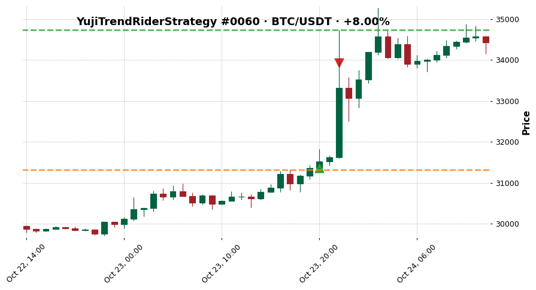

- outcome: `clean_win`  ·  exit_diagnosis: `premature_exit`
- MFE +10.80%  ·  MAE -0.11%
- exit_reason: `roi`

### 2. YujiTrendRiderStrategy — XRP/USDT · +8.00%

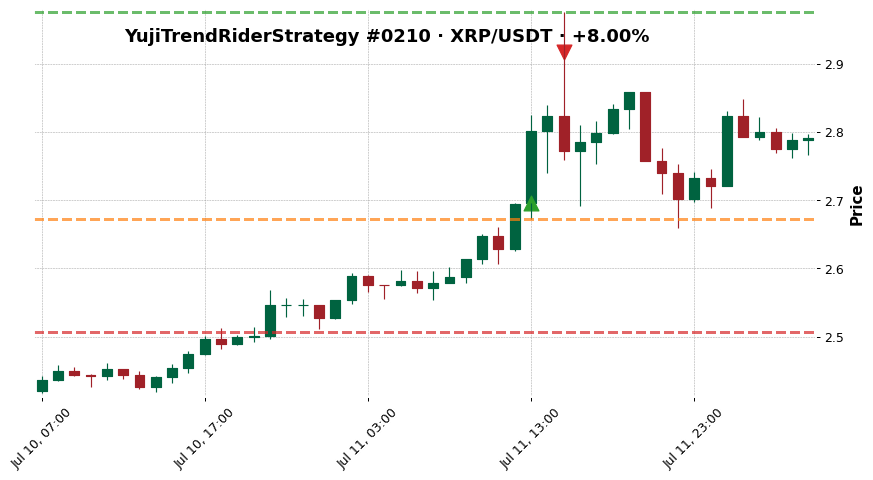

- outcome: `noisy_win`  ·  exit_diagnosis: `efficient_exit`
- MFE +10.38%  ·  MAE -0.85%
- exit_reason: `roi`

### 3. YujiTrendRiderStrategy — AVAX/USDT · +3.98%

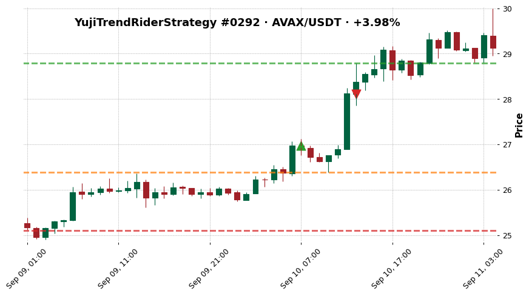

- outcome: `missed_continuation`  ·  exit_diagnosis: `premature_exit`
- MFE +6.71%  ·  MAE -2.22%
- exit_reason: `roi`

### 4. YujiTrendRiderStrategy — ETH/USDT · -7.19%

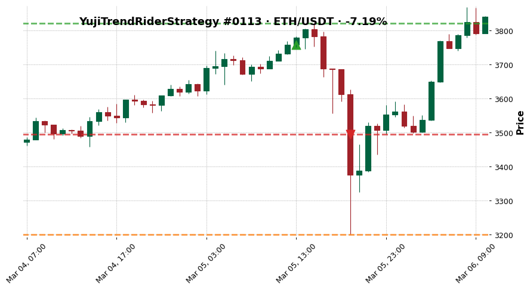

- outcome: `bad_entry_good_idea`  ·  exit_diagnosis: `stop_loss_failure`
- MFE +1.68%  ·  MAE -14.87%
- exit_reason: `stop_loss`

### 5. YujiTrendRiderStrategy — ETH/USDT · -7.19%

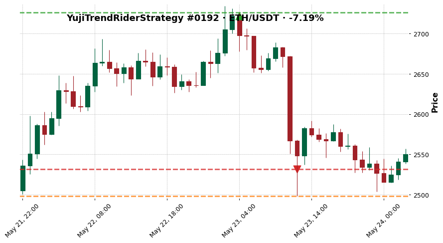

- outcome: `fast_loss`  ·  exit_diagnosis: `poor_entry`
- MFE +0.15%  ·  MAE -8.22%
- exit_reason: `stop_loss`

### 6. YujiTrendRiderStrategy — SOL/USDT · -7.19%

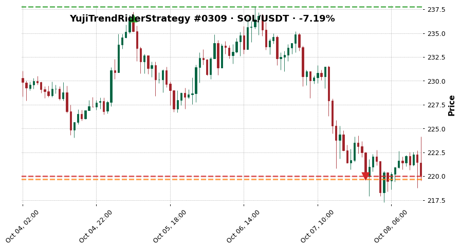

- outcome: `slow_loss`  ·  exit_diagnosis: `premature_exit`
- MFE +0.51%  ·  MAE -7.14%
- exit_reason: `stop_loss`

### 7. YujiTrendRiderStrategy — BTC/USDT · -0.19%

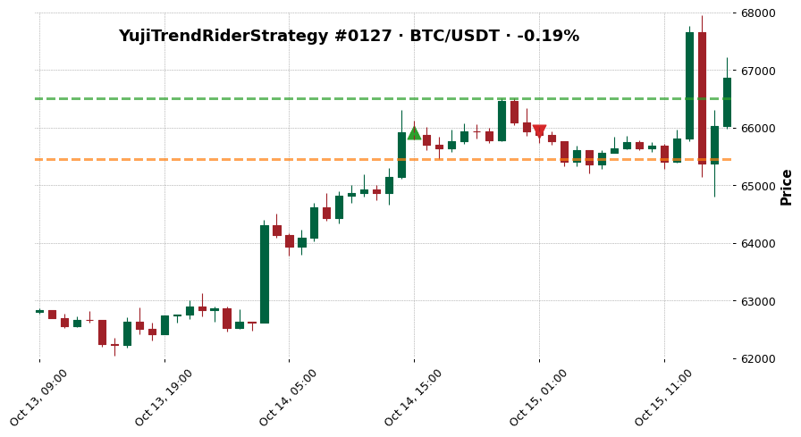

- outcome: `scratch`  ·  exit_diagnosis: `premature_exit`
- MFE +0.88%  ·  MAE -0.70%
- exit_reason: `exit_signal`

### 8. YujiTrendRiderStrategy — ETH/USDT · +8.00%

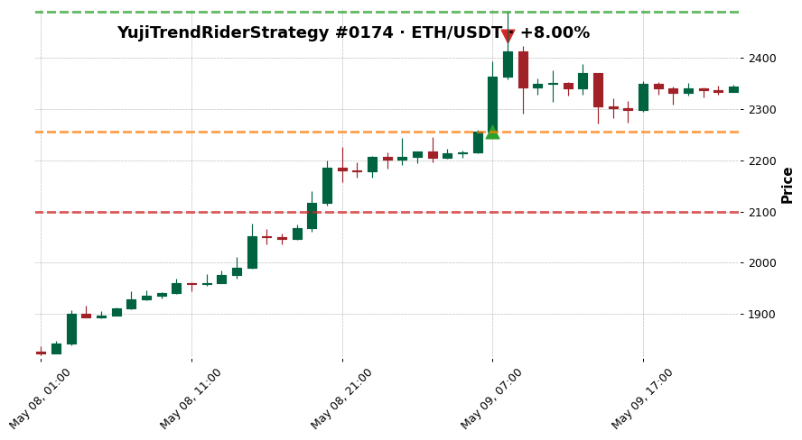

- outcome: `clean_win`  ·  exit_diagnosis: `efficient_exit`
- MFE +10.36%  ·  MAE -0.04%
- exit_reason: `roi`

### 9. YujiTrendRiderStrategy — LINK/USDT · +5.01%

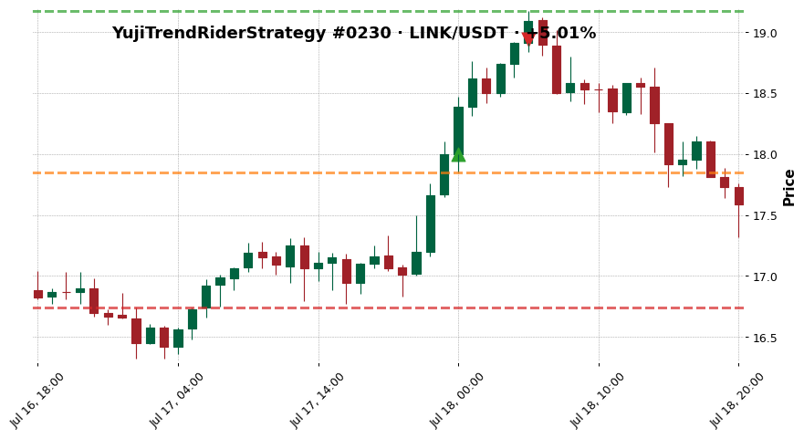

- outcome: `noisy_win`  ·  exit_diagnosis: `efficient_exit`
- MFE +6.50%  ·  MAE -0.83%
- exit_reason: `roi`

### 10. YujiTrendRiderStrategy — ETH/USDT · +3.64%

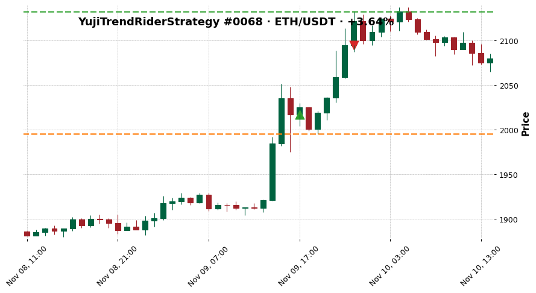

- outcome: `missed_continuation`  ·  exit_diagnosis: `premature_exit`
- MFE +5.72%  ·  MAE -1.07%
- exit_reason: `roi`

### 11. YujiTrendRiderStrategy — ETH/USDT · -7.19%

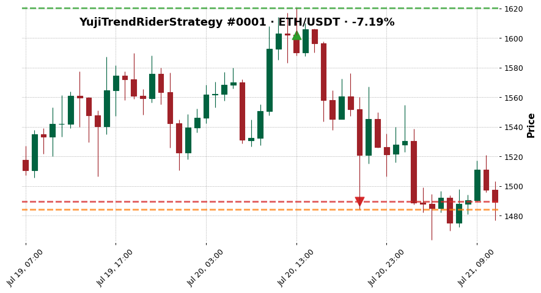

- outcome: `bad_entry_good_idea`  ·  exit_diagnosis: `premature_exit`
- MFE +1.15%  ·  MAE -7.35%
- exit_reason: `stop_loss`

### 12. YujiTrendRiderStrategy — BTC/USDT · -7.19%

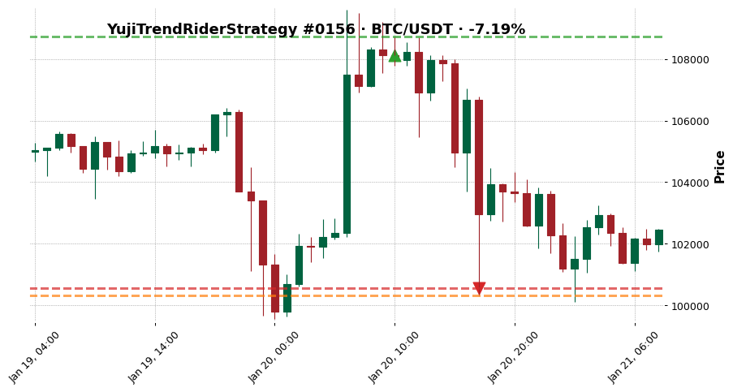

- outcome: `fast_loss`  ·  exit_diagnosis: `premature_exit`
- MFE +0.55%  ·  MAE -7.21%
- exit_reason: `stop_loss`

### 13. YujiTrendRiderStrategy — ETH/USDT · -7.19%

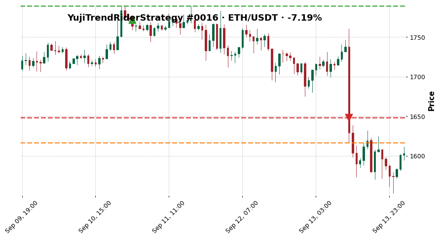

- outcome: `slow_loss`  ·  exit_diagnosis: `premature_exit`
- MFE +0.95%  ·  MAE -8.79%
- exit_reason: `stop_loss`

### 14. YujiTrendRiderStrategy — BTC/USDT · -0.17%

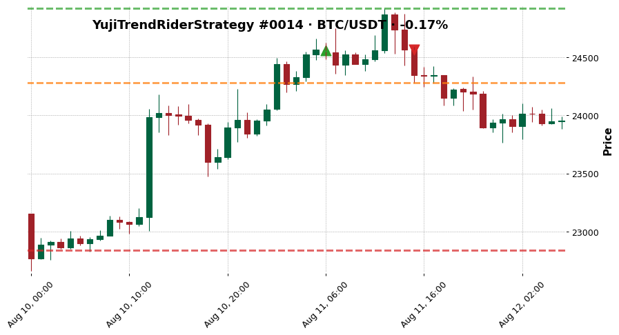

- outcome: `scratch`  ·  exit_diagnosis: `premature_exit`
- MFE +1.47%  ·  MAE -1.13%
- exit_reason: `exit_signal`

### 15. YujiTrendRiderStrategy — AVAX/USDT · +5.01%

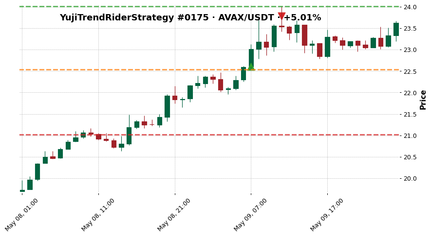

- outcome: `clean_win`  ·  exit_diagnosis: `efficient_exit`
- MFE +6.24%  ·  MAE -0.27%
- exit_reason: `roi`

### 16. YujiTrendRiderStrategy — XRP/USDT · +5.00%

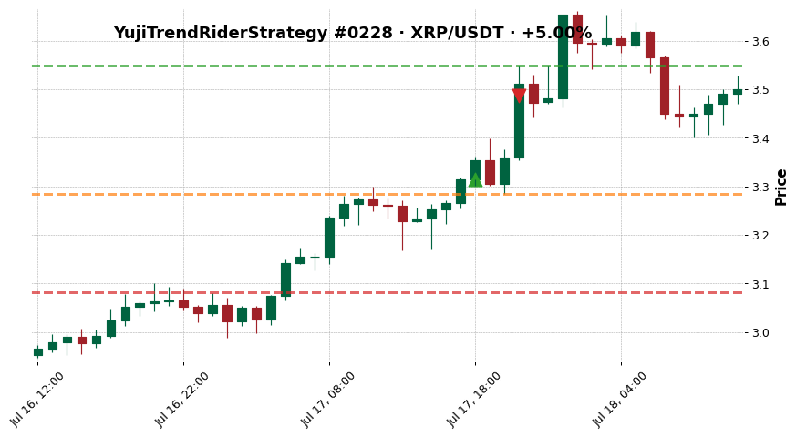

- outcome: `noisy_win`  ·  exit_diagnosis: `premature_exit`
- MFE +7.10%  ·  MAE -0.91%
- exit_reason: `roi`

### 17. YujiTrendRiderStrategy — LINK/USDT · +3.60%

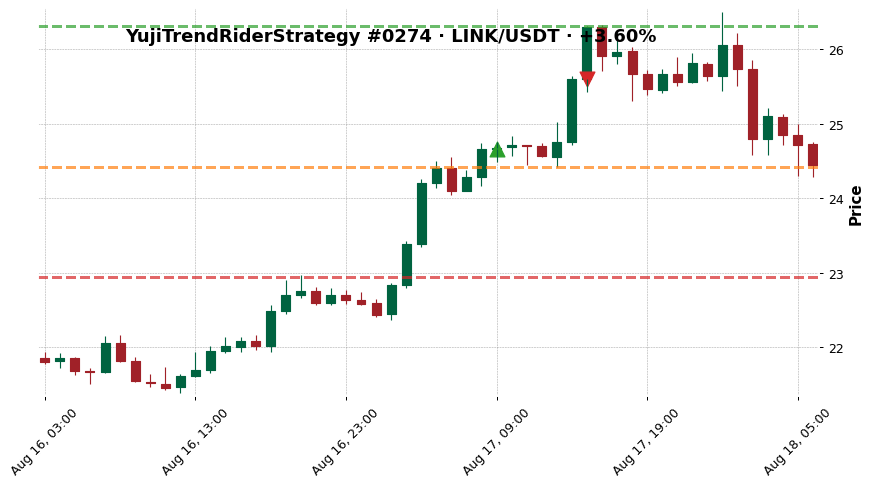

- outcome: `missed_continuation`  ·  exit_diagnosis: `premature_exit`
- MFE +6.69%  ·  MAE -0.97%
- exit_reason: `roi`

### 18. YujiTrendRiderStrategy — ETH/USDT · -7.19%

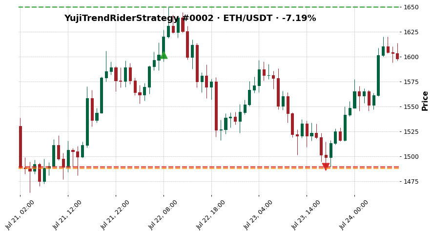

- outcome: `bad_entry_good_idea`  ·  exit_diagnosis: `stop_loss_failure`
- MFE +3.02%  ·  MAE -7.10%
- exit_reason: `stop_loss`

### 19. YujiTrendRiderStrategy — ETH/USDT · -7.19%

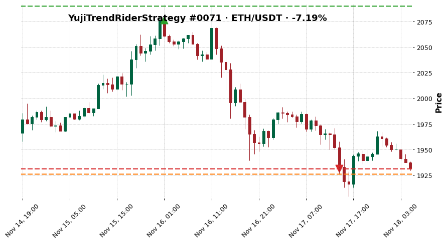

- outcome: `fast_loss`  ·  exit_diagnosis: `premature_exit`
- MFE +0.67%  ·  MAE -7.24%
- exit_reason: `stop_loss`

### 20. YujiTrendRiderStrategy — ETH/USDT · -4.62%

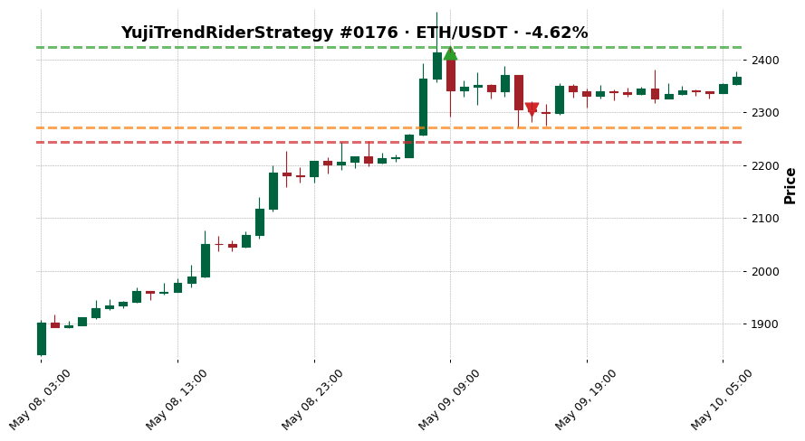

- outcome: `slow_loss`  ·  exit_diagnosis: `poor_entry`
- MFE +0.45%  ·  MAE -5.86%
- exit_reason: `exit_signal`

## See also

- [[../../../wiki/synthesis/cross-strategy-trade-library|Cross-Strategy Trade Library]]
- [[../../README|Research index]]
- [[../../../Training Journal/master|Training Journal master]]
