# vwap_deviation_reversion_sophisticated

Representative sample of 20 trades drawn from the full library (`enter_tag = vwap_deviation_reversion_sophisticated`). Charts were generated by the upstream all-trades pipeline; this page only embeds them. Selection is outcome-stratified to surface failure modes alongside winners — not a top-N-by-PnL list.

## Trade index

| # | Strategy | Pair | open_date | profit | MFE | MAE | outcome | exit_diagnosis |
|---:|---|---|---|---:|---:|---:|---|---|
| 1 | `YujiVWAPMeanReversionStrategy` | ETH/USDT | 2022-07-23 | +1.36% | +3.38% | -0.13% | `clean_win` | `stop_loss_failure` |
| 2 | `YujiVWAPMeanReversionStrategy` | ETH/USDT | 2023-12-07 | +0.36% | +0.99% | -0.13% | `missed_continuation` | `missed_continuation` |
| 3 | `YujiVWAPMeanReversionStrategy` | XRP/USDT | 2025-08-14 | -5.19% | +0.53% | -7.04% | `fast_loss` | `premature_exit` |
| 4 | `YujiVWAPMeanReversionStrategy` | BTC/USDT | 2025-04-19 | -0.20% | +0.19% | -0.01% | `scratch` | `noise_trade` |
| 5 | `YujiVWAPMeanReversionStrategy` | ETH/USDT | 2023-03-20 | +1.06% | +1.96% | -0.34% | `clean_win` | `stop_loss_failure` |
| 6 | `YujiVWAPMeanReversionStrategy` | XRP/USDT | 2025-11-27 | +0.29% | +1.04% | -0.18% | `missed_continuation` | `missed_continuation` |
| 7 | `YujiVWAPMeanReversionStrategy` | ETH/USDT | 2023-04-19 | -5.19% | +0.00% | -5.20% | `fast_loss` | `poor_entry` |
| 8 | `YujiVWAPMeanReversionStrategy` | BTC/USDT | 2023-10-22 | -0.20% | +0.26% | -0.00% | `scratch` | `noise_trade` |
| 9 | `YujiVWAPMeanReversionStrategy` | XRP/USDT | 2025-11-29 | +0.84% | +1.54% | -0.23% | `clean_win` | `stop_loss_failure` |
| 10 | `YujiVWAPMeanReversionStrategy` | XRP/USDT | 2026-03-14 | +0.24% | +0.63% | -0.18% | `missed_continuation` | `missed_continuation` |
| 11 | `YujiVWAPMeanReversionStrategy` | SOL/USDT | 2025-03-03 | -2.15% | +1.15% | -1.95% | `fast_loss` | `premature_exit` |
| 12 | `YujiVWAPMeanReversionStrategy` | BTC/USDT | 2024-09-28 | -0.20% | +0.44% | -0.00% | `scratch` | `noise_trade` |
| 13 | `YujiVWAPMeanReversionStrategy` | ETH/USDT | 2026-03-14 | +0.76% | +1.10% | -0.02% | `clean_win` | `premature_exit` |
| 14 | `YujiVWAPMeanReversionStrategy` | ETH/USDT | 2025-07-15 | +0.20% | +0.83% | -0.18% | `missed_continuation` | `missed_continuation` |
| 15 | `YujiVWAPMeanReversionStrategy` | SOL/USDT | 2025-01-23 | -1.72% | +0.16% | -1.52% | `fast_loss` | `poor_entry` |
| 16 | `YujiVWAPMeanReversionStrategy` | BTC/USDT | 2024-05-23 | -0.20% | +0.66% | -0.00% | `scratch` | `premature_exit` |
| 17 | `YujiVWAPMeanReversionStrategy` | BTC/USDT | 2024-03-01 | +0.69% | +1.86% | -0.07% | `clean_win` | `stop_loss_failure` |
| 18 | `YujiVWAPMeanReversionStrategy` | BTC/USDT | 2022-10-24 | +0.17% | +0.73% | -0.01% | `missed_continuation` | `missed_continuation` |
| 19 | `YujiVWAPMeanReversionStrategy` | BTC/USDT | 2024-01-12 | -1.34% | +0.27% | -1.16% | `fast_loss` | `poor_entry` |
| 20 | `YujiVWAPMeanReversionStrategy` | BTC/USDT | 2024-12-13 | -0.20% | +0.31% | -0.00% | `scratch` | `noise_trade` |

## Charts

### 1. YujiVWAPMeanReversionStrategy — ETH/USDT · +1.36%

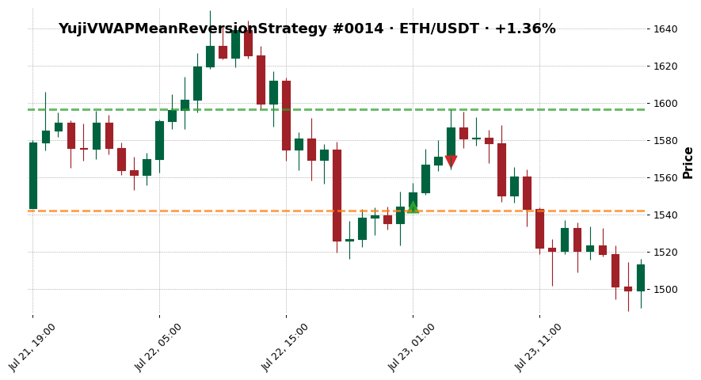

- outcome: `clean_win`  ·  exit_diagnosis: `stop_loss_failure`
- MFE +3.38%  ·  MAE -0.13%
- exit_reason: `trailing_stop_loss`

### 2. YujiVWAPMeanReversionStrategy — ETH/USDT · +0.36%

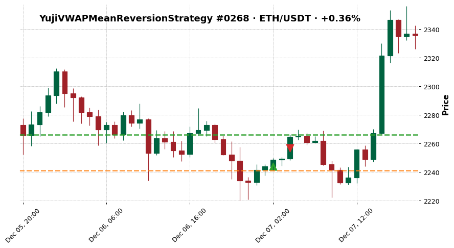

- outcome: `missed_continuation`  ·  exit_diagnosis: `missed_continuation`
- MFE +0.99%  ·  MAE -0.13%
- exit_reason: `trailing_stop_loss`

### 3. YujiVWAPMeanReversionStrategy — XRP/USDT · -5.19%

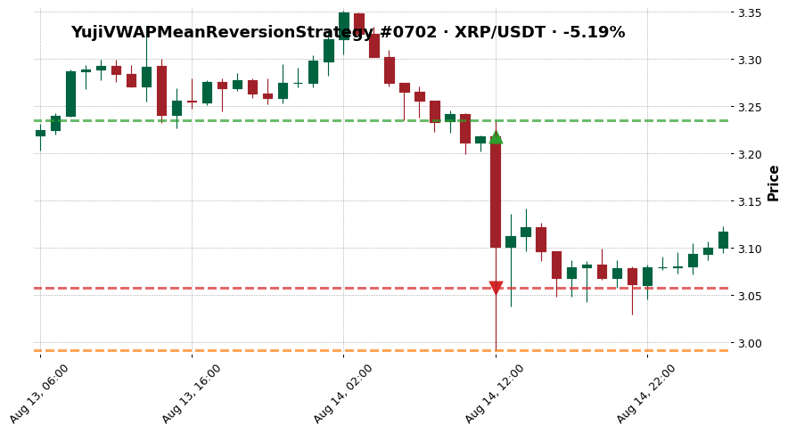

- outcome: `fast_loss`  ·  exit_diagnosis: `premature_exit`
- MFE +0.53%  ·  MAE -7.04%
- exit_reason: `stop_loss`

### 4. YujiVWAPMeanReversionStrategy — BTC/USDT · -0.20%

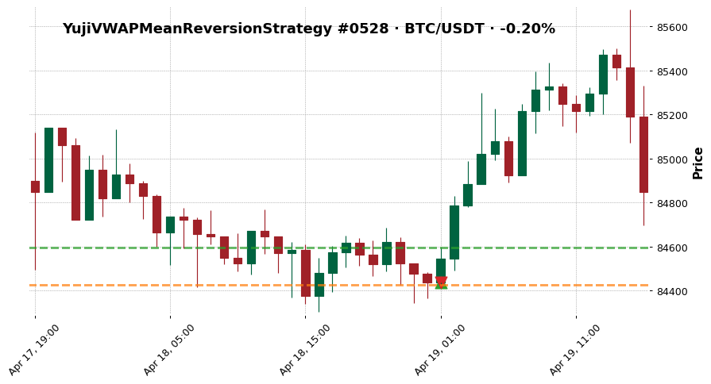

- outcome: `scratch`  ·  exit_diagnosis: `noise_trade`
- MFE +0.19%  ·  MAE -0.01%
- exit_reason: `trailing_stop_loss`

### 5. YujiVWAPMeanReversionStrategy — ETH/USDT · +1.06%

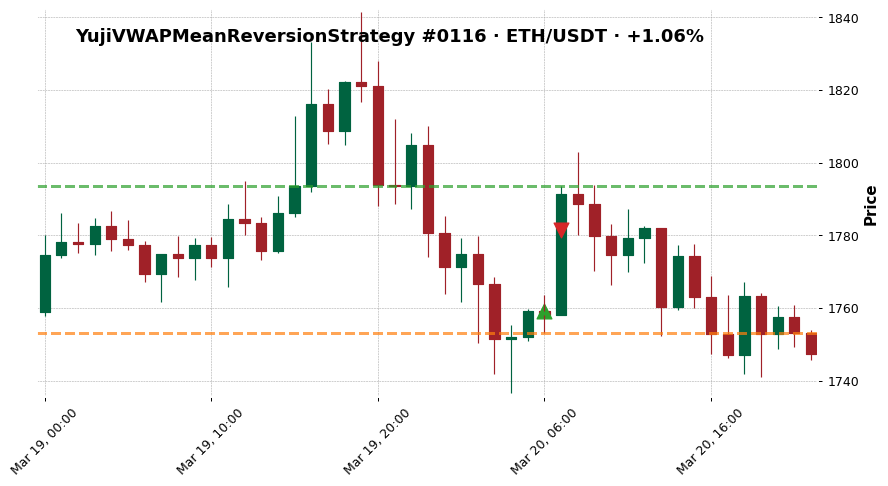

- outcome: `clean_win`  ·  exit_diagnosis: `stop_loss_failure`
- MFE +1.96%  ·  MAE -0.34%
- exit_reason: `trailing_stop_loss`

### 6. YujiVWAPMeanReversionStrategy — XRP/USDT · +0.29%

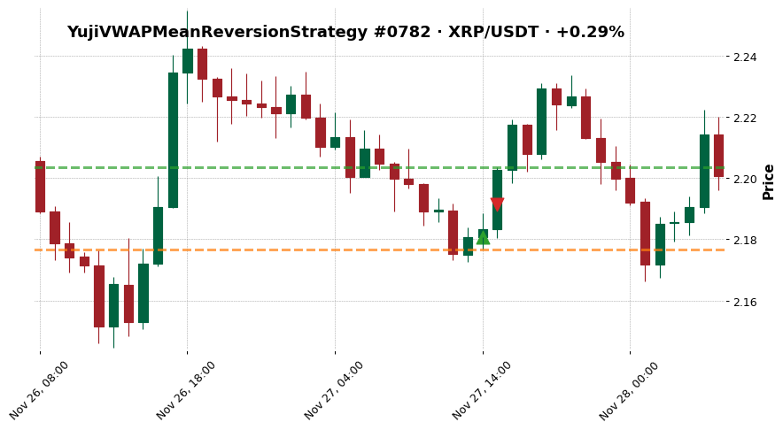

- outcome: `missed_continuation`  ·  exit_diagnosis: `missed_continuation`
- MFE +1.04%  ·  MAE -0.18%
- exit_reason: `trailing_stop_loss`

### 7. YujiVWAPMeanReversionStrategy — ETH/USDT · -5.19%

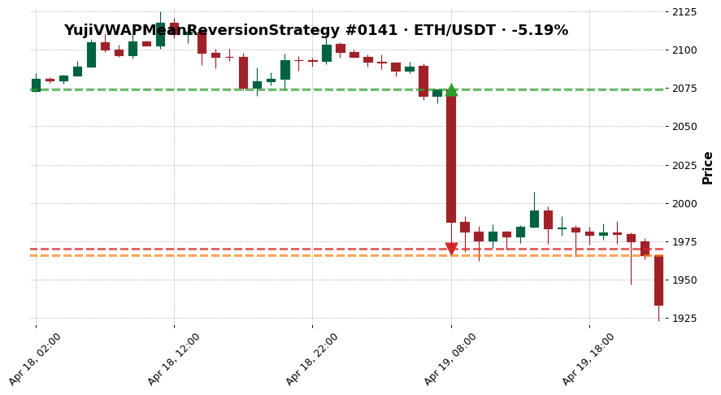

- outcome: `fast_loss`  ·  exit_diagnosis: `poor_entry`
- MFE +0.00%  ·  MAE -5.20%
- exit_reason: `stop_loss`

### 8. YujiVWAPMeanReversionStrategy — BTC/USDT · -0.20%

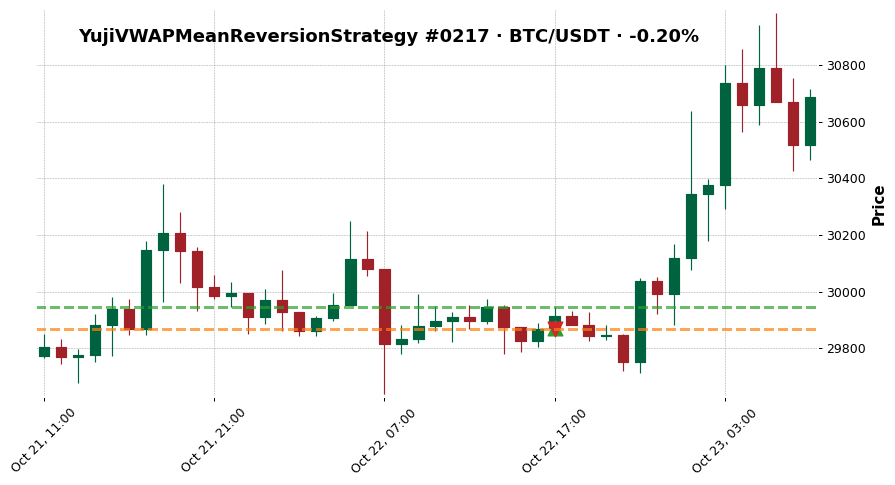

- outcome: `scratch`  ·  exit_diagnosis: `noise_trade`
- MFE +0.26%  ·  MAE -0.00%
- exit_reason: `trailing_stop_loss`

### 9. YujiVWAPMeanReversionStrategy — XRP/USDT · +0.84%

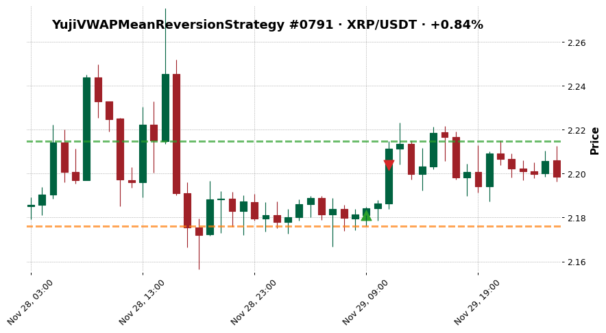

- outcome: `clean_win`  ·  exit_diagnosis: `stop_loss_failure`
- MFE +1.54%  ·  MAE -0.23%
- exit_reason: `trailing_stop_loss`

### 10. YujiVWAPMeanReversionStrategy — XRP/USDT · +0.24%

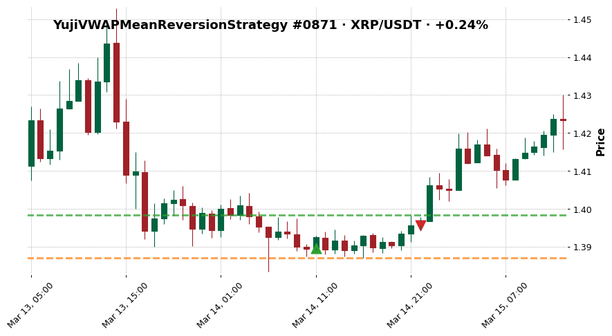

- outcome: `missed_continuation`  ·  exit_diagnosis: `missed_continuation`
- MFE +0.63%  ·  MAE -0.18%
- exit_reason: `vwap_reversion_complete`

### 11. YujiVWAPMeanReversionStrategy — SOL/USDT · -2.15%

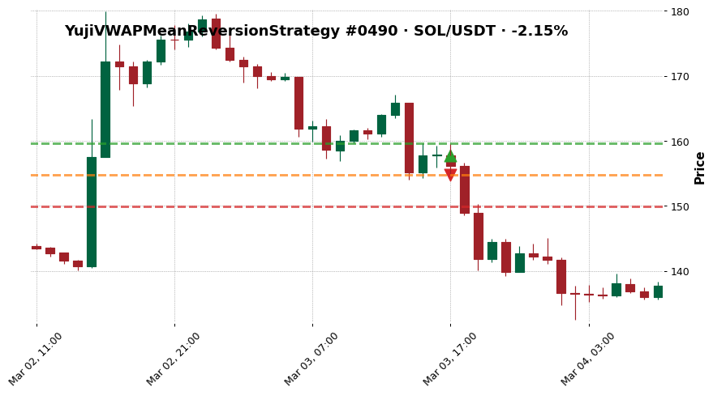

- outcome: `fast_loss`  ·  exit_diagnosis: `premature_exit`
- MFE +1.15%  ·  MAE -1.95%
- exit_reason: `trailing_stop_loss`

### 12. YujiVWAPMeanReversionStrategy — BTC/USDT · -0.20%

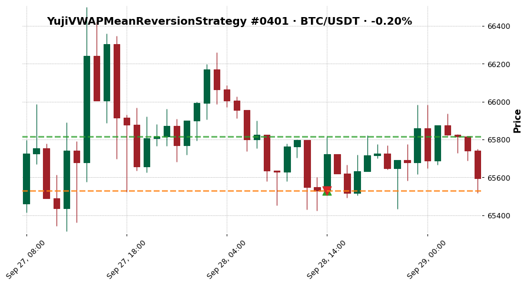

- outcome: `scratch`  ·  exit_diagnosis: `noise_trade`
- MFE +0.44%  ·  MAE -0.00%
- exit_reason: `trailing_stop_loss`

### 13. YujiVWAPMeanReversionStrategy — ETH/USDT · +0.76%

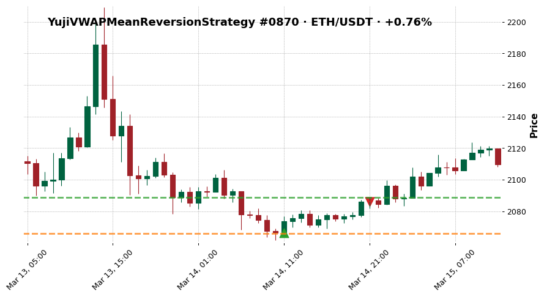

- outcome: `clean_win`  ·  exit_diagnosis: `premature_exit`
- MFE +1.10%  ·  MAE -0.02%
- exit_reason: `vwap_reversion_complete`

### 14. YujiVWAPMeanReversionStrategy — ETH/USDT · +0.20%

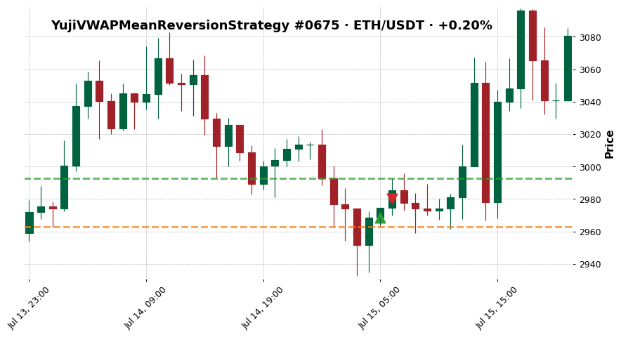

- outcome: `missed_continuation`  ·  exit_diagnosis: `missed_continuation`
- MFE +0.83%  ·  MAE -0.18%
- exit_reason: `trailing_stop_loss`

### 15. YujiVWAPMeanReversionStrategy — SOL/USDT · -1.72%

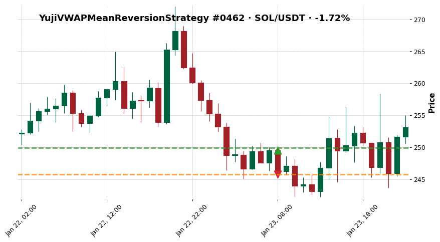

- outcome: `fast_loss`  ·  exit_diagnosis: `poor_entry`
- MFE +0.16%  ·  MAE -1.52%
- exit_reason: `trailing_stop_loss`

### 16. YujiVWAPMeanReversionStrategy — BTC/USDT · -0.20%

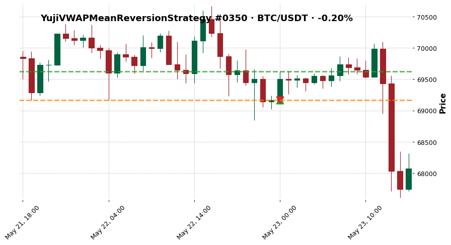

- outcome: `scratch`  ·  exit_diagnosis: `premature_exit`
- MFE +0.66%  ·  MAE -0.00%
- exit_reason: `trailing_stop_loss`

### 17. YujiVWAPMeanReversionStrategy — BTC/USDT · +0.69%

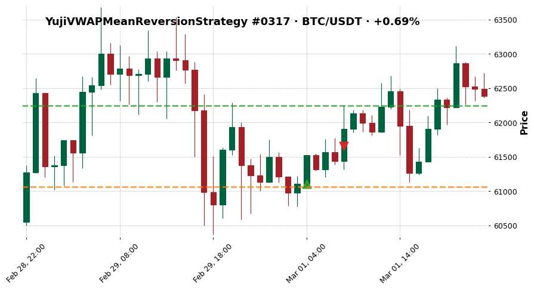

- outcome: `clean_win`  ·  exit_diagnosis: `stop_loss_failure`
- MFE +1.86%  ·  MAE -0.07%
- exit_reason: `trailing_stop_loss`

### 18. YujiVWAPMeanReversionStrategy — BTC/USDT · +0.17%

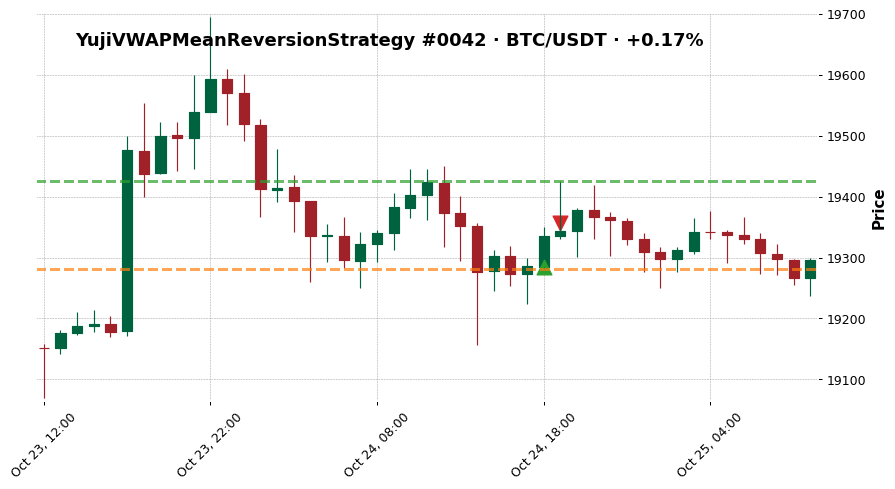

- outcome: `missed_continuation`  ·  exit_diagnosis: `missed_continuation`
- MFE +0.73%  ·  MAE -0.01%
- exit_reason: `trailing_stop_loss`

### 19. YujiVWAPMeanReversionStrategy — BTC/USDT · -1.34%

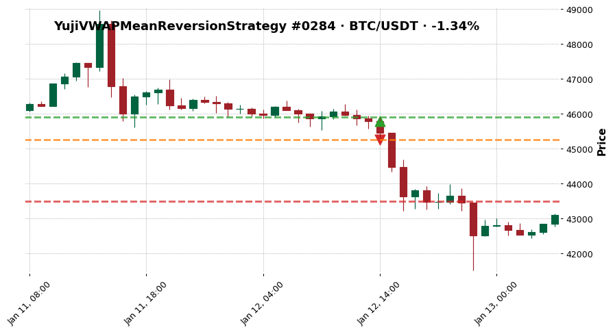

- outcome: `fast_loss`  ·  exit_diagnosis: `poor_entry`
- MFE +0.27%  ·  MAE -1.16%
- exit_reason: `trailing_stop_loss`

### 20. YujiVWAPMeanReversionStrategy — BTC/USDT · -0.20%

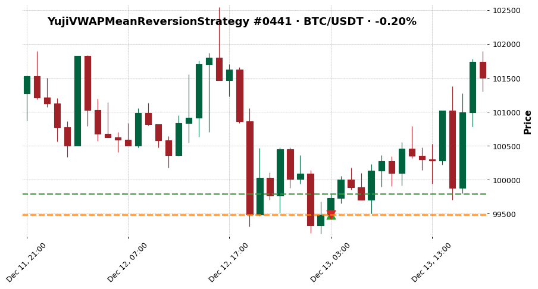

- outcome: `scratch`  ·  exit_diagnosis: `noise_trade`
- MFE +0.31%  ·  MAE -0.00%
- exit_reason: `trailing_stop_loss`

## See also

- [[../../../wiki/synthesis/cross-strategy-trade-library|Cross-Strategy Trade Library]]
- [[../../README|Research index]]
- [[../../../Training Journal/master|Training Journal master]]
