# vwap_mean_reversion

Representative sample of 20 trades drawn from the full library (`enter_tag = vwap_mean_reversion`). Charts were generated by the upstream all-trades pipeline; this page only embeds them. Selection is outcome-stratified to surface failure modes alongside winners — not a top-N-by-PnL list.

## Trade index

| # | Strategy | Pair | open_date | profit | MFE | MAE | outcome | exit_diagnosis |
|---:|---|---|---|---:|---:|---:|---|---|
| 1 | `YujiMoneyMakerStrategy` | AVAX/USDT | 2026-04-11 | +3.04% | +3.25% | -0.00% | `clean_win` | `efficient_exit` |
| 2 | `YujiMoneyMakerStrategy` | AVAX/USDT | 2025-08-28 | +2.01% | +2.42% | -1.19% | `noisy_win` | `efficient_exit` |
| 3 | `YujiMoneyMakerStrategy` | LINK/USDT | 2025-07-22 | +2.07% | +3.44% | -0.90% | `missed_continuation` | `premature_exit` |
| 4 | `YujiMoneyMakerStrategy` | BTC/USDT | 2026-03-18 | -6.19% | +1.09% | -6.45% | `bad_entry_good_idea` | `premature_exit` |
| 5 | `YujiMoneyMakerStrategy` | BTC/USDT | 2024-08-26 | -6.19% | +0.54% | -8.65% | `fast_loss` | `premature_exit` |
| 6 | `YujiMoneyMakerStrategy` | BTC/USDT | 2022-10-07 | -6.19% | +0.71% | -6.83% | `slow_loss` | `premature_exit` |
| 7 | `YujiMoneyMakerStrategy` | BTC/USDT | 2023-04-02 | -0.16% | +0.78% | -3.82% | `scratch` | `premature_exit` |
| 8 | `YujiMoneyMakerStrategy` | BTC/USDT | 2023-03-16 | +3.00% | +3.31% | -0.15% | `clean_win` | `efficient_exit` |
| 9 | `YujiMoneyMakerStrategy` | XRP/USDT | 2025-07-22 | +2.00% | +2.23% | -0.98% | `noisy_win` | `efficient_exit` |
| 10 | `YujiMoneyMakerStrategy` | XRP/USDT | 2025-04-27 | +2.00% | +4.59% | -0.57% | `missed_continuation` | `missed_continuation` |
| 11 | `YujiMoneyMakerStrategy` | BTC/USDT | 2024-03-14 | -6.19% | +1.52% | -6.50% | `bad_entry_good_idea` | `stop_loss_failure` |
| 12 | `YujiMoneyMakerStrategy` | ETH/USDT | 2025-02-01 | -6.19% | +0.65% | -6.15% | `fast_loss` | `premature_exit` |
| 13 | `YujiMoneyMakerStrategy` | BTC/USDT | 2024-09-28 | -6.19% | +0.84% | -6.77% | `slow_loss` | `premature_exit` |
| 14 | `YujiMoneyMakerStrategy` | SOL/USDT | 2025-05-02 | -0.16% | +0.85% | -4.63% | `scratch` | `premature_exit` |
| 15 | `YujiMoneyMakerStrategy` | AVAX/USDT | 2025-08-24 | +2.99% | +3.43% | -0.12% | `clean_win` | `efficient_exit` |
| 16 | `YujiMoneyMakerStrategy` | XRP/USDT | 2025-06-30 | +2.00% | +2.80% | -0.55% | `noisy_win` | `premature_exit` |
| 17 | `YujiMoneyMakerStrategy` | ETH/USDT | 2022-11-02 | +2.00% | +4.22% | -1.77% | `missed_continuation` | `missed_continuation` |
| 18 | `YujiMoneyMakerStrategy` | ETH/USDT | 2024-06-06 | -6.19% | +1.08% | -6.14% | `bad_entry_good_idea` | `premature_exit` |
| 19 | `YujiMoneyMakerStrategy` | BTC/USDT | 2024-01-12 | -6.19% | +0.44% | -6.19% | `fast_loss` | `poor_entry` |
| 20 | `YujiMoneyMakerStrategy` | BTC/USDT | 2025-10-28 | -6.19% | +0.57% | -6.62% | `slow_loss` | `premature_exit` |

## Charts

### 1. YujiMoneyMakerStrategy — AVAX/USDT · +3.04%

- outcome: `clean_win`  ·  exit_diagnosis: `efficient_exit`
- MFE +3.25%  ·  MAE -0.00%
- exit_reason: `roi`

### 2. YujiMoneyMakerStrategy — AVAX/USDT · +2.01%

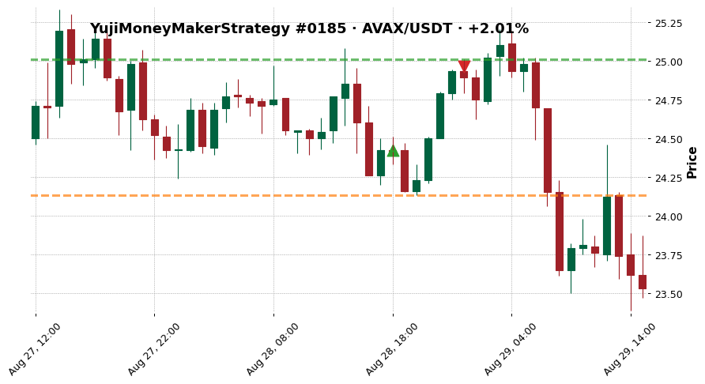

- outcome: `noisy_win`  ·  exit_diagnosis: `efficient_exit`
- MFE +2.42%  ·  MAE -1.19%
- exit_reason: `roi`

### 3. YujiMoneyMakerStrategy — LINK/USDT · +2.07%

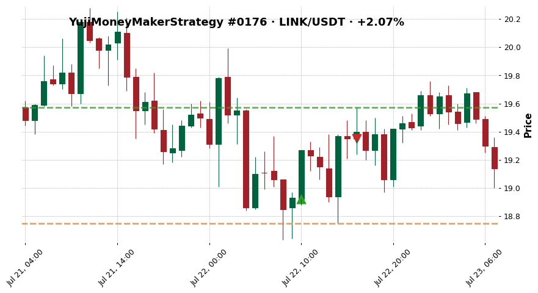

- outcome: `missed_continuation`  ·  exit_diagnosis: `premature_exit`
- MFE +3.44%  ·  MAE -0.90%
- exit_reason: `roi`

### 4. YujiMoneyMakerStrategy — BTC/USDT · -6.19%

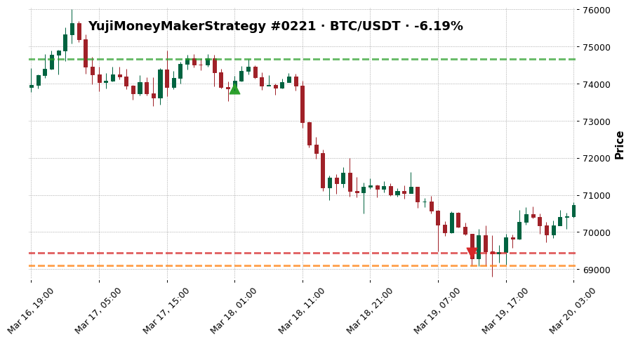

- outcome: `bad_entry_good_idea`  ·  exit_diagnosis: `premature_exit`
- MFE +1.09%  ·  MAE -6.45%
- exit_reason: `stop_loss`

### 5. YujiMoneyMakerStrategy — BTC/USDT · -6.19%

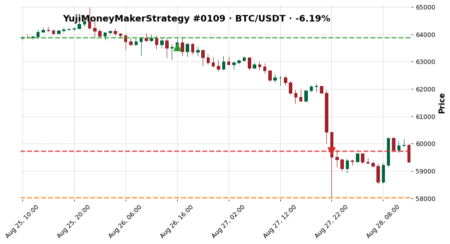

- outcome: `fast_loss`  ·  exit_diagnosis: `premature_exit`
- MFE +0.54%  ·  MAE -8.65%
- exit_reason: `stop_loss`

### 6. YujiMoneyMakerStrategy — BTC/USDT · -6.19%

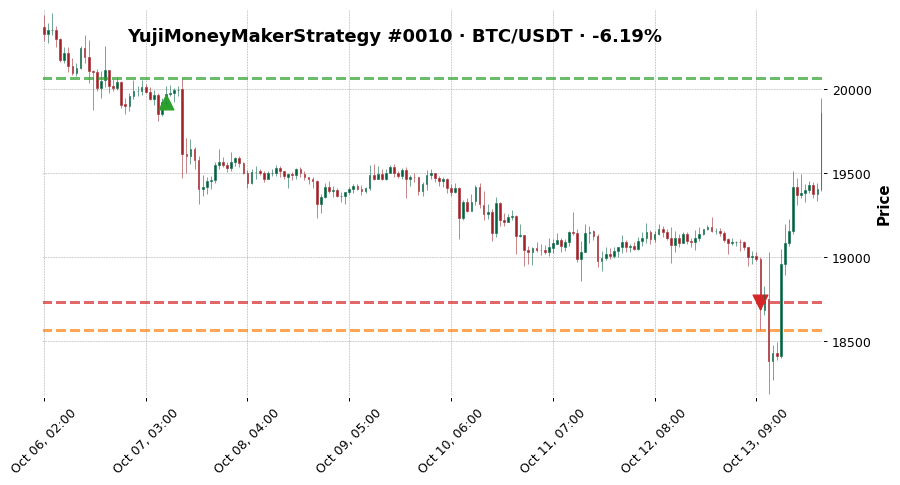

- outcome: `slow_loss`  ·  exit_diagnosis: `premature_exit`
- MFE +0.71%  ·  MAE -6.83%
- exit_reason: `stop_loss`

### 7. YujiMoneyMakerStrategy — BTC/USDT · -0.16%

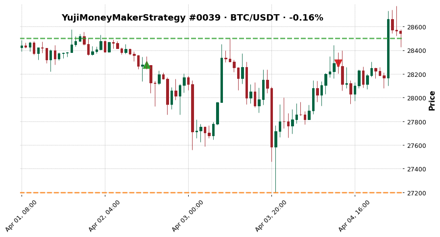

- outcome: `scratch`  ·  exit_diagnosis: `premature_exit`
- MFE +0.78%  ·  MAE -3.82%
- exit_reason: `rsi_overbought_exit`

### 8. YujiMoneyMakerStrategy — BTC/USDT · +3.00%

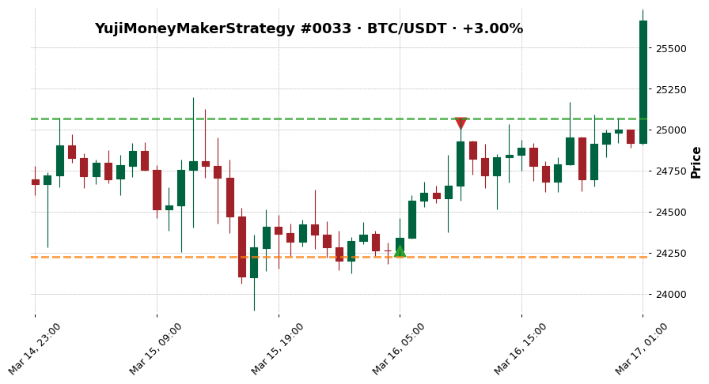

- outcome: `clean_win`  ·  exit_diagnosis: `efficient_exit`
- MFE +3.31%  ·  MAE -0.15%
- exit_reason: `roi`

### 9. YujiMoneyMakerStrategy — XRP/USDT · +2.00%

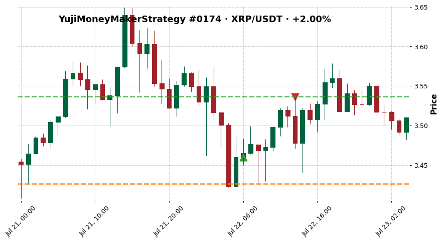

- outcome: `noisy_win`  ·  exit_diagnosis: `efficient_exit`
- MFE +2.23%  ·  MAE -0.98%
- exit_reason: `roi`

### 10. YujiMoneyMakerStrategy — XRP/USDT · +2.00%

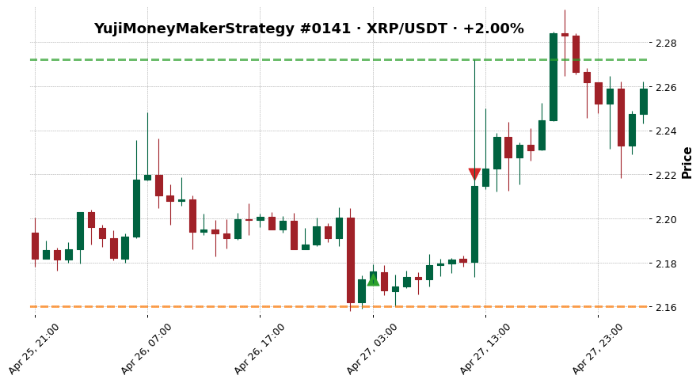

- outcome: `missed_continuation`  ·  exit_diagnosis: `missed_continuation`
- MFE +4.59%  ·  MAE -0.57%
- exit_reason: `roi`

### 11. YujiMoneyMakerStrategy — BTC/USDT · -6.19%

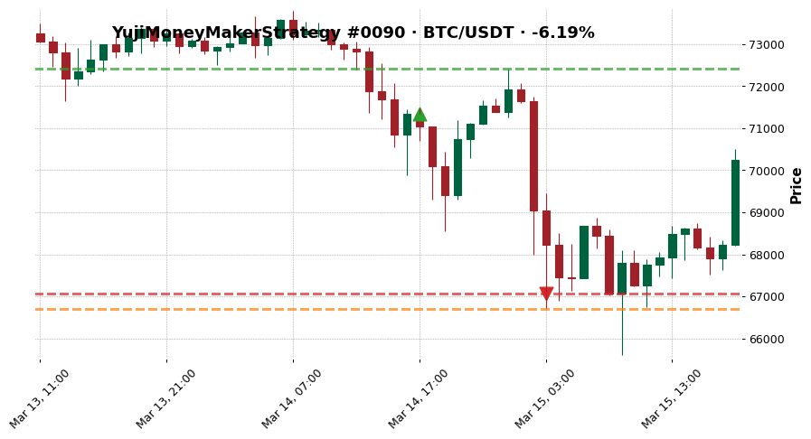

- outcome: `bad_entry_good_idea`  ·  exit_diagnosis: `stop_loss_failure`
- MFE +1.52%  ·  MAE -6.50%
- exit_reason: `stop_loss`

### 12. YujiMoneyMakerStrategy — ETH/USDT · -6.19%

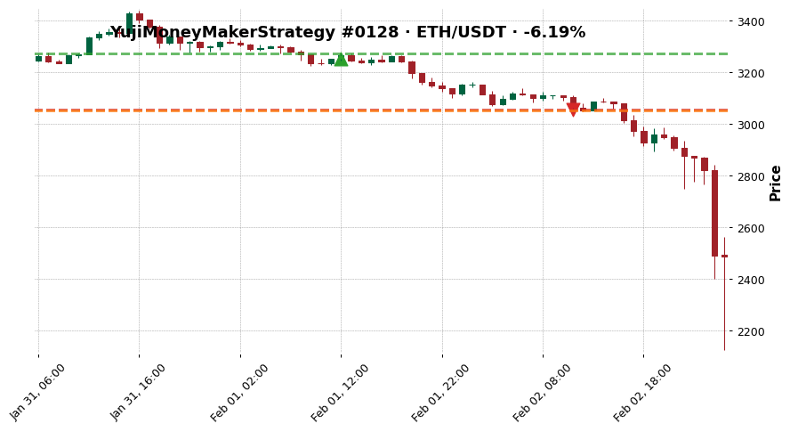

- outcome: `fast_loss`  ·  exit_diagnosis: `premature_exit`
- MFE +0.65%  ·  MAE -6.15%
- exit_reason: `stop_loss`

### 13. YujiMoneyMakerStrategy — BTC/USDT · -6.19%

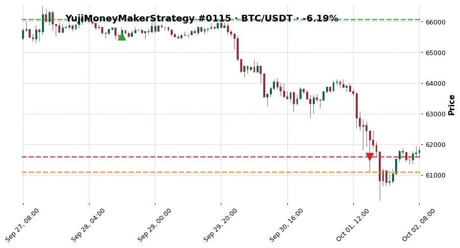

- outcome: `slow_loss`  ·  exit_diagnosis: `premature_exit`
- MFE +0.84%  ·  MAE -6.77%
- exit_reason: `stop_loss`

### 14. YujiMoneyMakerStrategy — SOL/USDT · -0.16%

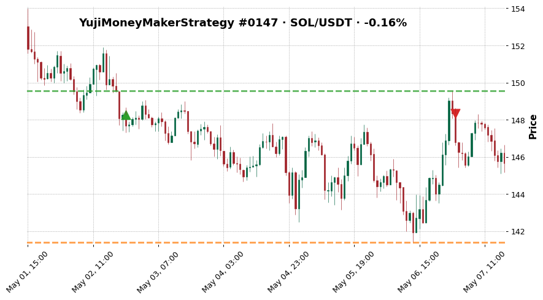

- outcome: `scratch`  ·  exit_diagnosis: `premature_exit`
- MFE +0.85%  ·  MAE -4.63%
- exit_reason: `rsi_overbought_exit`

### 15. YujiMoneyMakerStrategy — AVAX/USDT · +2.99%

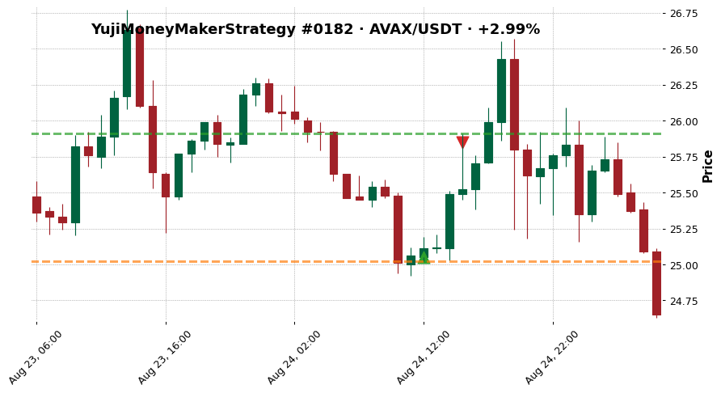

- outcome: `clean_win`  ·  exit_diagnosis: `efficient_exit`
- MFE +3.43%  ·  MAE -0.12%
- exit_reason: `roi`

### 16. YujiMoneyMakerStrategy — XRP/USDT · +2.00%

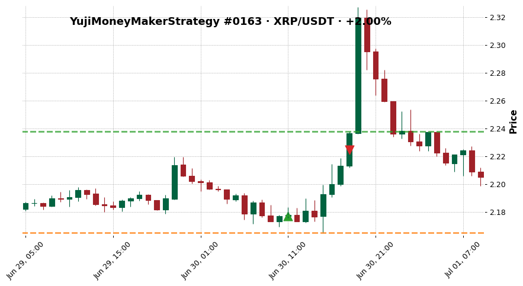

- outcome: `noisy_win`  ·  exit_diagnosis: `premature_exit`
- MFE +2.80%  ·  MAE -0.55%
- exit_reason: `roi`

### 17. YujiMoneyMakerStrategy — ETH/USDT · +2.00%

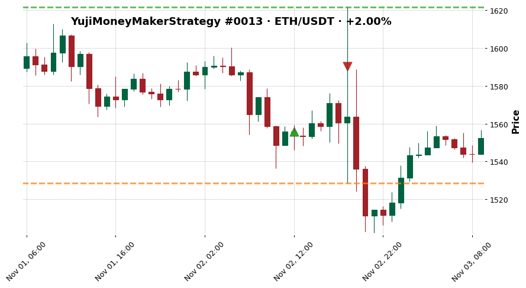

- outcome: `missed_continuation`  ·  exit_diagnosis: `missed_continuation`
- MFE +4.22%  ·  MAE -1.77%
- exit_reason: `roi`

### 18. YujiMoneyMakerStrategy — ETH/USDT · -6.19%

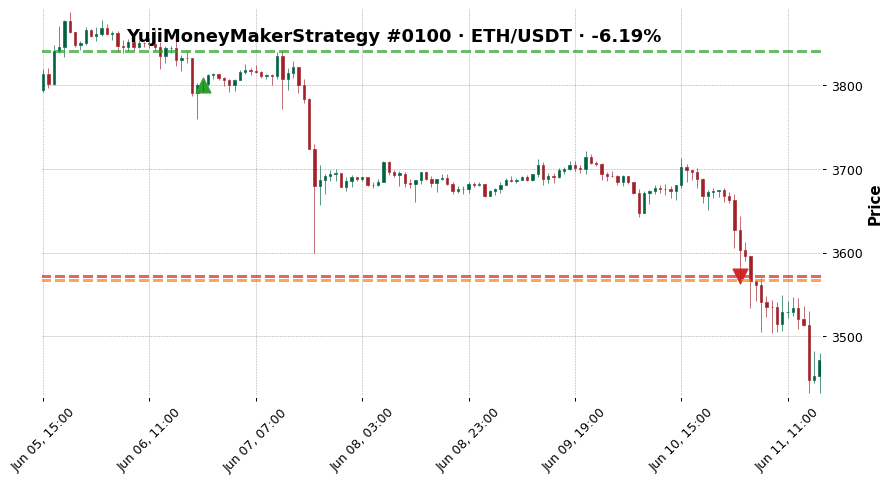

- outcome: `bad_entry_good_idea`  ·  exit_diagnosis: `premature_exit`
- MFE +1.08%  ·  MAE -6.14%
- exit_reason: `stop_loss`

### 19. YujiMoneyMakerStrategy — BTC/USDT · -6.19%

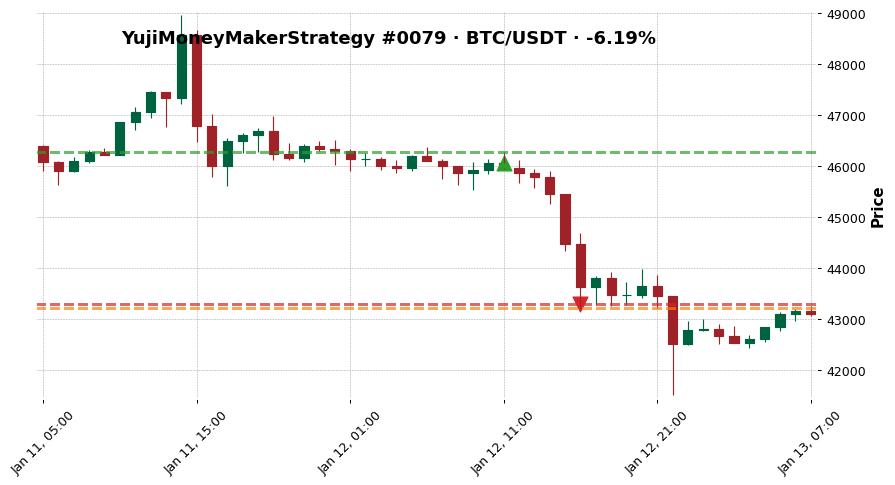

- outcome: `fast_loss`  ·  exit_diagnosis: `poor_entry`
- MFE +0.44%  ·  MAE -6.19%
- exit_reason: `stop_loss`

### 20. YujiMoneyMakerStrategy — BTC/USDT · -6.19%

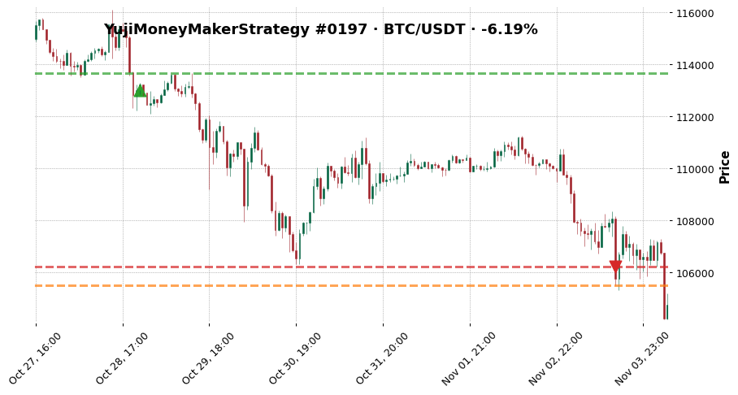

- outcome: `slow_loss`  ·  exit_diagnosis: `premature_exit`
- MFE +0.57%  ·  MAE -6.62%
- exit_reason: `stop_loss`

## See also

- [[../../../wiki/synthesis/cross-strategy-trade-library|Cross-Strategy Trade Library]]
- [[../../README|Research index]]
- [[../../../Training Journal/master|Training Journal master]]
