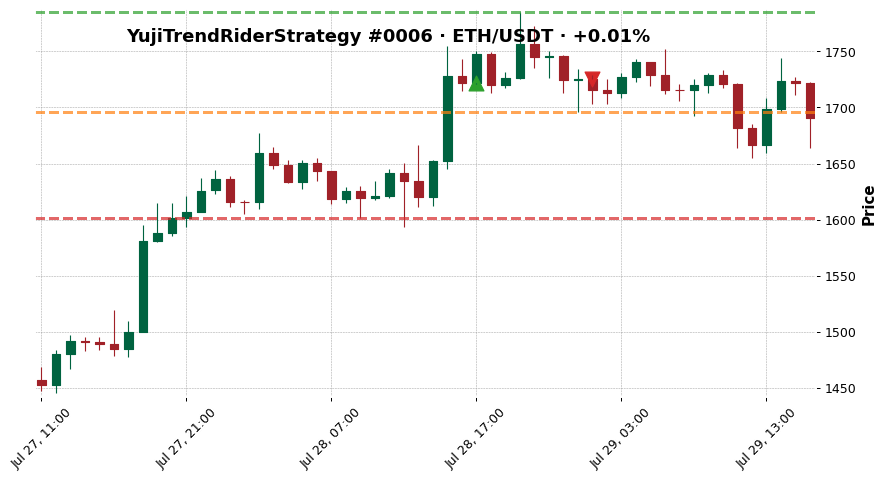
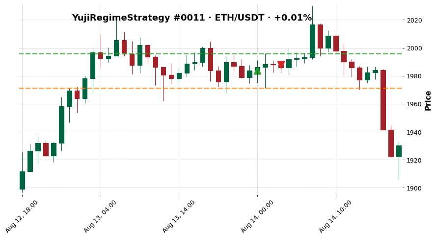
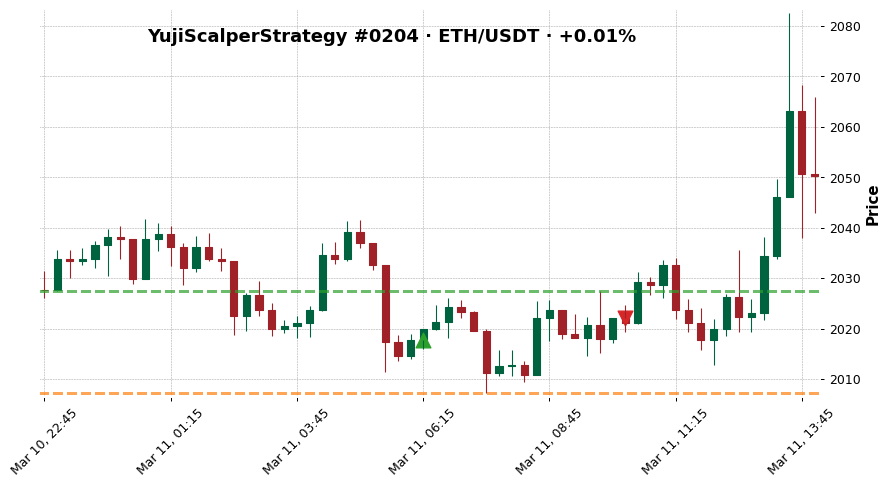

# Pattern — Low MFE Capture

Practitioner-facing recognition & remedy page. The definitional / reference version lives at
[[../../wiki/concepts/mfe-capture-ratio|wiki/concepts/mfe-capture-ratio]].

## Recognition — how to spot it

Unlike premature_exit and missed_continuation, low MFE capture is a **strategy-level** pattern,
not a per-trade one. The ratio `profit_ratio / mfe_pct` (computed from two existing CSV fields —
not a new metric, this is the MFE Capture Ratio concept already established in the wiki) is
averaged across winners for a strategy. Low capture = exits systematically under-use the
favourable excursion.

Threshold: **capture < 66%** marks a strategy as exit-weak under the archetype framework used
in `reports/strategy_diagnosis.md`. Below ~50% the exit rule is severely mismatched to the
strategy's typical winner path.

## Library evidence — strategy-level distribution

From `reports/strategy_diagnosis.md` (computed from the same trade data as Ben's library):

| Strategy | Trades | MFE capture | Archetype |
|---|---:|---:|---|
| YujiVWAPMeanReversionStrategy | 920 | **37.50%** | fully_inefficient |
| YujiRegimeStrategy | 219 | 43.94% | fully_inefficient |
| YujiFVGStrategy | 37 | 46.75% | fully_inefficient |
| YujiScalperStrategy | 288 | 49.03% | fully_inefficient |
| YujiTrendRiderStrategy | 322 | 57.28% | fully_inefficient |
| YujiStrategyV3 | 126 | 59.19% | fully_inefficient |
| YujiMoneyMakerStrategy | 232 | 61.35% | fully_inefficient |
| YujiFluidStrategy | 132 | 61.81% | fully_inefficient |
| YujiMultiSignalStrategy | 98 | 62.73% | fully_inefficient |
| YujiCointegrationResidualReversionStrategy | 8 | 62.83% | strong_entry_weak_exit |
| YujiInverseScalperStrategy | 411 | 64.79% | fully_inefficient |
| YujiDivergenceStrategy | 44 | 65.97% | fully_inefficient |
| YujiStrategyV2 | 352 | 67.95% | weak_entry_strong_exit |
| YujiStrategy | 107 | 72.73% | weak_entry_strong_exit |
| YujiSmartMoneyStrategy | 4 | — | fully_inefficient |

- **0 strategies reach the 66% capture threshold combined with avg MFE ≥ 5%** (the
  `strong_entry_strong_exit` archetype).
- **Mean capture across strategies with measurable winners: ≈58%.** Typical strategy leaves
  ≈42% of the favourable move on the table.

## Representative low-capture trades (single-trade illustrations)

These are extreme individual examples from strategies that exhibit the strategy-level
pattern. Selection rule: winners (profit_ratio > 0, mfe_pct > ~0%) sorted by
`profit_ratio / mfe_pct` ascending, strategy-diverse picking.

### TrendRider trade_0006 — ETH/USDT, +0.01% realised vs +3.63% MFE

| Field | Value |
|---|---|
| strategy | `YujiTrendRiderStrategy` |
| profit_ratio | +0.01% |
| MFE | +3.63% |
| capture | ≈0.2% |
| exit_reason | `exit_signal` |

> Favourable excursion of +3.63% existed; trade closed at +0.01%. Exit signal fired almost
> immediately after entry, capturing essentially none of the available move.

### Regime trade_0011 — ETH/USDT, +0.01% realised vs +0.63% MFE

| Field | Value |
|---|---|
| strategy | `YujiRegimeStrategy` |
| profit_ratio | +0.01% |
| MFE | +0.63% |
| capture | ≈2.2% |
| exit_reason | `exit_signal` |

> Small favourable excursion, even smaller realised — the problem here is a combination of
> small typical moves (low avg MFE signal) AND tight exits. This is the fully_inefficient
> profile: not much to capture, and the exit rule doesn't capture what little is there.

### Scalper trade_0204 — ETH/USDT, +0.01% realised vs +0.48% MFE

| Field | Value |
|---|---|
| strategy | `YujiScalperStrategy` |
| profit_ratio | +0.01% |
| MFE | +0.48% |
| capture | ≈2.9% |
| exit_reason | `exit_signal` |

> Scalper's design targets small moves, but the exit signal fires even faster than the small
> moves develop. 288 trades, 49% mean capture, net -66.54%. The exit rule is under-utilising
> an already-small signal.

## Strategy-level interpretation (exit problem vs entry problem)

| Signature | Meaning | Strategies |
|---|---|---|
| high MFE (≥5%) + low capture (<66%) | exit problem — fix the exit rule | 1 (Coint) |
| low MFE (<5%) + high capture (≥66%) | entry problem — signal finds too-small moves | 2 (Strategy, StrategyV2) |
| low MFE + low capture | fully inefficient — both broken | 12 |
| high MFE + high capture | robust | **0** |

## Remedy candidates by archetype

**For strong_entry_weak_exit (1 strategy):**
- Trailing stop, partial + runner, time-based exit, widened target. High-leverage work.

**For fully_inefficient (12 strategies):**
- Two-stage work: (a) fix the exit rule to close the capture gap, (b) fix the entry filter to
  raise avg MFE above 5%. Neither alone will be sufficient — the strategy needs both.
- In practice, start with the exit rule because it's cheaper to iterate.

**For weak_entry_strong_exit (2 strategies):**
- Exit is already working. Tune the entry — either filter out low-MFE entries or replace the
  signal to target larger moves.

## Action Trigger

Trigger conditions (strategy-level aggregate from existing CSV fields — no new metrics):

- Strategy-level **mean MFE capture < 66%** across winners
- Strategy-level **avg MFE ≥ 5%** (the entry signal is finding tradeable moves)
  → this combination defines the `strong_entry_weak_exit` archetype
- OR strategy-level **mean MFE capture < 66%** AND **avg MFE < 5%**
  → the `fully_inefficient` archetype (both levers broken; exit still first to fix)

Required actions (in priority order):

- **If strong_entry_weak_exit:** exit redesign is the single highest-leverage fix — run
  [[../Experiments/trailing-stop-vs-coint|trailing-stop-vs-coint]] first, then
  [[../Experiments/partial-tp-runner|partial-tp-runner]]
- **If fully_inefficient:** start with exit redesign (cheaper to iterate), then entry-filter
  work after exit is closed — see per-strategy recommendations in `reports/strategy_diagnosis.md`
- **If weak_entry_strong_exit:** deprioritised per [[../Control Signals#Active Instructions]]
  — entry work is blocked until exit fixes exhausted

Priority: **HIGH** for strong_entry_weak_exit, **HIGH** for fully_inefficient exit work,
**LOW** for entry-side work on weak_entry_strong_exit (blocked by Enforcement Rule).

## Current status

- No strategies have had exit-rule experiments run yet.
- Low-capture is the **strategy-level aggregate** behind the trade-level
  [[premature-exit|premature_exit]] and [[missed-continuation|missed_continuation]] patterns.
  Those two patterns are the mechanism; low capture is the summary statistic.

## Open questions

- [[../../wiki/questions/trailing-stop-vs-coint-z-reverted|Does a trailing stop outperform coint_z_reverted on Coint?]]
- Will exit-rule fixes also change the *archetype* of fully_inefficient strategies, or only
  their capture percentage without saving net PnL?

## Active Experiments

- [[../Experiments/trailing-stop-vs-coint|trailing-stop-vs-coint]] — status: queued · priority: HIGH (strong_entry_weak_exit target)
- [[../Experiments/partial-tp-runner|partial-tp-runner]] — status: queued · priority: HIGH (fully_inefficient targets)
- [[../Experiments/time-based-exit|time-based-exit]] — status: queued · priority: MEDIUM (cross-archetype)

## Linked pages

- Concept (definitional): [[../../wiki/concepts/mfe-capture-ratio|wiki/concepts/mfe-capture-ratio]]
- Library section: [[../../wiki/synthesis/cross-strategy-trade-library#Wins|Cross-Strategy Trade Library § Wins]]
- Archetypes: [[../../wiki/synthesis/current-trading-thesis#Strategy Archetypes|Current trading thesis § Strategy Archetypes]]
- Control: [[../Control Signals]]
- Master: [[../master|Training Journal master]]
