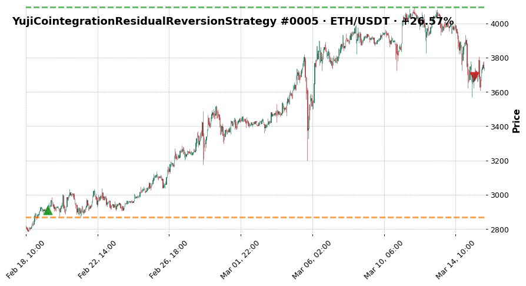
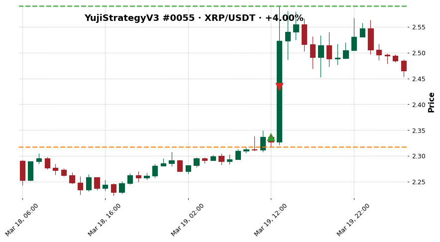

# Pattern — Missed Continuation

Practitioner-facing recognition & remedy page. The definitional / reference version lives at
[[../../wiki/concepts/missed-continuation|wiki/concepts/missed-continuation]].

## Recognition — how to spot it on a chart

A winner exits well before the MFE extremum, AND the favourable move **continues** after exit.
On the chart:

- Entry → favourable run → exit at partial capture
- Post-exit bars continue in the same direction
- Distinguished from vanilla premature_exit by the post-exit continuation — the move isn't
  just paused, it keeps going

CSV signature: `outcome = missed_continuation` (524 trades) OR `exit_diagnosis = missed_continuation`
(326 trades). The two labels overlap heavily but are not identical:

- **Outcome label (524)** is the broader symptom: realised PnL fell short of MFE on a winner.
- **Exit-diagnosis label (326)** is the narrower cause-attribution: the diagnosis rule
  attributed the shortfall specifically to continuation being missed, distinct from
  premature_exit as a competing attribution.

## Library evidence

From `data/all_trades_dataset.csv`:

- **524 trades** with `outcome = missed_continuation` (15.9% of the library)
- **326 trades** with `exit_diagnosis = missed_continuation` (9.9% of the library)
- **Union (unique trades with either label): ~688**
- Top 5 by absolute missed-continuation count: Scalper 89, V2 87, MoneyMaker 70, TrendRider 53,
  Regime 53
- Present in 14 of 15 strategies

## Representative trades

### Coint trade_0005 — ETH/USDT, +26.57% realised vs +40.74% MFE

| Field | Value |
|---|---|
| strategy | `YujiCointegrationResidualReversionStrategy` |
| pair | ETH/USDT |
| profit_ratio | +26.57% |
| MFE | +40.74% |
| outcome | `missed_continuation` |
| exit_diagnosis | `premature_exit` |

> Trade closed at +26.57% against a peak MFE of +40.74%; labelled missed_continuation because
> the favourable excursion extended well beyond the realised exit. Note the outcome is
> `missed_continuation` but the exit-diagnosis is `premature_exit` — the two can differ on the
> same trade.

### Fluid trade_0058 — XRP/USDT, +4.00% realised vs +10.86% MFE

| Field | Value |
|---|---|
| strategy | `YujiFluidStrategy` |
| pair | XRP/USDT |
| profit_ratio | +4.00% |
| MFE | +10.86% |
| outcome | `missed_continuation` |
| exit_diagnosis | `missed_continuation` |
| exit_reason | `roi` |

> Trade closed at +4.00% against MFE of +10.86%; both outcome and exit_diagnosis agree on
> missed_continuation. ROI-target exit fired at the configured profit level, clipping the move
> at about 37% of its MFE.

### V3 trade_0055 — XRP/USDT, +4.00% realised vs +10.86% MFE

| Field | Value |
|---|---|
| strategy | `YujiStrategyV3` |
| pair | XRP/USDT |
| profit_ratio | +4.00% |
| MFE | +10.86% |
| exit_reason | `roi` |

> Identical MFE and close to the Fluid example on the same pair — two strategies hit the
> same move on XRP at the same time and both exited early at ROI. Consistent with a
> system-wide ROI threshold that is set tighter than the typical winner's favourable
> excursion.

## Remedy candidates

Missed-continuation is a *subtype* of premature-exit where the post-exit price path continues
in the winning direction. Remedies are a superset of the premature-exit remedies, with an
emphasis on continuation-aware exits:

1. **Trailing stop** — best suited for continuation-style moves; rides the trend.
2. **Partial take-profit + runner** — the direct answer: take off risk at 1R, let the runner
   capture continuation.
3. **ROI target widening or removal** — many missed-continuation trades hit `exit_reason = roi`.
   A tighter ROI creates missed_continuation by design.
4. **Regime-aware exit** — if continuation concentrates in specific market states (hypothesis,
   not tested), exit rule could branch: tight exit in ranging regime, loose exit in trending.
   Requires Phase 1 market-state labeller.

## Action Trigger

Trigger conditions (all labels from existing CSV fields — no new metrics):

- `outcome = missed_continuation` OR `exit_diagnosis = missed_continuation`
- `mfe_pct` is materially above `profit_ratio` on a winner
- `exit_reason` is a fixed-target exit (`roi`, `coint_z_reverted`) OR a signal-based exit
  that fires on mean reversion rather than trend exhaustion

Required actions (in priority order):

- **Test partial take-profit + runner** — 50% off at 1R, trail remainder; directly targets
  continuation capture → [[../Experiments/partial-tp-runner|partial-tp-runner]]
- **Test trailing stop** — rides the move after the exit signal would have fired →
  [[../Experiments/trailing-stop-vs-coint|trailing-stop-vs-coint]]
- **Test time-based exit** — exit at median winner duration, keeping runners past the
  typical ROI hit → [[../Experiments/time-based-exit|time-based-exit]]
- **Widen ROI target or remove it** where continuation is the dominant missed behaviour
- **Regime-aware exit branching** (deferred) — requires Phase 1 market-state labeller

Priority: **HIGH** — 688 unique trades affected (union of outcome and diagnosis labels).
Subset of [[premature-exit]] but with confirmed continuation, so the remedy set is narrower
and more targeted.

## Current status

- Top-3 highest-volume strategies for this pattern (Scalper, V2, MoneyMaker) haven't had
  remedy experiments run yet.
- The Coint strategy is the cleanest test case because of its small n and high rate.

## Open questions

- [[../../wiki/questions/missed-continuation-regime-clustering|Do missed-continuation trades cluster by regime?]]
- [[../../wiki/questions/trailing-stop-vs-coint-z-reverted|Does a trailing stop outperform coint_z_reverted?]]

## Active Experiments

- [[../Experiments/partial-tp-runner|partial-tp-runner]] — status: queued · priority: HIGH
- [[../Experiments/trailing-stop-vs-coint|trailing-stop-vs-coint]] — status: queued · priority: HIGH
- [[../Experiments/time-based-exit|time-based-exit]] — status: queued · priority: MEDIUM

## Linked pages

- Concept (definitional): [[../../wiki/concepts/missed-continuation|wiki/concepts/missed-continuation]]
- Library section: [[../../wiki/synthesis/cross-strategy-trade-library#Missed Continuations|Cross-Strategy Trade Library § Missed Continuations]]
- Related pattern: [[premature-exit|Premature Exit]]
- Control: [[../Control Signals]]
- Master: [[../master|Training Journal master]]
