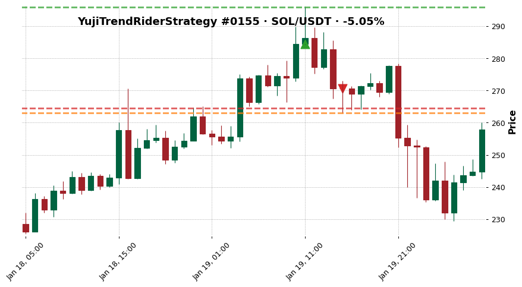
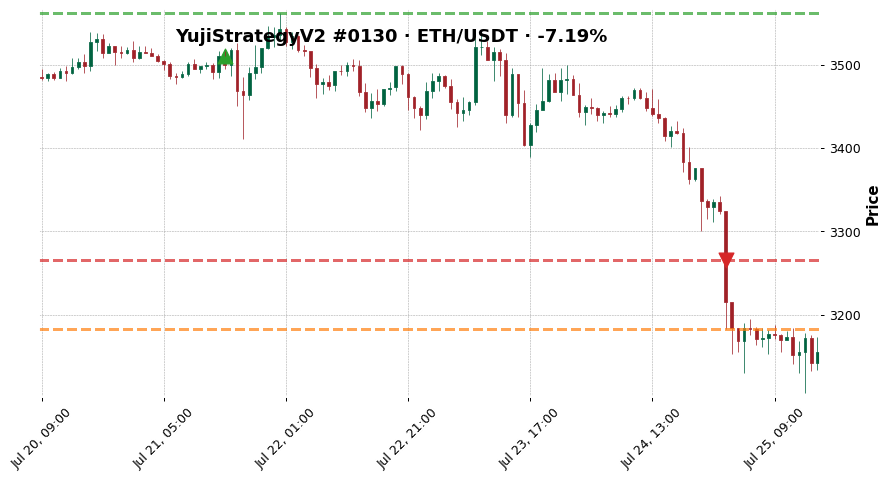

# Pattern — Premature Exit

Practitioner-facing recognition & remedy page. The definitional / reference version lives at
[[../../wiki/exit-analysis/premature-exit|wiki/exit-analysis/premature-exit]].

## Recognition — how to spot it on a chart

The exit signal fires while price is still moving favourably. On the chart:

- Entry candle, then a run of favourable bars
- Exit candle lands **before** the MFE extremum
- Price continues in the favourable direction for several bars after the exit
- Realised PnL ends materially below MFE

CSV signature: `exit_diagnosis = premature_exit`. Mechanical rule that produced the label:
`profit_ratio` closes materially short of `mfe_pct`.

## Library evidence

From `data/all_trades_dataset.csv` (3,300 trades, 15 strategies):

- **1,280 trades** carry this diagnosis — the single most common exit diagnosis (38.8% of the library)
- Present in 14 of 15 strategies (every strategy except YujiSmartMoneyStrategy at N=4 with no wins)
- Strategies with the highest premature_exit rate: Coint 62.5%, MoneyMaker 59.5%, FVG 56.8%,
  MultiSignal 53.1%, Fluid 53.0%, TrendRider 52.2%, StrategyV3 50.8%, StrategyV2 45.2%

## Representative trades

### Coint trade_0005 — ETH/USDT, +26.57% realised vs +40.74% MFE

| Field | Value |
|---|---|
| strategy | `YujiCointegrationResidualReversionStrategy` |
| pair | ETH/USDT |
| open_date | 2024-02-19 16:00:00+00:00 |
| profit_ratio | +26.57% |
| MFE | +40.74% |
| exit_reason | `coint_z_reverted` |

> Trade reached +40.74% MFE but closed at +26.57%, so capture was low and is classified as
> premature_exit. The gap between MFE and realised is 14.17 percentage points — the largest
> single-trade gap in the library.

### TrendRider trade_0155 — SOL/USDT, -5.05% realised

| Field | Value |
|---|---|
| strategy | `YujiTrendRiderStrategy` |
| pair | SOL/USDT |
| profit_ratio | -5.05% |
| MFE | +4.00% |
| MAE | -5.05% (equals close) |
| exit_reason | `exit_signal` |

> Trade showed +4.00% MFE before reversing and exiting at the -5.05% stop. premature_exit in
> this case means the favourable excursion existed briefly and was not captured before the
> adverse move took over.

### StrategyV2 trade_0130 — ETH/USDT, -7.19% realised

| Field | Value |
|---|---|
| strategy | `YujiStrategyV2` |
| pair | ETH/USDT |
| profit_ratio | -7.19% |
| MFE | +1.48% |
| exit_reason | `stop_loss` |

> MFE of +1.48% existed before the trade reversed and hit stop. The small favourable excursion
> wasn't large enough for ROI to fire but was large enough to register as premature_exit when
> stop triggered.

## Remedy candidates

Ordered by expected leverage, drawn from the per-strategy recommendations in
`reports/strategy_diagnosis.md`:

1. **Trailing stop** — the most general fix. Replace fixed exits with a trail that activates
   after a threshold and follows price. Candidates: 1.5%, 2.5%, ATR × 2.
2. **Partial take-profit + runner** — exit 50% at 1R, trail the remainder. Preserves winners'
   upside while locking in positive PnL.
3. **Time-based exit** — exit at the median winner duration. Bounds capital occupancy and
   releases for new entries.
4. **Wider exit threshold** — for reversion-to-target exits, loosen the threshold so the move
   has more room to develop.

## Action Trigger

Trigger conditions (all labels from existing CSV fields — no new metrics):

- `mfe_pct` is materially positive (trade had a favourable excursion)
- `profit_ratio` is well below `mfe_pct` (favourable excursion was not captured)
- `exit_reason` is signal-based (`exit_signal`, `roi`, `coint_z_reverted`, `rsi_overbought_exit`)
  OR adverse-stop (`stop_loss`, `trailing_stop_loss`) that fired after a brief favourable excursion

Required actions (in priority order):

- **Test trailing stop** variants (1.5%, 2.5%, ATR × 2) → [[../Experiments/trailing-stop-vs-coint|trailing-stop-vs-coint]]
- **Test partial take-profit + runner** (50% at 1R, trail remainder) → [[../Experiments/partial-tp-runner|partial-tp-runner]]
- **Test time-based exit** at median winner duration → [[../Experiments/time-based-exit|time-based-exit]]
- **Widen signal-exit thresholds** — loosen the reversion / confirmation gate that fires the premature exit

Priority: **HIGH** — this pattern is the dominant failure mode system-wide
(1,280 trades, 38.8% of library; see [[../Control Signals]]).

## Current status

- No remedy has been backtested yet. The library is a diagnosis, not a solution.
- Most leverage is on **Experiment 1** (trailing stop vs coint_z_reverted on Coint) because
  the Coint strategy has the highest premature_exit rate AND is the only profitable strategy
  in the library.

## Open questions

- [[../../wiki/questions/trailing-stop-vs-coint-z-reverted|Does a trailing stop outperform coint_z_reverted?]]

## Active Experiments

- [[../Experiments/trailing-stop-vs-coint|trailing-stop-vs-coint]] — status: queued · priority: HIGH
- [[../Experiments/partial-tp-runner|partial-tp-runner]] — status: queued · priority: HIGH
- [[../Experiments/time-based-exit|time-based-exit]] — status: queued · priority: MEDIUM

## Linked pages

- Concept (definitional): [[../../wiki/exit-analysis/premature-exit|wiki/exit-analysis/premature-exit]]
- Library section: [[../../wiki/synthesis/cross-strategy-trade-library#Premature Exits|Cross-Strategy Trade Library § Premature Exits]]
- Thesis: [[../../wiki/synthesis/current-trading-thesis#Cross-Strategy Findings|Current trading thesis]]
- Control: [[../Control Signals]]
- Master: [[../master|Training Journal master]]
