# Cross-Strategy Trade Library

A summarised, representative-sample view over the full 3,300-trade dataset exported from
Ben's all-trades build. **This page does not re-run backtests or derive new metrics — it
only groups, counts, and embeds trades using fields already present in
`data/all_trades_dataset.csv`.**

Chart images are embedded via filesystem-relative paths into `data/all_trade_charts/` —
not moved into `raw/`. The full dataset stays in `data/` as Ben's build produced it.

---

## Overview

- **Total trades:** 3,300
- **Strategies:** 15
- **Pairs:** 6 — top 5 by volume: BTC/USDT (1231), ETH/USDT (1177), SOL/USDT (262), XRP/USDT (220), LINK/USDT (208)
- **Date span (open_date):** 2022-05-02 → 2026-04-20

### Outcome distribution

| Outcome | Count | % |
|---|---:|---:|
| `fast_loss` | 1,074 | 32.5% |
| `slow_loss` | 565 | 17.1% |
| `missed_continuation` | 524 | 15.9% |
| `clean_win` | 477 | 14.5% |
| `noisy_win` | 331 | 10.0% |
| `bad_entry_good_idea` | 189 | 5.7% |
| `scratch` | 140 | 4.2% |

### Exit diagnosis distribution

| Diagnosis | Count | % |
|---|---:|---:|
| `premature_exit` | 1,280 | 38.8% |
| `poor_entry` | 668 | 20.2% |
| `noise_trade` | 561 | 17.0% |
| `efficient_exit` | 336 | 10.2% |
| `missed_continuation` | 326 | 9.9% |
| `stop_loss_failure` | 129 | 3.9% |

### Strategies

| Strategy | Trades |
|---|---:|
| `YujiVWAPMeanReversionStrategy` | 920 |
| `YujiInverseScalperStrategy` | 411 |
| `YujiStrategyV2` | 352 |
| `YujiTrendRiderStrategy` | 322 |
| `YujiScalperStrategy` | 288 |
| `YujiMoneyMakerStrategy` | 232 |
| `YujiRegimeStrategy` | 219 |
| `YujiFluidStrategy` | 132 |
| `YujiStrategyV3` | 126 |
| `YujiStrategy` | 107 |
| `YujiMultiSignalStrategy` | 98 |
| `YujiDivergenceStrategy` | 44 |
| `YujiFVGStrategy` | 37 |
| `YujiCointegrationResidualReversionStrategy` | 8 |
| `YujiSmartMoneyStrategy` | 4 |

## Wins

- **Pool size:** 808 trades
- **Selection rule:** Union of `outcome ∈ {clean_win, noisy_win}`, ranked by `profit_ratio` descending with strategy-diversity picking (no strategy may appear twice until every strategy with a win has been represented once).
- **Showing:** top 10 representative trades

**clean_win:** 477 · **noisy_win:** 331

### 1. YujiCointegrationResidualReversionStrategy — ETH/USDT · +8.10%

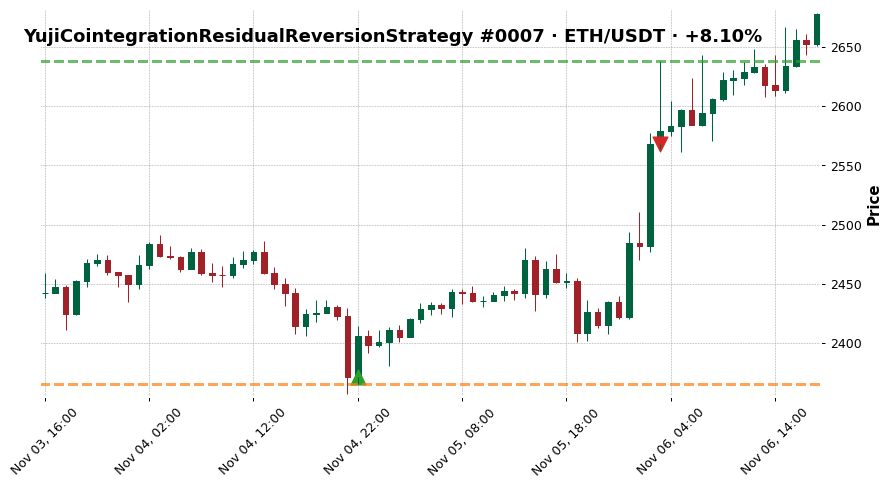

| Field | Value |
|---|---|
| strategy | `YujiCointegrationResidualReversionStrategy` |
| pair | ETH/USDT |
| open_date | 2024-11-04 22:00:00+00:00 |
| close_date | 2024-11-06 03:00:00+00:00 |
| profit_ratio | +8.10% |
| MFE | +11.25% |
| MAE | -0.23% |
| exit_reason | `coint_z_reverted` |
| outcome | `clean_win` |
| exit_diagnosis | `premature_exit` |

> Trade reached +11.25% MFE but closed at +8.10%, so capture was low and is classified as premature_exit.

### 2. YujiTrendRiderStrategy — XRP/USDT · +8.00%

| Field | Value |
|---|---|
| strategy | `YujiTrendRiderStrategy` |
| pair | XRP/USDT |
| open_date | 2025-07-11 13:00:00+00:00 |
| close_date | 2025-07-11 15:00:00+00:00 |
| profit_ratio | +8.00% |
| MFE | +10.38% |
| MAE | -0.85% |
| exit_reason | `roi` |
| outcome | `noisy_win` |
| exit_diagnosis | `efficient_exit` |

> Trade closed at +8.00% near the MFE of +10.38%; labelled efficient_exit — exit captured most of the favourable move.

### 3. YujiStrategyV2 — LINK/USDT · +4.02%

| Field | Value |
|---|---|
| strategy | `YujiStrategyV2` |
| pair | LINK/USDT |
| open_date | 2025-05-13 17:00:00+00:00 |
| close_date | 2025-05-13 19:00:00+00:00 |
| profit_ratio | +4.02% |
| MFE | +4.52% |
| MAE | -0.18% |
| exit_reason | `roi` |
| outcome | `clean_win` |
| exit_diagnosis | `efficient_exit` |

> Trade closed at +4.02% near the MFE of +4.52%; labelled efficient_exit — exit captured most of the favourable move.

### 4. YujiMoneyMakerStrategy — AVAX/USDT · +3.04%

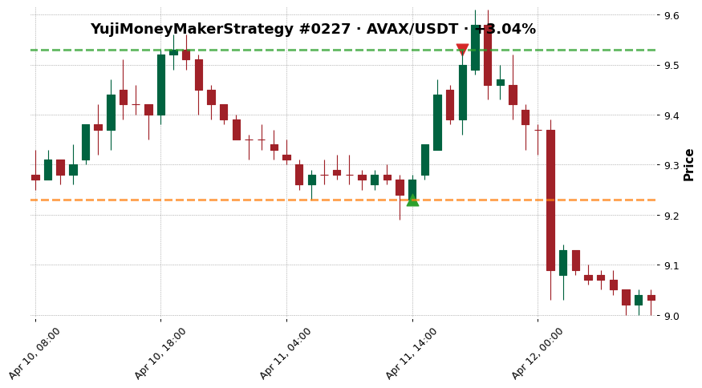

| Field | Value |
|---|---|
| strategy | `YujiMoneyMakerStrategy` |
| pair | AVAX/USDT |
| open_date | 2026-04-11 14:00:00+00:00 |
| close_date | 2026-04-11 18:00:00+00:00 |
| profit_ratio | +3.04% |
| MFE | +3.25% |
| MAE | -0.00% |
| exit_reason | `roi` |
| outcome | `clean_win` |
| exit_diagnosis | `efficient_exit` |

> Trade closed at +3.04% near the MFE of +3.25%; labelled efficient_exit — exit captured most of the favourable move.

### 5. YujiDivergenceStrategy — AVAX/USDT · +3.02%

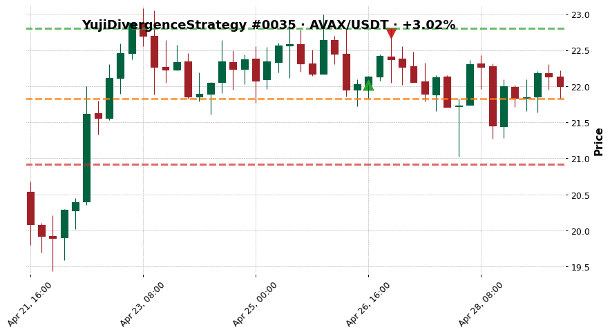

| Field | Value |
|---|---|
| strategy | `YujiDivergenceStrategy` |
| pair | AVAX/USDT |
| open_date | 2025-04-26 16:00:00+00:00 |
| close_date | 2025-04-27 00:00:00+00:00 |
| profit_ratio | +3.02% |
| MFE | +3.54% |
| MAE | -0.86% |
| exit_reason | `roi` |
| outcome | `noisy_win` |
| exit_diagnosis | `efficient_exit` |

> Trade closed at +3.02% near the MFE of +3.54%; labelled efficient_exit — exit captured most of the favourable move.

### 6. YujiInverseScalperStrategy — BTC/USDT · +3.00%

| Field | Value |
|---|---|
| strategy | `YujiInverseScalperStrategy` |
| pair | BTC/USDT |
| open_date | 2026-03-02 15:00:00+00:00 |
| close_date | 2026-03-02 15:30:00+00:00 |
| profit_ratio | +3.00% |
| MFE | +3.50% |
| MAE | -0.30% |
| exit_reason | `roi` |
| outcome | `clean_win` |
| exit_diagnosis | `efficient_exit` |

> Trade closed at +3.00% near the MFE of +3.50%; labelled efficient_exit — exit captured most of the favourable move.

### 7. YujiRegimeStrategy — BTC/USDT · +3.00%

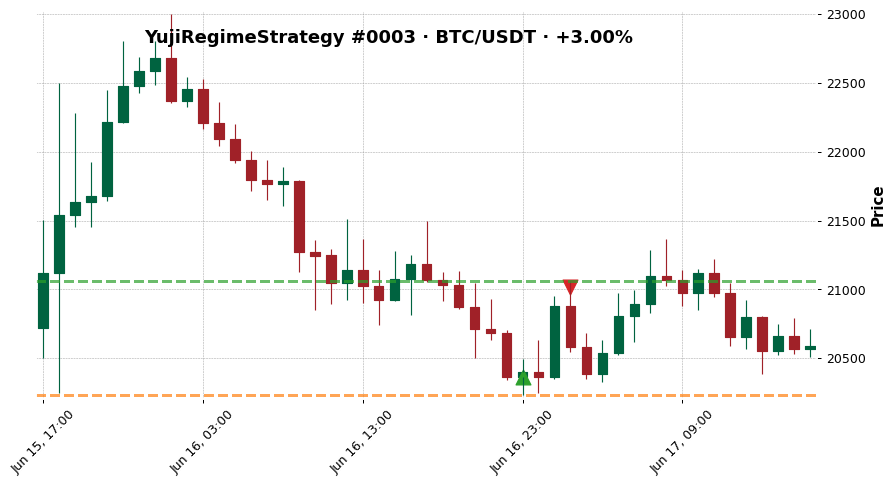

| Field | Value |
|---|---|
| strategy | `YujiRegimeStrategy` |
| pair | BTC/USDT |
| open_date | 2022-06-16 23:00:00+00:00 |
| close_date | 2022-06-17 02:00:00+00:00 |
| profit_ratio | +3.00% |
| MFE | +3.41% |
| MAE | -0.65% |
| exit_reason | `roi` |
| outcome | `noisy_win` |
| exit_diagnosis | `efficient_exit` |

> Trade closed at +3.00% near the MFE of +3.41%; labelled efficient_exit — exit captured most of the favourable move.

### 8. YujiFluidStrategy — BTC/USDT · +2.75%

| Field | Value |
|---|---|
| strategy | `YujiFluidStrategy` |
| pair | BTC/USDT |
| open_date | 2024-09-17 14:00:00+00:00 |
| close_date | 2024-09-17 15:00:00+00:00 |
| profit_ratio | +2.75% |
| MFE | +3.99% |
| MAE | -0.04% |
| exit_reason | `trailing_stop_loss` |
| outcome | `clean_win` |
| exit_diagnosis | `stop_loss_failure` |

> Trade closed at +2.75% with MAE of -0.04%; labelled stop_loss_failure because the stop exit did not contain the adverse move.

### 9. YujiStrategyV3 — BTC/USDT · +2.75%

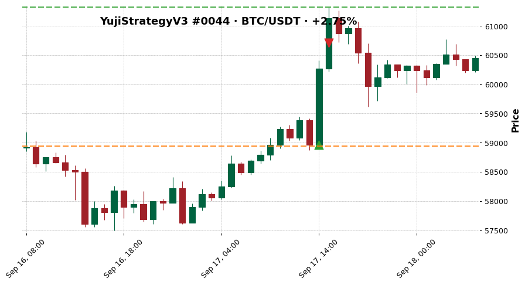

| Field | Value |
|---|---|
| strategy | `YujiStrategyV3` |
| pair | BTC/USDT |
| open_date | 2024-09-17 14:00:00+00:00 |
| close_date | 2024-09-17 15:00:00+00:00 |
| profit_ratio | +2.75% |
| MFE | +3.99% |
| MAE | -0.04% |
| exit_reason | `trailing_stop_loss` |
| outcome | `clean_win` |
| exit_diagnosis | `stop_loss_failure` |

> Trade closed at +2.75% with MAE of -0.04%; labelled stop_loss_failure because the stop exit did not contain the adverse move.

### 10. YujiStrategy — ETH/USDT · +2.07%

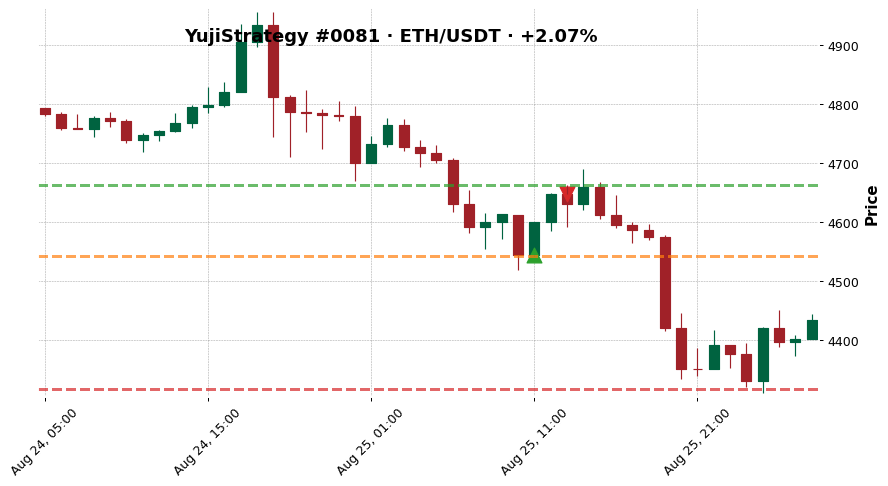

| Field | Value |
|---|---|
| strategy | `YujiStrategy` |
| pair | ETH/USDT |
| open_date | 2025-08-25 11:00:00+00:00 |
| close_date | 2025-08-25 13:00:00+00:00 |
| profit_ratio | +2.07% |
| MFE | +2.62% |
| MAE | -0.01% |
| exit_reason | `roi` |
| outcome | `clean_win` |
| exit_diagnosis | `efficient_exit` |

> Trade closed at +2.07% near the MFE of +2.62%; labelled efficient_exit — exit captured most of the favourable move.

## Losses

- **Pool size:** 1968 trades
- **Selection rule:** Union of `outcome ∈ {fast_loss, slow_loss, bad_entry_good_idea, scratch}`, ranked by `profit_ratio` ascending (largest losses first) with strategy-diversity picking.
- **Showing:** top 10 representative trades

**fast_loss:** 1,074 · **slow_loss:** 565 · **bad_entry_good_idea:** 189 · **scratch:** 140

### 1. YujiStrategyV2 — ETH/USDT · -7.19%

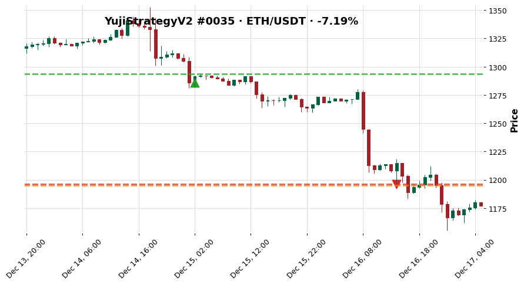

| Field | Value |
|---|---|
| strategy | `YujiStrategyV2` |
| pair | ETH/USDT |
| open_date | 2022-12-15 02:00:00+00:00 |
| close_date | 2022-12-16 14:00:00+00:00 |
| profit_ratio | -7.19% |
| MFE | +0.61% |
| MAE | -7.07% |
| exit_reason | `stop_loss` |
| outcome | `fast_loss` |
| exit_diagnosis | `premature_exit` |

> Trade reached +0.61% MFE but closed at -7.19%, so capture was low and is classified as premature_exit.

### 2. YujiTrendRiderStrategy — ETH/USDT · -7.19%

| Field | Value |
|---|---|
| strategy | `YujiTrendRiderStrategy` |
| pair | ETH/USDT |
| open_date | 2024-03-05 13:00:00+00:00 |
| close_date | 2024-03-05 19:00:00+00:00 |
| profit_ratio | -7.19% |
| MFE | +1.68% |
| MAE | -14.87% |
| exit_reason | `stop_loss` |
| outcome | `bad_entry_good_idea` |
| exit_diagnosis | `stop_loss_failure` |

> Trade closed at -7.19% with MAE of -14.87%; labelled stop_loss_failure because the stop exit did not contain the adverse move.

### 3. YujiMoneyMakerStrategy — ETH/USDT · -6.19%

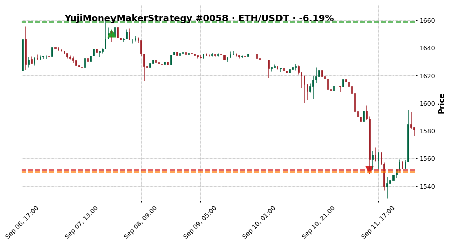

| Field | Value |
|---|---|
| strategy | `YujiMoneyMakerStrategy` |
| pair | ETH/USDT |
| open_date | 2023-09-07 23:00:00+00:00 |
| close_date | 2023-09-11 14:00:00+00:00 |
| profit_ratio | -6.19% |
| MFE | +0.51% |
| MAE | -6.09% |
| exit_reason | `stop_loss` |
| outcome | `slow_loss` |
| exit_diagnosis | `premature_exit` |

> Trade reached +0.51% MFE but closed at -6.19%, so capture was low and is classified as premature_exit.

### 4. YujiStrategyV3 — ETH/USDT · -6.19%

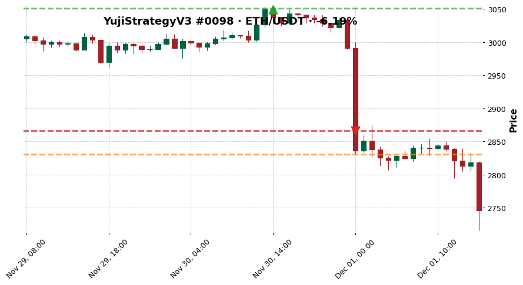

| Field | Value |
|---|---|
| strategy | `YujiStrategyV3` |
| pair | ETH/USDT |
| open_date | 2025-11-30 14:00:00+00:00 |
| close_date | 2025-12-01 00:00:00+00:00 |
| profit_ratio | -6.19% |
| MFE | +0.07% |
| MAE | -7.16% |
| exit_reason | `stop_loss` |
| outcome | `fast_loss` |
| exit_diagnosis | `poor_entry` |

> Trade closed at -6.19% with MFE +0.07% and MAE -7.16%; labelled poor_entry because adverse excursion matched or exceeded favourable excursion.

### 5. YujiFluidStrategy — ETH/USDT · -6.13%

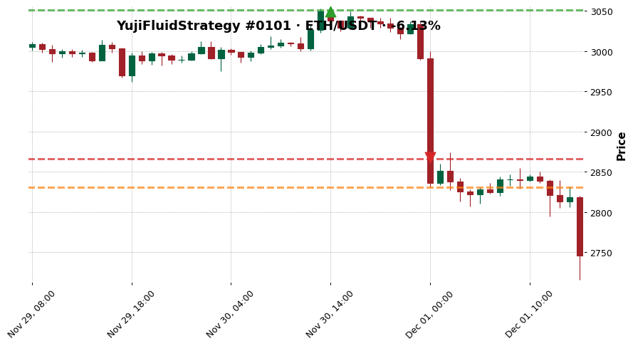

| Field | Value |
|---|---|
| strategy | `YujiFluidStrategy` |
| pair | ETH/USDT |
| open_date | 2025-11-30 14:00:00+00:00 |
| close_date | 2025-12-01 00:00:00+00:00 |
| profit_ratio | -6.13% |
| MFE | +0.07% |
| MAE | -7.16% |
| exit_reason | `trailing_stop_loss` |
| outcome | `fast_loss` |
| exit_diagnosis | `poor_entry` |

> Trade closed at -6.13% with MFE +0.07% and MAE -7.16%; labelled poor_entry because adverse excursion matched or exceeded favourable excursion.

### 6. YujiRegimeStrategy — BTC/USDT · -5.19%

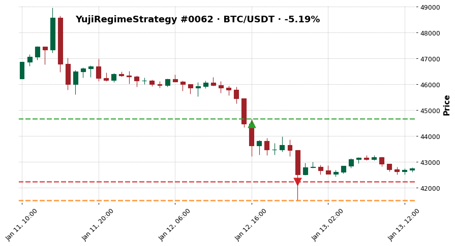

| Field | Value |
|---|---|
| strategy | `YujiRegimeStrategy` |
| pair | BTC/USDT |
| open_date | 2024-01-12 16:00:00+00:00 |
| close_date | 2024-01-12 22:00:00+00:00 |
| profit_ratio | -5.19% |
| MFE | +0.48% |
| MAE | -6.66% |
| exit_reason | `stop_loss` |
| outcome | `fast_loss` |
| exit_diagnosis | `poor_entry` |

> Trade closed at -5.19% with MFE +0.48% and MAE -6.66%; labelled poor_entry because adverse excursion matched or exceeded favourable excursion.

### 7. YujiDivergenceStrategy — BTC/USDT · -5.19%

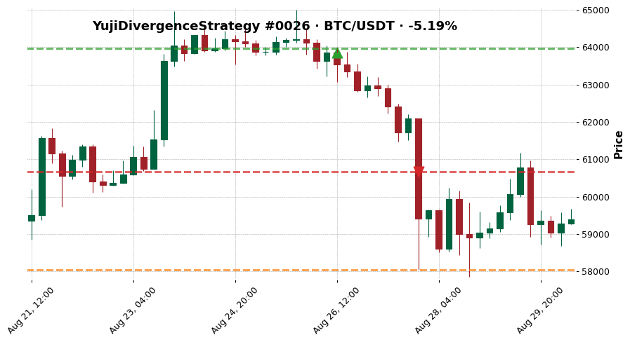

| Field | Value |
|---|---|
| strategy | `YujiDivergenceStrategy` |
| pair | BTC/USDT |
| open_date | 2024-08-26 12:00:00+00:00 |
| close_date | 2024-08-27 20:00:00+00:00 |
| profit_ratio | -5.19% |
| MFE | +0.16% |
| MAE | -9.12% |
| exit_reason | `stop_loss` |
| outcome | `fast_loss` |
| exit_diagnosis | `poor_entry` |

> Trade closed at -5.19% with MFE +0.16% and MAE -9.12%; labelled poor_entry because adverse excursion matched or exceeded favourable excursion.

### 8. YujiSmartMoneyStrategy — BTC/USDT · -5.19%

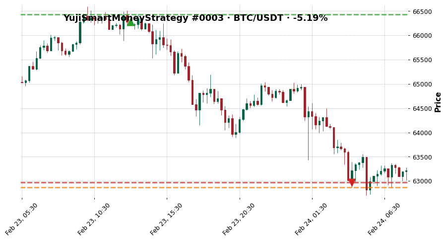

| Field | Value |
|---|---|
| strategy | `YujiSmartMoneyStrategy` |
| pair | BTC/USDT |
| open_date | 2026-02-23 13:00:00+00:00 |
| close_date | 2026-02-24 04:15:00+00:00 |
| profit_ratio | -5.19% |
| MFE | +0.23% |
| MAE | -5.15% |
| exit_reason | `stop_loss` |
| outcome | `slow_loss` |
| exit_diagnosis | `poor_entry` |

> Trade closed at -5.19% with MFE +0.23% and MAE -5.15%; labelled poor_entry because adverse excursion matched or exceeded favourable excursion.

### 9. YujiStrategy — ETH/USDT · -5.19%

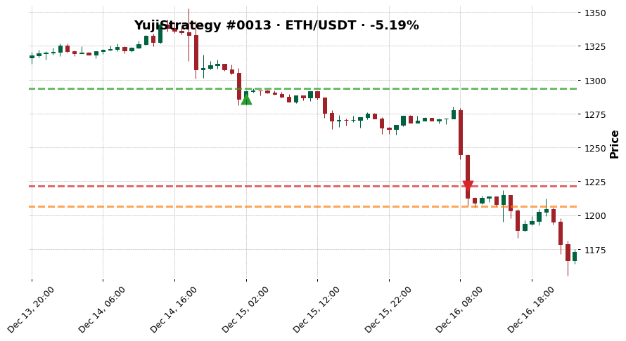

| Field | Value |
|---|---|
| strategy | `YujiStrategy` |
| pair | ETH/USDT |
| open_date | 2022-12-15 02:00:00+00:00 |
| close_date | 2022-12-16 09:00:00+00:00 |
| profit_ratio | -5.19% |
| MFE | +0.61% |
| MAE | -6.20% |
| exit_reason | `stop_loss` |
| outcome | `fast_loss` |
| exit_diagnosis | `premature_exit` |

> Trade reached +0.61% MFE but closed at -5.19%, so capture was low and is classified as premature_exit.

### 10. YujiFVGStrategy — ETH/USDT · -5.19%

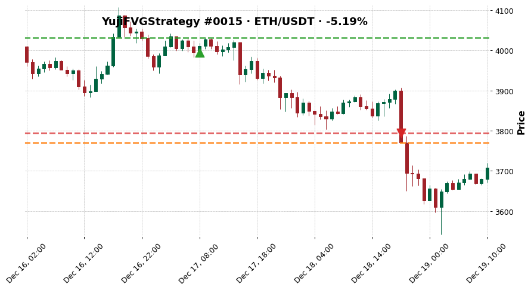

| Field | Value |
|---|---|
| strategy | `YujiFVGStrategy` |
| pair | ETH/USDT |
| open_date | 2024-12-17 08:00:00+00:00 |
| close_date | 2024-12-18 19:00:00+00:00 |
| profit_ratio | -5.19% |
| MFE | +0.93% |
| MAE | -5.61% |
| exit_reason | `stop_loss` |
| outcome | `fast_loss` |
| exit_diagnosis | `premature_exit` |

> Trade reached +0.93% MFE but closed at -5.19%, so capture was low and is classified as premature_exit.

## Premature Exits

- **Pool size:** 1280 trades
- **Selection rule:** `exit_diagnosis = premature_exit`, ranked by `mfe_pct − profit_ratio` descending (largest unrealised gap first) with strategy-diversity picking. Note: the ranking key is a subtraction of two existing CSV fields, not a new metric.
- **Showing:** top 10 representative trades

### 1. YujiCointegrationResidualReversionStrategy — ETH/USDT · +26.57%

| Field | Value |
|---|---|
| strategy | `YujiCointegrationResidualReversionStrategy` |
| pair | ETH/USDT |
| open_date | 2024-02-19 16:00:00+00:00 |
| close_date | 2024-03-15 12:00:00+00:00 |
| profit_ratio | +26.57% |
| MFE | +40.74% |
| MAE | -1.41% |
| exit_reason | `coint_z_reverted` |
| outcome | `missed_continuation` |
| exit_diagnosis | `premature_exit` |

> Trade reached +40.74% MFE but closed at +26.57%, so capture was low and is classified as premature_exit.

### 2. YujiTrendRiderStrategy — SOL/USDT · -5.05%

| Field | Value |
|---|---|
| strategy | `YujiTrendRiderStrategy` |
| pair | SOL/USDT |
| open_date | 2025-01-19 11:00:00+00:00 |
| close_date | 2025-01-19 15:00:00+00:00 |
| profit_ratio | -5.05% |
| MFE | +4.00% |
| MAE | -7.56% |
| exit_reason | `exit_signal` |
| outcome | `bad_entry_good_idea` |
| exit_diagnosis | `premature_exit` |

> Trade reached +4.00% MFE but closed at -5.05%, so capture was low and is classified as premature_exit.

### 3. YujiStrategyV2 — ETH/USDT · -7.19%

| Field | Value |
|---|---|
| strategy | `YujiStrategyV2` |
| pair | ETH/USDT |
| open_date | 2024-07-21 15:00:00+00:00 |
| close_date | 2024-07-25 01:00:00+00:00 |
| profit_ratio | -7.19% |
| MFE | +1.48% |
| MAE | -9.34% |
| exit_reason | `stop_loss` |
| outcome | `bad_entry_good_idea` |
| exit_diagnosis | `premature_exit` |

> Trade reached +1.48% MFE but closed at -7.19%, so capture was low and is classified as premature_exit.

### 4. YujiStrategyV3 — SOL/USDT · -6.19%

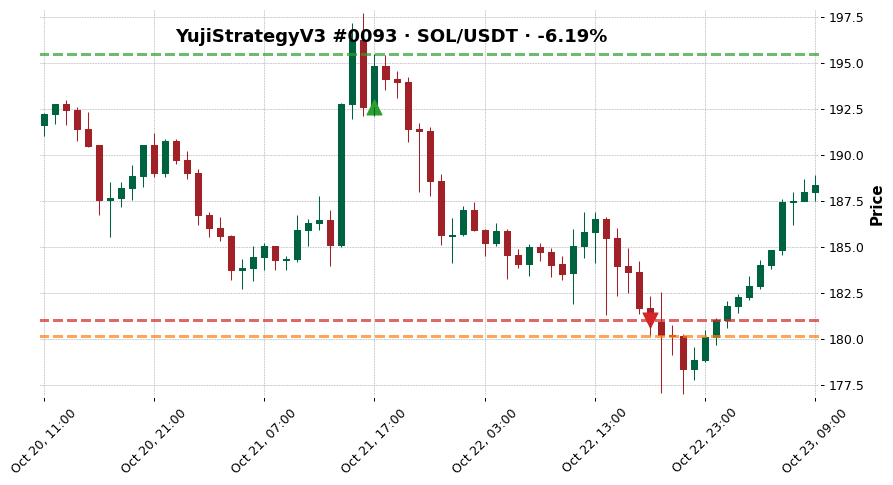

| Field | Value |
|---|---|
| strategy | `YujiStrategyV3` |
| pair | SOL/USDT |
| open_date | 2025-10-21 17:00:00+00:00 |
| close_date | 2025-10-22 18:00:00+00:00 |
| profit_ratio | -6.19% |
| MFE | +1.49% |
| MAE | -6.44% |
| exit_reason | `stop_loss` |
| outcome | `bad_entry_good_idea` |
| exit_diagnosis | `premature_exit` |

> Trade reached +1.49% MFE but closed at -6.19%, so capture was low and is classified as premature_exit.

### 5. YujiMoneyMakerStrategy — AVAX/USDT · -6.16%

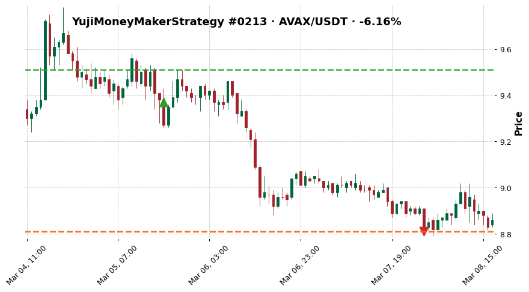

| Field | Value |
|---|---|
| strategy | `YujiMoneyMakerStrategy` |
| pair | AVAX/USDT |
| open_date | 2026-03-05 17:00:00+00:00 |
| close_date | 2026-03-08 02:00:00+00:00 |
| profit_ratio | -6.16% |
| MFE | +1.49% |
| MAE | -5.98% |
| exit_reason | `stop_loss` |
| outcome | `bad_entry_good_idea` |
| exit_diagnosis | `premature_exit` |

> Trade reached +1.49% MFE but closed at -6.16%, so capture was low and is classified as premature_exit.

### 6. YujiStrategy — BTC/USDT · -5.19%

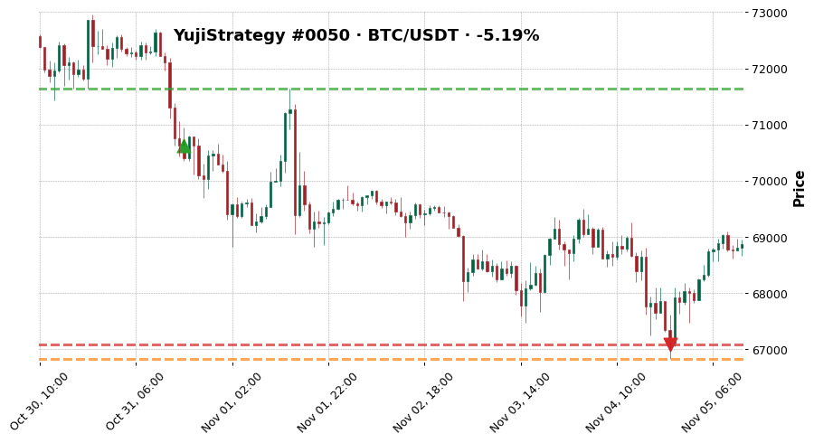

| Field | Value |
|---|---|
| strategy | `YujiStrategy` |
| pair | BTC/USDT |
| open_date | 2024-10-31 16:00:00+00:00 |
| close_date | 2024-11-04 21:00:00+00:00 |
| profit_ratio | -5.19% |
| MFE | +1.43% |
| MAE | -5.36% |
| exit_reason | `stop_loss` |
| outcome | `bad_entry_good_idea` |
| exit_diagnosis | `premature_exit` |

> Trade reached +1.43% MFE but closed at -5.19%, so capture was low and is classified as premature_exit.

### 7. YujiDivergenceStrategy — LINK/USDT · -5.14%

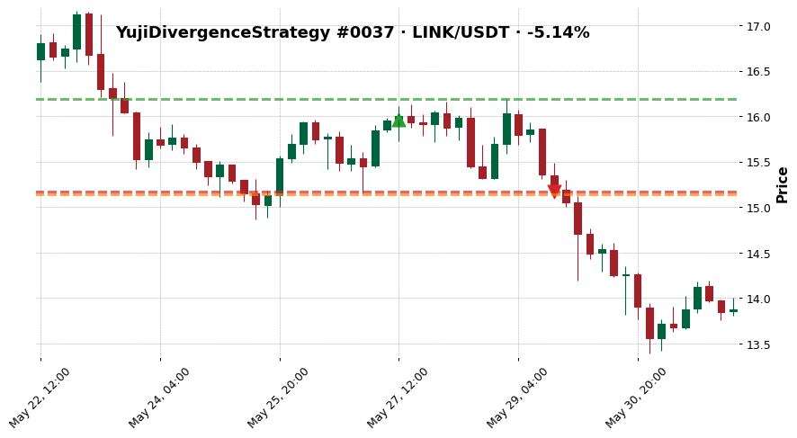

| Field | Value |
|---|---|
| strategy | `YujiDivergenceStrategy` |
| pair | LINK/USDT |
| open_date | 2025-05-27 12:00:00+00:00 |
| close_date | 2025-05-29 16:00:00+00:00 |
| profit_ratio | -5.14% |
| MFE | +1.44% |
| MAE | -5.14% |
| exit_reason | `stop_loss` |
| outcome | `bad_entry_good_idea` |
| exit_diagnosis | `premature_exit` |

> Trade reached +1.44% MFE but closed at -5.14%, so capture was low and is classified as premature_exit.

### 8. YujiRegimeStrategy — ETH/USDT · -5.19%

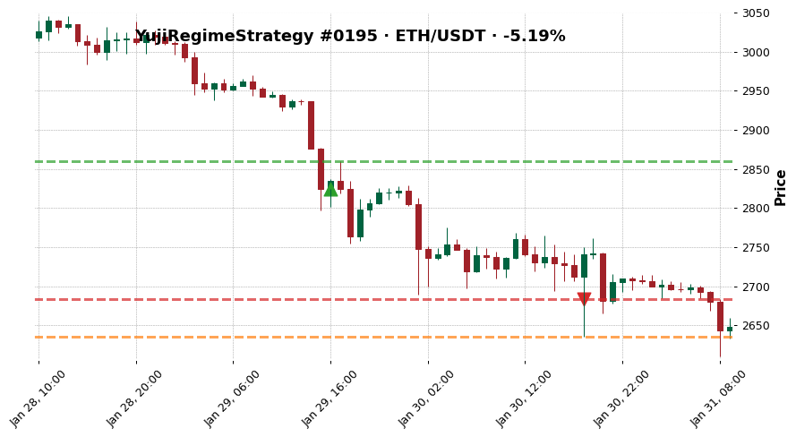

| Field | Value |
|---|---|
| strategy | `YujiRegimeStrategy` |
| pair | ETH/USDT |
| open_date | 2026-01-29 16:00:00+00:00 |
| close_date | 2026-01-30 18:00:00+00:00 |
| profit_ratio | -5.19% |
| MFE | +1.27% |
| MAE | -6.67% |
| exit_reason | `stop_loss` |
| outcome | `bad_entry_good_idea` |
| exit_diagnosis | `premature_exit` |

> Trade reached +1.27% MFE but closed at -5.19%, so capture was low and is classified as premature_exit.

### 9. YujiFluidStrategy — BTC/USDT · -5.51%

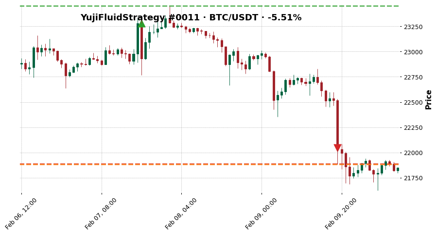

| Field | Value |
|---|---|
| strategy | `YujiFluidStrategy` |
| pair | BTC/USDT |
| open_date | 2023-02-07 18:00:00+00:00 |
| close_date | 2023-02-09 19:00:00+00:00 |
| profit_ratio | -5.51% |
| MFE | +0.73% |
| MAE | -6.02% |
| exit_reason | `trailing_stop_loss` |
| outcome | `slow_loss` |
| exit_diagnosis | `premature_exit` |

> Trade reached +0.73% MFE but closed at -5.51%, so capture was low and is classified as premature_exit.

### 10. YujiFVGStrategy — ETH/USDT · -5.19%

| Field | Value |
|---|---|
| strategy | `YujiFVGStrategy` |
| pair | ETH/USDT |
| open_date | 2024-12-17 08:00:00+00:00 |
| close_date | 2024-12-18 19:00:00+00:00 |
| profit_ratio | -5.19% |
| MFE | +0.93% |
| MAE | -5.61% |
| exit_reason | `stop_loss` |
| outcome | `fast_loss` |
| exit_diagnosis | `premature_exit` |

> Trade reached +0.93% MFE but closed at -5.19%, so capture was low and is classified as premature_exit.

## Missed Continuations

- **Pool size:** 579 trades
- **Selection rule:** `outcome = missed_continuation` OR `exit_diagnosis = missed_continuation` (union), ranked by `mfe_pct` descending with strategy-diversity picking.
- **Showing:** top 10 representative trades

**outcome=missed_continuation:** 524 · **exit_diagnosis=missed_continuation:** 326 · **union (unique trades):** 579

### 1. YujiCointegrationResidualReversionStrategy — ETH/USDT · +26.57%

| Field | Value |
|---|---|
| strategy | `YujiCointegrationResidualReversionStrategy` |
| pair | ETH/USDT |
| open_date | 2024-02-19 16:00:00+00:00 |
| close_date | 2024-03-15 12:00:00+00:00 |
| profit_ratio | +26.57% |
| MFE | +40.74% |
| MAE | -1.41% |
| exit_reason | `coint_z_reverted` |
| outcome | `missed_continuation` |
| exit_diagnosis | `premature_exit` |

> Trade reached +40.74% MFE but closed at +26.57%, so capture was low and is classified as premature_exit.

### 2. YujiFluidStrategy — XRP/USDT · +4.00%

| Field | Value |
|---|---|
| strategy | `YujiFluidStrategy` |
| pair | XRP/USDT |
| open_date | 2025-03-19 12:00:00+00:00 |
| close_date | 2025-03-19 13:00:00+00:00 |
| profit_ratio | +4.00% |
| MFE | +10.86% |
| MAE | -0.81% |
| exit_reason | `roi` |
| outcome | `missed_continuation` |
| exit_diagnosis | `missed_continuation` |

> Trade closed at +4.00% against a peak MFE of +10.86%; labelled missed_continuation because the favourable excursion extended well beyond the realised exit.

### 3. YujiStrategyV3 — XRP/USDT · +4.00%

| Field | Value |
|---|---|
| strategy | `YujiStrategyV3` |
| pair | XRP/USDT |
| open_date | 2025-03-19 12:00:00+00:00 |
| close_date | 2025-03-19 13:00:00+00:00 |
| profit_ratio | +4.00% |
| MFE | +10.86% |
| MAE | -0.81% |
| exit_reason | `roi` |
| outcome | `missed_continuation` |
| exit_diagnosis | `missed_continuation` |

> Trade closed at +4.00% against a peak MFE of +10.86%; labelled missed_continuation because the favourable excursion extended well beyond the realised exit.

### 4. YujiStrategyV2 — ETH/USDT · +1.50%

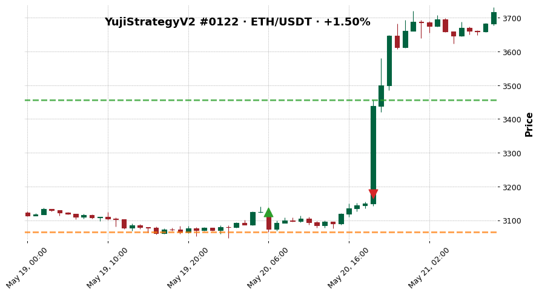

| Field | Value |
|---|---|
| strategy | `YujiStrategyV2` |
| pair | ETH/USDT |
| open_date | 2024-05-20 06:00:00+00:00 |
| close_date | 2024-05-20 19:00:00+00:00 |
| profit_ratio | +1.50% |
| MFE | +10.63% |
| MAE | -1.92% |
| exit_reason | `roi` |
| outcome | `missed_continuation` |
| exit_diagnosis | `missed_continuation` |

> Trade closed at +1.50% against a peak MFE of +10.63%; labelled missed_continuation because the favourable excursion extended well beyond the realised exit.

### 5. YujiTrendRiderStrategy — BTC/USDT · +5.00%

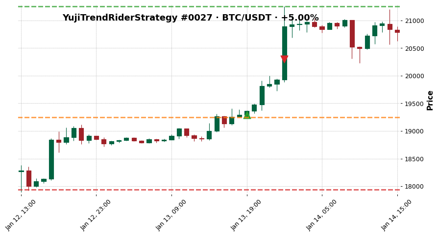

| Field | Value |
|---|---|
| strategy | `YujiTrendRiderStrategy` |
| pair | BTC/USDT |
| open_date | 2023-01-13 19:00:00+00:00 |
| close_date | 2023-01-14 00:00:00+00:00 |
| profit_ratio | +5.00% |
| MFE | +10.18% |
| MAE | -0.24% |
| exit_reason | `roi` |
| outcome | `clean_win` |
| exit_diagnosis | `missed_continuation` |

> Trade closed at +5.00% against a peak MFE of +10.18%; labelled missed_continuation because the favourable excursion extended well beyond the realised exit.

### 6. YujiStrategy — ETH/USDT · +2.00%

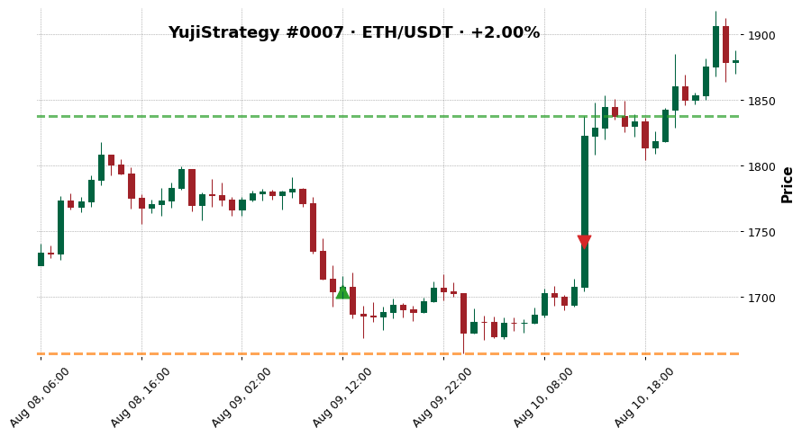

| Field | Value |
|---|---|
| strategy | `YujiStrategy` |
| pair | ETH/USDT |
| open_date | 2022-08-09 12:00:00+00:00 |
| close_date | 2022-08-10 12:00:00+00:00 |
| profit_ratio | +2.00% |
| MFE | +7.86% |
| MAE | -2.77% |
| exit_reason | `roi` |
| outcome | `missed_continuation` |
| exit_diagnosis | `missed_continuation` |

> Trade closed at +2.00% against a peak MFE of +7.86%; labelled missed_continuation because the favourable excursion extended well beyond the realised exit.

### 7. YujiMoneyMakerStrategy — LINK/USDT · +1.01%

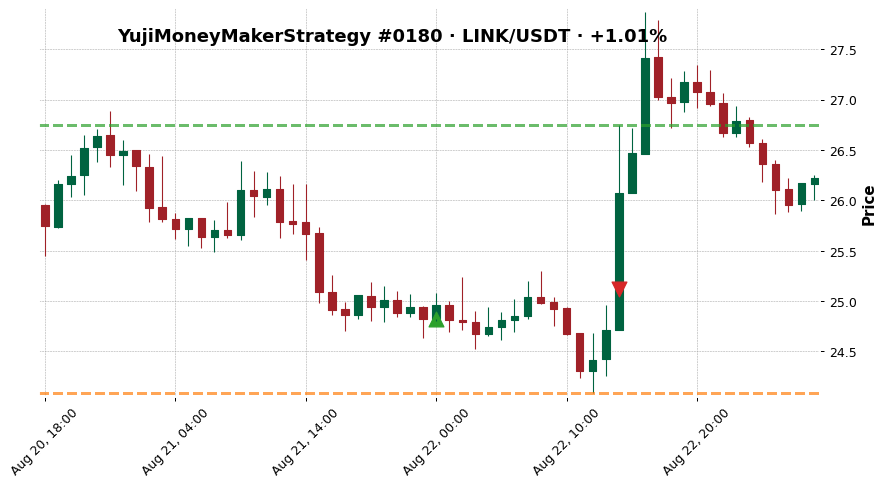

| Field | Value |
|---|---|
| strategy | `YujiMoneyMakerStrategy` |
| pair | LINK/USDT |
| open_date | 2025-08-22 00:00:00+00:00 |
| close_date | 2025-08-22 14:00:00+00:00 |
| profit_ratio | +1.01% |
| MFE | +7.78% |
| MAE | -2.94% |
| exit_reason | `roi` |
| outcome | `missed_continuation` |
| exit_diagnosis | `missed_continuation` |

> Trade closed at +1.01% against a peak MFE of +7.78%; labelled missed_continuation because the favourable excursion extended well beyond the realised exit.

### 8. YujiDivergenceStrategy — SOL/USDT · +3.00%

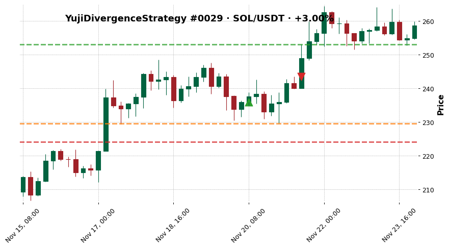

| Field | Value |
|---|---|
| strategy | `YujiDivergenceStrategy` |
| pair | SOL/USDT |
| open_date | 2024-11-20 08:00:00+00:00 |
| close_date | 2024-11-21 12:00:00+00:00 |
| profit_ratio | +3.00% |
| MFE | +7.23% |
| MAE | -2.69% |
| exit_reason | `roi` |
| outcome | `missed_continuation` |
| exit_diagnosis | `missed_continuation` |

> Trade closed at +3.00% against a peak MFE of +7.23%; labelled missed_continuation because the favourable excursion extended well beyond the realised exit.

### 9. YujiRegimeStrategy — ETH/USDT · +1.50%

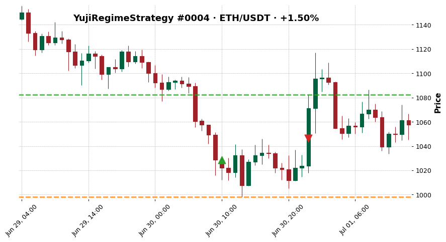

| Field | Value |
|---|---|
| strategy | `YujiRegimeStrategy` |
| pair | ETH/USDT |
| open_date | 2022-06-30 10:00:00+00:00 |
| close_date | 2022-06-30 23:00:00+00:00 |
| profit_ratio | +1.50% |
| MFE | +5.20% |
| MAE | -3.00% |
| exit_reason | `roi` |
| outcome | `missed_continuation` |
| exit_diagnosis | `missed_continuation` |

> Trade closed at +1.50% against a peak MFE of +5.20%; labelled missed_continuation because the favourable excursion extended well beyond the realised exit.

### 10. YujiInverseScalperStrategy — BTC/USDT · +1.00%

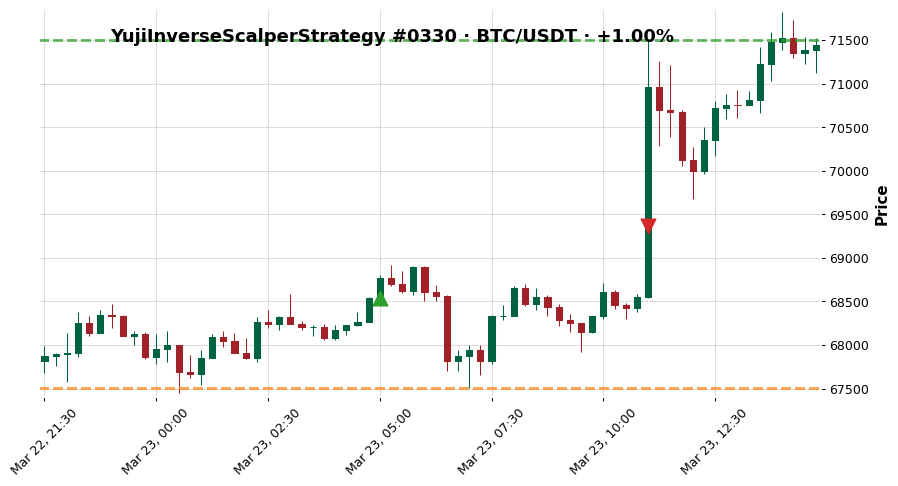

| Field | Value |
|---|---|
| strategy | `YujiInverseScalperStrategy` |
| pair | BTC/USDT |
| open_date | 2026-03-23 05:00:00+00:00 |
| close_date | 2026-03-23 11:00:00+00:00 |
| profit_ratio | +1.00% |
| MFE | +4.32% |
| MAE | -1.52% |
| exit_reason | `roi` |
| outcome | `missed_continuation` |
| exit_diagnosis | `missed_continuation` |

> Trade closed at +1.00% against a peak MFE of +4.32%; labelled missed_continuation because the favourable excursion extended well beyond the realised exit.

## Stop Loss Failures

- **Pool size:** 129 trades
- **Selection rule:** `exit_diagnosis = stop_loss_failure`, ranked by `mae_pct` ascending (deepest adverse excursion first) with strategy-diversity picking.
- **Showing:** top 10 representative trades

### 1. YujiTrendRiderStrategy — ETH/USDT · -7.19%

| Field | Value |
|---|---|
| strategy | `YujiTrendRiderStrategy` |
| pair | ETH/USDT |
| open_date | 2024-03-05 13:00:00+00:00 |
| close_date | 2024-03-05 19:00:00+00:00 |
| profit_ratio | -7.19% |
| MFE | +1.68% |
| MAE | -14.87% |
| exit_reason | `stop_loss` |
| outcome | `bad_entry_good_idea` |
| exit_diagnosis | `stop_loss_failure` |

> Trade closed at -7.19% with MAE of -14.87%; labelled stop_loss_failure because the stop exit did not contain the adverse move.

### 2. YujiStrategyV2 — ETH/USDT · -7.19%

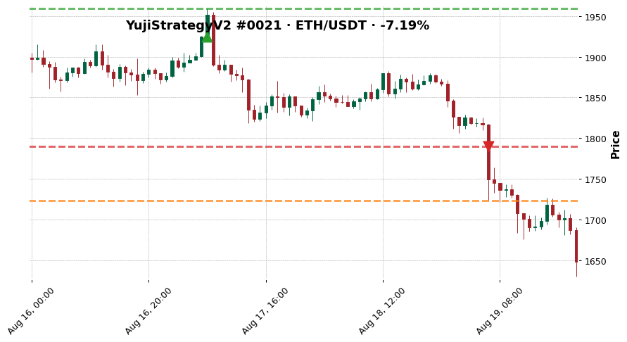

| Field | Value |
|---|---|
| strategy | `YujiStrategyV2` |
| pair | ETH/USDT |
| open_date | 2022-08-17 06:00:00+00:00 |
| close_date | 2022-08-19 06:00:00+00:00 |
| profit_ratio | -7.19% |
| MFE | +1.81% |
| MAE | -10.47% |
| exit_reason | `stop_loss` |
| outcome | `bad_entry_good_idea` |
| exit_diagnosis | `stop_loss_failure` |

> Trade closed at -7.19% with MAE of -10.47%; labelled stop_loss_failure because the stop exit did not contain the adverse move.

### 3. YujiRegimeStrategy — BTC/USDT · -5.19%

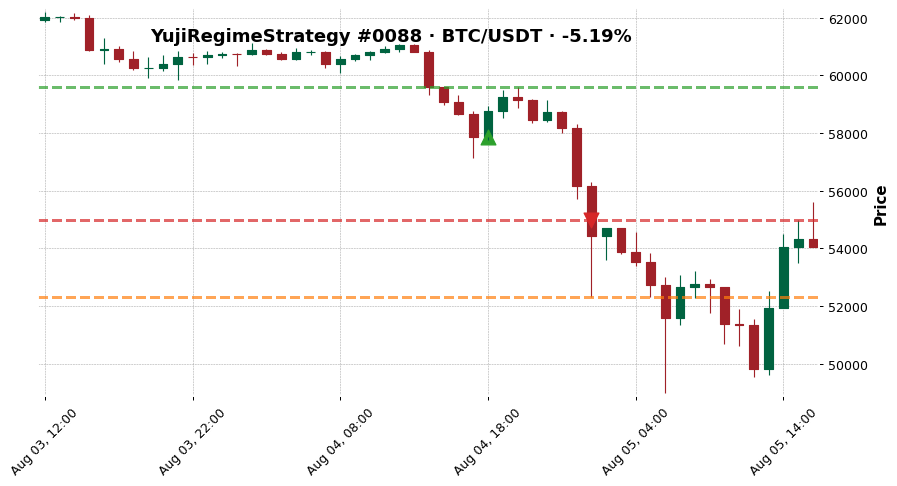

| Field | Value |
|---|---|
| strategy | `YujiRegimeStrategy` |
| pair | BTC/USDT |
| open_date | 2024-08-04 18:00:00+00:00 |
| close_date | 2024-08-05 01:00:00+00:00 |
| profit_ratio | -5.19% |
| MFE | +2.97% |
| MAE | -9.62% |
| exit_reason | `stop_loss` |
| outcome | `bad_entry_good_idea` |
| exit_diagnosis | `stop_loss_failure` |

> Trade closed at -5.19% with MAE of -9.62%; labelled stop_loss_failure because the stop exit did not contain the adverse move.

### 4. YujiDivergenceStrategy — ETH/USDT · -5.19%

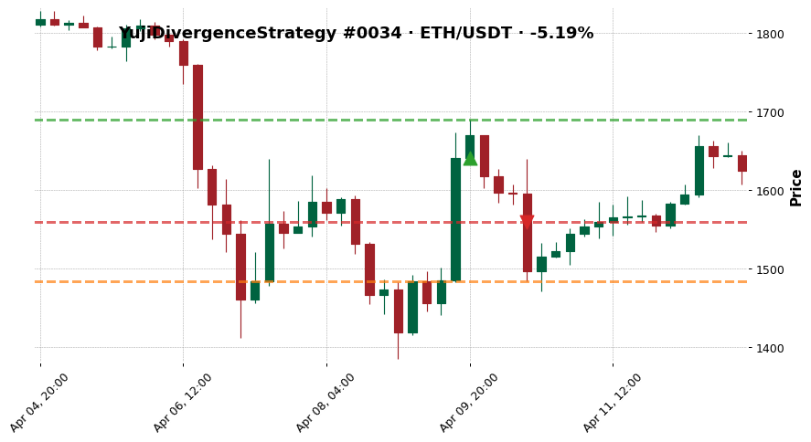

| Field | Value |
|---|---|
| strategy | `YujiDivergenceStrategy` |
| pair | ETH/USDT |
| open_date | 2025-04-09 20:00:00+00:00 |
| close_date | 2025-04-10 12:00:00+00:00 |
| profit_ratio | -5.19% |
| MFE | +2.93% |
| MAE | -9.59% |
| exit_reason | `stop_loss` |
| outcome | `bad_entry_good_idea` |
| exit_diagnosis | `stop_loss_failure` |

> Trade closed at -5.19% with MAE of -9.59%; labelled stop_loss_failure because the stop exit did not contain the adverse move.

### 5. YujiStrategy — ETH/USDT · -5.19%

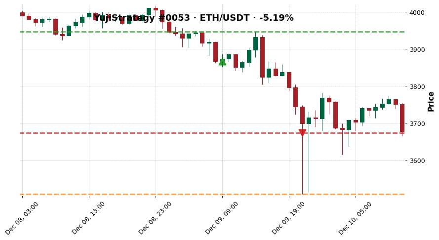

| Field | Value |
|---|---|
| strategy | `YujiStrategy` |
| pair | ETH/USDT |
| open_date | 2024-12-09 09:00:00+00:00 |
| close_date | 2024-12-09 21:00:00+00:00 |
| profit_ratio | -5.19% |
| MFE | +2.05% |
| MAE | -9.25% |
| exit_reason | `stop_loss` |
| outcome | `bad_entry_good_idea` |
| exit_diagnosis | `stop_loss_failure` |

> Trade closed at -5.19% with MAE of -9.25%; labelled stop_loss_failure because the stop exit did not contain the adverse move.

### 6. YujiStrategyV3 — LINK/USDT · -6.15%

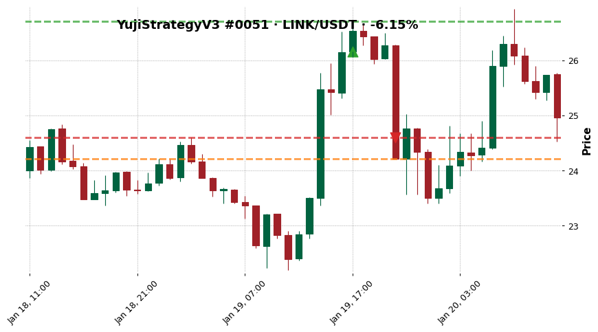

| Field | Value |
|---|---|
| strategy | `YujiStrategyV3` |
| pair | LINK/USDT |
| open_date | 2025-01-19 17:00:00+00:00 |
| close_date | 2025-01-19 21:00:00+00:00 |
| profit_ratio | -6.15% |
| MFE | +2.10% |
| MAE | -7.45% |
| exit_reason | `stop_loss` |
| outcome | `bad_entry_good_idea` |
| exit_diagnosis | `stop_loss_failure` |

> Trade closed at -6.15% with MAE of -7.45%; labelled stop_loss_failure because the stop exit did not contain the adverse move.

### 7. YujiMoneyMakerStrategy — XRP/USDT · -6.19%

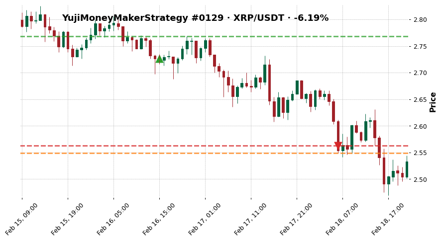

| Field | Value |
|---|---|
| strategy | `YujiMoneyMakerStrategy` |
| pair | XRP/USDT |
| open_date | 2025-02-16 15:00:00+00:00 |
| close_date | 2025-02-18 06:00:00+00:00 |
| profit_ratio | -6.19% |
| MFE | +1.53% |
| MAE | -6.51% |
| exit_reason | `stop_loss` |
| outcome | `bad_entry_good_idea` |
| exit_diagnosis | `stop_loss_failure` |

> Trade closed at -6.19% with MAE of -6.51%; labelled stop_loss_failure because the stop exit did not contain the adverse move.

### 8. YujiSmartMoneyStrategy — ETH/USDT · -5.19%

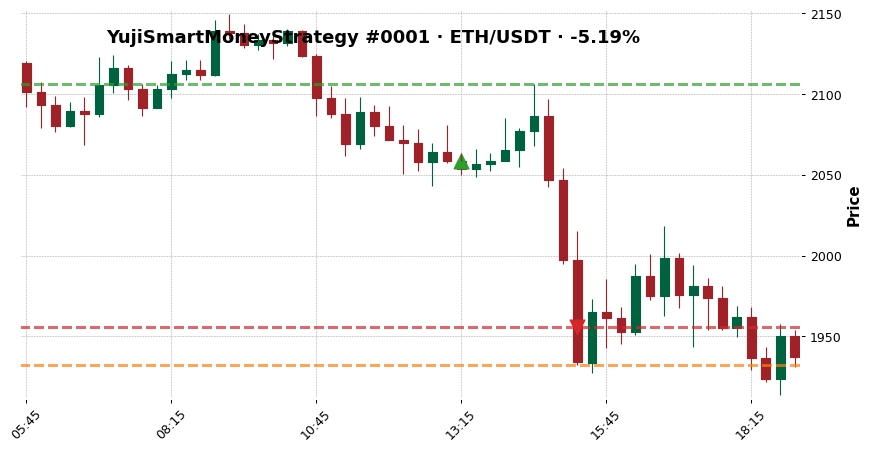

| Field | Value |
|---|---|
| strategy | `YujiSmartMoneyStrategy` |
| pair | ETH/USDT |
| open_date | 2026-02-05 13:15:00+00:00 |
| close_date | 2026-02-05 15:15:00+00:00 |
| profit_ratio | -5.19% |
| MFE | +2.32% |
| MAE | -6.14% |
| exit_reason | `stop_loss` |
| outcome | `bad_entry_good_idea` |
| exit_diagnosis | `stop_loss_failure` |

> Trade closed at -5.19% with MAE of -6.14%; labelled stop_loss_failure because the stop exit did not contain the adverse move.

### 9. YujiMultiSignalStrategy — ETH/USDT · -4.19%

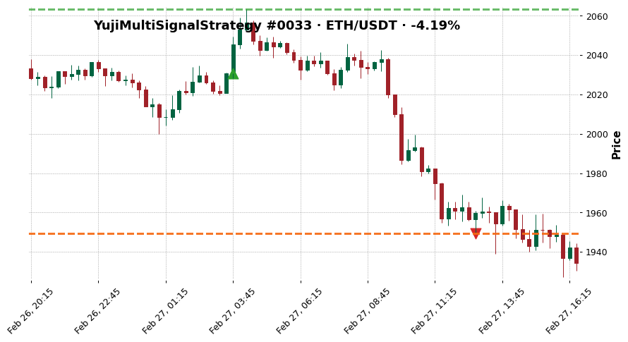

| Field | Value |
|---|---|
| strategy | `YujiMultiSignalStrategy` |
| pair | ETH/USDT |
| open_date | 2026-02-27 03:45:00+00:00 |
| close_date | 2026-02-27 12:45:00+00:00 |
| profit_ratio | -4.19% |
| MFE | +1.62% |
| MAE | -4.00% |
| exit_reason | `stop_loss` |
| outcome | `bad_entry_good_idea` |
| exit_diagnosis | `stop_loss_failure` |

> Trade closed at -4.19% with MAE of -4.00%; labelled stop_loss_failure because the stop exit did not contain the adverse move.

### 10. YujiFluidStrategy — SOL/USDT · -0.69%

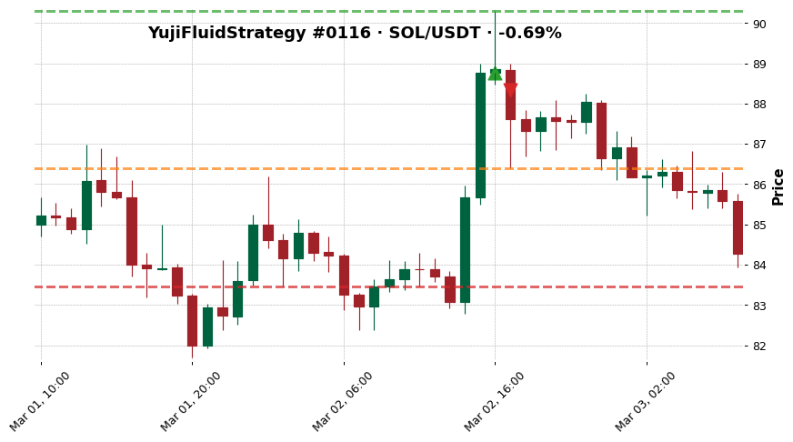

| Field | Value |
|---|---|
| strategy | `YujiFluidStrategy` |
| pair | SOL/USDT |
| open_date | 2026-03-02 16:00:00+00:00 |
| close_date | 2026-03-02 17:00:00+00:00 |
| profit_ratio | -0.69% |
| MFE | +1.71% |
| MAE | -2.68% |
| exit_reason | `trailing_stop_loss` |
| outcome | `fast_loss` |
| exit_diagnosis | `stop_loss_failure` |

> Trade closed at -0.69% with MAE of -2.68%; labelled stop_loss_failure because the stop exit did not contain the adverse move.

---

## Chart path index (by strategy)

All charts live under `data/all_trade_charts/<Strategy>/`. Per-strategy counts:

- `../../../data/all_trade_charts/YujiVWAPMeanReversionStrategy/` — 920 charts
- `../../../data/all_trade_charts/YujiInverseScalperStrategy/` — 411 charts
- `../../../data/all_trade_charts/YujiStrategyV2/` — 352 charts
- `../../../data/all_trade_charts/YujiTrendRiderStrategy/` — 322 charts
- `../../../data/all_trade_charts/YujiScalperStrategy/` — 288 charts
- `../../../data/all_trade_charts/YujiMoneyMakerStrategy/` — 232 charts
- `../../../data/all_trade_charts/YujiRegimeStrategy/` — 219 charts
- `../../../data/all_trade_charts/YujiFluidStrategy/` — 132 charts
- `../../../data/all_trade_charts/YujiStrategyV3/` — 126 charts
- `../../../data/all_trade_charts/YujiStrategy/` — 107 charts
- `../../../data/all_trade_charts/YujiMultiSignalStrategy/` — 98 charts
- `../../../data/all_trade_charts/YujiDivergenceStrategy/` — 44 charts
- `../../../data/all_trade_charts/YujiFVGStrategy/` — 37 charts
- `../../../data/all_trade_charts/YujiCointegrationResidualReversionStrategy/` — 8 charts
- `../../../data/all_trade_charts/YujiSmartMoneyStrategy/` — 4 charts

## Related wiki pages

- [[current-trading-thesis|Current trading thesis]] (cross-strategy findings + archetypes)
- [[../concepts/missed-continuation|Missed Continuation]] (concept · evidence updated to full library)
- [[../concepts/mfe-capture-ratio|MFE Capture Ratio]] (concept · evidence updated to full library)
- [[../exit-analysis/premature-exit|premature_exit]] (exit diagnosis · evidence updated to full library)
- [[../exit-analysis/coint-z-reverted|coint_z_reverted]] (exit reason · Coint strategy)

